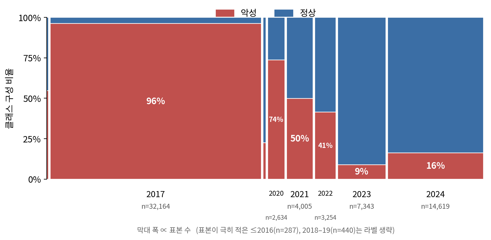
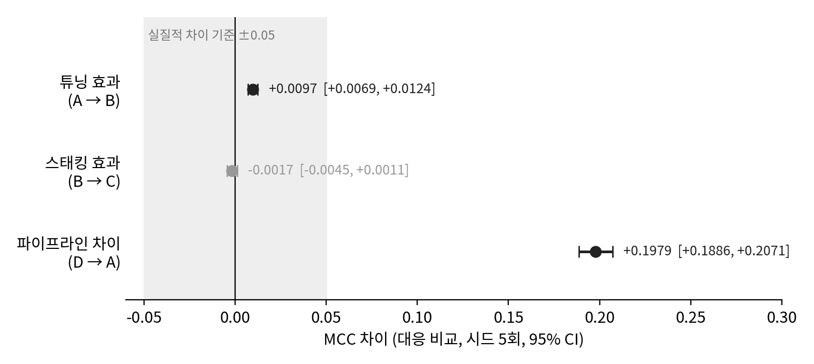
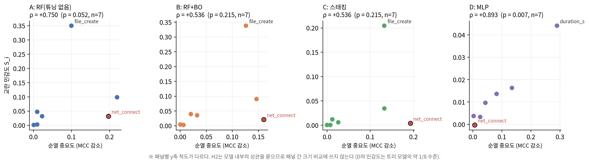
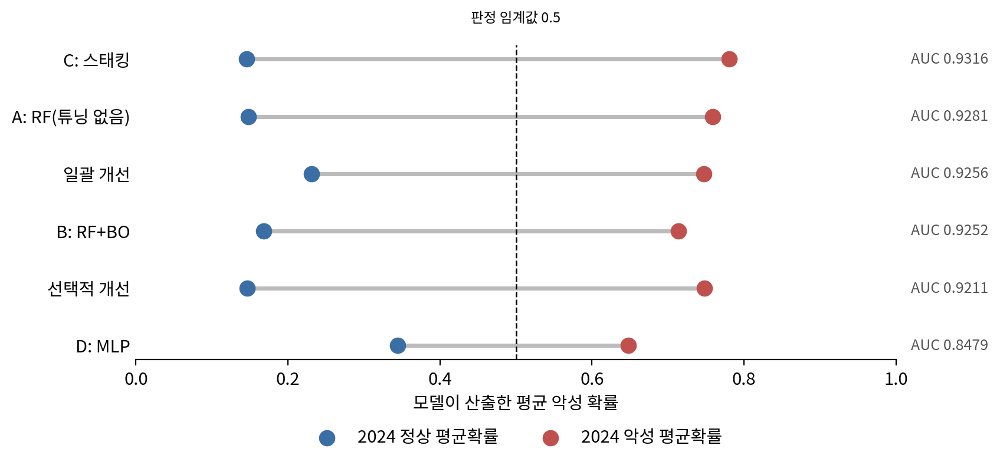

# 높은 탐지 성능은 무엇을 측정하는가 — 호스트 행위 기반 악성코드 탐지 평가의 네 층위 분석

*What Does High Detection Performance Measure? A Four-Layer Analysis of Host-Behavior Malware Detection Evaluation*

## 초록

머신러닝 기반 악성코드 탐지 연구는 탐지 성능을 정확도나 F1 같은 지표 하나로 요약해 보고하는 경우가 많다. 본 연구는 높은 탐지 성능이 실제로 무엇을 측정하며 탐지 지표 하나로 평가할 때 무엇을 놓치는지를, 호스트 행위 기반 악성코드 탐지에서 벤치마크, 모델, 개선, 해석의 네 층위로 나누어 분석했다. DMBD 2025를 주실험 데이터셋으로, CIC-MalMem-2022를 사례 연구로 사용했으며, 구조와 튜닝 방식이 다른 네 모델을 탐지, 프라이버시, 강건성, 자원 비용의 네 축에서 함께 평가했다. 가설과 판정 규칙은 실험 전에 문서로 명세했다. 그 결과 CIC-MalMem-2022에서는 실행 중인 서비스 수라는 특징 하나만으로 99.65%의 정확도에 도달할 수 있었다. DMBD 2025에서는 수집 연도만으로 라벨을 ROC-AUC 0.907로 예측할 수 있었고, 이 교란이 탐지 성능에 기여한 크기는 약 0.03 MCC로 추정되었다. 모델 구조에 따른 탐지 성능의 차이는 튜닝에 따른 차이의 약 20배였으나, 탐지 성능의 순위는 다른 축의 순위와 일치하지 않았다. 진단에 기반한 선택적 개선은 일괄 개선을 지배하지 못했으며, 두 전략은 탐지 성능과 프라이버시·강건성을 서로 맞바꾸었다. 시간적 일반화를 살펴본 2024년 코호트에서는 랜덤 포레스트 계열 모델 사이의 탐지율 차이가 구분 능력(AUC) 차이의 약 8배였고, 그 대부분은 판단 경계의 위치에서 왔다. 이 결과는 요약 수치가 서로 다른 원인을 같은 숫자로 압축할 수 있음을 보여주며, 탐지 성능을 보고하고 읽을 때 그 수치가 무엇을 반영하는지를 함께 점검해야 함을 시사한다.

**주제어**: 악성코드 탐지, 평가 방법론, 지름길 학습, 벤치마크 타당성, 멤버십 추론, 사전 명세

---

## Abstract

*What Does High Detection Performance Measure? A Four-Layer Analysis of Host-Behavior Malware Detection Evaluation*

Machine learning–based malware detection is often evaluated with a single summary metric such as accuracy or F1. This study asks what high detection performance actually measures, and what single-metric evaluation misses, in host-behavior malware detection, analyzing four layers: benchmark, model, improvement, and interpretation. Using DMBD 2025 as the main dataset and CIC-MalMem-2022 as a case study, we evaluated four models differing in architecture and tuning on four axes: detection, privacy, robustness, and resource cost. Hypotheses and decision rules were specified in writing before the experiments. On CIC-MalMem-2022, a decision rule based on a single feature, the number of running services, reached 99.65% accuracy. On DMBD 2025, the collection year alone predicted the label with an ROC-AUC of 0.907, and this confound was estimated to contribute about 0.03 MCC to detection performance. Differences due to model architecture were about 20 times larger than those due to tuning, yet the ranking by detection performance did not match the rankings on the other axes. Diagnosis-driven selective improvement did not dominate batch improvement; the two strategies traded detection performance against privacy and robustness. On the 2024 cohort used to examine temporal generalization, the spread in detection rate (recall) among random-forest models was about eight times the spread in AUC, and most of it came from the location of the decision boundary rather than from discriminative ability. These results show that a summary metric can compress different causes into the same number, and suggest that detection performance should be reported and read together with an examination of what the number reflects.

**Keywords**: malware detection, evaluation methodology, shortcut learning, benchmark validity, membership inference, pre-specified analysis

---

# 1. 서론

머신러닝 기반 악성코드 탐지는 호스트의 행위 로그, 메모리 덤프, 네트워크 트래픽 등 다양한 데이터에서 악성 여부를 판별하는 방향으로 활발히 연구되어 왔다. 이 분야의 많은 연구는 모델의 성능을 정확도나 F1 점수 같은 탐지 지표 하나로 요약해 보고하며, 그 수치가 높을수록 더 나은 탐지기로 받아들여진다. 그러나 Arp et al.(2022)이 최상위 보안 학회의 논문 30편을 조사한 결과, 절반이 넘는 논문이 적용 상황의 제약을 반영하지 않은 성능 지표를 적어도 부분적으로 사용하고 있었다. 불균형한 데이터나 낮은 오탐률이 요구되는 상황 같은 제약이다. 탐지 지표 하나가 모델에 관해 말해 주는 것은 생각보다 적을 수 있다.

이러한 평가 관행의 한계는 CIC-MalMem-2022에서 선명하게 드러난다. 메모리 덤프로 난독화된 악성코드를 탐지하기 위해 구축된 이 데이터셋에서 원 논문은 스태킹 앙상블로 99%의 정확도를 보고했다(Carrier et al., 2022). 이후 연구들이 로지스틱 회귀, 경량 모델, 랜덤 포레스트 등으로 얻은 정확도는 99.9~99.99%에 이른다(Dener et al., 2022; Shafin et al., 2023; Hasan & Dhakal, 2023). 그러나 본 연구가 이 데이터셋에 깊이 1의 결정트리를 적용한 결과, 단 하나의 분기만으로 99.65%의 정확도에 도달했다. 분기에 쓰인 특징은 실행 중인 서비스의 수였으며, 정상 덤프는 대부분 395개, 악성 덤프는 대부분 389개의 값을 가졌다. 행동이 전혀 다른 15개 악성코드 계열이 모두 같은 값을 보였으며, 이 여섯 개의 차이가 악성 행위의 흔적인지 악성 샘플을 실행할 때의 시스템 구성 차이인지는 데이터만으로 가리기 어렵다. 이 결과는 높은 정확도가 무엇을 측정하고 있는지 되묻게 한다.

이 문제는 한 데이터셋에 국한되지 않는다. 본 연구가 주실험에 사용한 DMBD 2025에서는 샘플의 수집 연도가 라벨과 강하게 얽혀 있어, 연도 하나만으로 라벨을 ROC-AUC 0.907로 예측할 수 있었다. 나아가 탐지 성능은 벤치마크의 성질만이 아니라 모델의 다른 측면도 가린다. 실제로 배치되는 탐지 모델은 학습에 쓰인 데이터를 드러내지 않아야 하고(프라이버시), 공격자가 특징을 조작해도 판정을 유지해야 하며(강건성), 제한된 자원 안에서 동작해야 한다(자원 비용). 탐지 성능이 높다고 해서 이 요구들이 함께 충족된다는 보장은 없다. 결과를 해석하는 단계도 예외가 아니다. 탐지율 하나로 새로운 악성코드에 대한 일반화를 판단하면, 모델이 판단 경계를 옮긴 것을 일반화 능력이 향상된 것으로 오인할 수 있다. Lapuschkin et al.(2019)이 지적했듯, 표준적인 성능 지표는 모델이 같은 과제를 서로 다른 방식으로 해결하는 것을 구분하지 못할 수 있다.

평가 관행의 이러한 함정은 새로운 지적이 아니다. Arp et al.(2022)은 보안 분야 머신러닝 연구에서 반복되는 함정 열 가지를 체계화하고, 개별 함정이 비현실적인 성능과 잘못된 해석으로 이어지는 과정을 실증 사례로 보였다. 네트워크 보안 분야에서는 학습된 모델의 판단 근거를 결정트리로 추출해 지름길 학습을 드러내는 방법(Jacobs et al., 2022)과 입력 특징 가운데 지름길 후보를 진단하는 방법(Wang et al., 2026)도 제안되었다. 본 연구는 이 문제의식을 호스트의 행위와 메모리에 기반한 악성코드 탐지로 가져온다. 다만 함정을 하나씩 따로 보이는 대신, 단일 지표 평가가 벤치마크, 모델, 개선, 해석의 네 층위에서 차례로 무엇을 놓치는지를 한 연구 안에서 추적한다. 한 층위의 문제는 다음 층위로 이어진다. 벤치마크의 연도 교란은 공식 시험 분할의 수치를 시간적 일반화의 척도로 읽기 어렵게 만들고, 개선 전략이 만든 판단 경계의 이동은 새로운 악성코드에 대한 탐지율의 향상처럼 보인다. 또한 본 연구는 탐지 성능과 함께 프라이버시, 강건성, 자원 비용을 같은 모델 집합에서 측정한다. 그리고 분석을 사전에 명세하고 평가 집합을 봉인한 설계에서도 해석 단계의 함정은 남는다는 점을 보인다.

본 연구는 호스트 행위 기반 악성코드 탐지를 대상으로, 높은 탐지 성능이 실제로 무엇을 측정하며 탐지 지표 하나로 평가할 때 무엇을 놓치는가를 묻는다. 주실험에는 DMBD 2025를 사용하고, CIC-MalMem-2022는 벤치마크 점검의 사례로만 다룬다. 구조와 튜닝 방식이 서로 다른 네 모델을 탐지, 프라이버시, 강건성, 자원 비용의 네 축에서 함께 평가한다. 또한 진단에서 문제가 드러난 축에만 개선을 적용하는 선택적 개선과, 준비된 개선을 모두 적용하는 일괄 개선을 비교한다. 실험에 앞서 가설과 판정 규칙을 문서로 명세했으며, 판정과 보고에 쓸 평가 집합은 해시 값으로 봉인해 한 번만 열었다.

본 연구의 기여는 다음과 같다.

- **벤치마크 층위.** 선행 연구에서 널리 쓰인 CIC-MalMem-2022와 최근 공개된 DMBD 2025가 서로 다른 방식으로 평가를 왜곡할 수 있음을 보인다. CIC-MalMem-2022에서는 분기 하나짜리 결정트리가 99.65%의 정확도를 얻는다. DMBD 2025에서는 수집 연도만으로 라벨을 ROC-AUC 0.907로 예측할 수 있으며, 본 연구는 이 교란이 탐지 성능에 기여하는 크기(약 0.03 MCC)를 평가 데이터를 재구성해 분리한다.
- **모델 층위.** 네 모델을 네 축에서 함께 평가해, 모델 구조에 따른 탐지 성능의 차이(MCC 0.198)가 튜닝에 따른 차이(0.010)의 약 20배임을 보인다. 또한 탐지 성능이 가장 낮은 다층 퍼셉트론이 나머지 세 축에서는 모두 가장 유리하다는 교환 관계를 확인하고, 튜닝하지 않은 랜덤 포레스트가 본 연구의 진단에서 프라이버시, 강건성, 자원 비용의 세 축 모두에서 가장 불리했음을 보인다.
- **개선 층위.** 진단에 기반한 선택적 개선과 일괄 개선을 사전에 명세한 비열등성 검정으로 비교해, 선택적 개선이 일괄 개선을 지배하지 않음을 보인다. 선택적 개선은 탐지 성능을 보존하고, 일괄 개선은 프라이버시와 강건성을 얻는 대신 탐지 성능을 잃는다. 이 부정적 결과는 두 전략이 교환 관계에 있음을 뜻한다.
- **해석 층위.** 시간적 일반화를 탐지율로 비교하면, 학습에 쓰인 악성 샘플보다 뒤 시점의 2024년 코호트에서 랜덤 포레스트 계열 모델 사이의 탐지율 차이가 구분 능력(AUC) 차이의 약 8배에 이르며, 그 대부분이 판단 경계의 위치에서 온다는 것을 보인다.

이 논문의 구성은 다음과 같다. 2장은 관련 연구를 본 연구의 네 층위에 맞추어 정리한다. 3장은 데이터, 분할, 모델, 진단 축, 개선 전략, 통계 처리를 기술한다. 4장은 결과를 벤치마크, 모델, 개선, 해석의 순서로 보고한다. 5장은 네 층위를 가로지르는 공통의 메커니즘과 사전 명세의 역할, 실무적 함의를 논의한다. 6장은 각 결론을 얼마나 믿을 수 있는지와 연구의 한계를 정리하고, 7장에서 결론을 맺는다.

---

# 2. 관련 연구

## 2.1 머신러닝 기반 악성코드 탐지와 평가 관행

머신러닝 기반 악성코드 탐지는 실행 파일의 정적 특징, 실행 중의 행위, 메모리 덤프, 네트워크 트래픽 등 다양한 데이터를 대상으로 연구되어 왔다. 메모리 덤프를 예로 들면, CIC-MalMem-2022(Carrier et al., 2022)가 공개된 뒤 빅데이터 환경의 로지스틱 회귀, 경량 신경망, 소수 특징의 랜덤 포레스트 등 다양한 모델이 같은 데이터셋에서 비교되었다(Dener et al., 2022; Shafin et al., 2023; Madamidola et al., 2025). Madamidola et al.(2025)은 이 분야의 연구가 주로 정확도에 초점을 맞추어 왔고, 계산 비용 절감과 해석 가능성으로 관심이 점차 넓어지고 있다고 정리했다.

정확도 중심의 평가가 무엇을 놓칠 수 있는지는 보안 분야 머신러닝 연구 전반에 걸쳐 지적되어 왔다. Arp et al.(2022)은 학습 기반 보안 시스템의 설계, 구현, 평가 단계에서 반복되는 함정 열 가지를 정리하고, 최근 10년간 최상위 보안 학회에 발표된 논문 30편에서 이 함정들이 널리 나타남을 보였다. 저자들은 이것이 특정 연구를 지목하려는 것이 아니라 자신들의 연구에도 해당하는 성찰이라고 밝혔으며, 실증 분석을 통해 개별 함정이 비현실적인 성능과 잘못된 해석으로 이어지는 과정을 보였다.

열 가지 함정 가운데 여러 개가 본 연구의 네 층위와 직접 맞닿는다. **허위 상관**은 보안 문제와 무관한 인공물이 클래스를 가르는 지름길이 되어, 모델이 실제 과제 대신 그 인공물에 적응하는 문제다. **부적절한 기준선**에 대해서는 복잡한 모델만이 아니라 단순한 모델도 평가 내내 함께 고려할 것을 권고했다. 이 두 함정은 벤치마크 층위(2.2절)와 관련된다. **부적절한 위협 모델**은 멤버십 추론이나 적대적 예제 같은 공격을, **실험실 평가**는 실행 시간과 저장 공간의 제약을 고려하지 않는 문제로, 모델 층위의 다축 평가(2.3절)와 관련된다. **부적절한 성능 지표**에 대해서는 탐지 시스템을 정확도 같은 단일 성능 값 하나로 보고하는 것이 불충분하다고 지적했으며, 이 함정은 **기저율 오류**와 함께 평가 지표의 해석(2.5절)과 관련된다. 마지막으로 **데이터 스누핑**에 대해서는 공개 데이터셋의 특성이 점점 알려지므로 더 최근의 데이터로 실험을 보완할 것을 권고했다.

본 연구는 이 권고들 가운데 여럿을 한 연구 안에서 실제로 적용한다. 공개 벤치마크에 얕은 결정트리를 먼저 적용해 단순한 기준선으로 점검하고, 최근 공개된 DMBD 2025(Lawrence Livermore National Laboratory [LLNL], 2025)를 주실험에 사용한다. 또한 탐지 성능과 함께 멤버십 추론과 추론 비용을 같은 모델 집합에서 측정한다. 이어지는 절들은 본 연구의 네 층위에 맞추어 관련 연구를 정리한다. 2.2절은 벤치마크의 타당성, 2.3절은 탐지 외의 평가 축, 2.4절은 모델 개선과 앙상블, 2.5절은 평가 지표와 시간적 평가를 다룬다.

## 2.2 데이터셋과 벤치마크의 타당성

### 2.2.1 지름길 학습

모델이 과제의 본질이 아닌 데이터의 우연한 특성에 기대어 높은 성능을 내는 현상은 머신러닝 전반에서 연구되어 왔다. Geirhos et al.(2020)은 이를 지름길 학습이라 부르고, 지름길을 표준 벤치마크에서는 잘 작동하지만 실제 환경과 같은 더 까다로운 조건으로는 전이되지 않는 결정 규칙으로 정의했다. 저자들은 이것이 심층 신경망에 국한되지 않고 학습 시스템 일반의 특성일 수 있다고 보았다. 또한 지름길을 진단하는 방법으로, 의도한 특징을 쓰지 않는 단순한 기준선이 기대 이상으로 잘하는지 시험해 볼 것을 권했다. Lapuschkin et al.(2019)은 과제와 무관한 단서에 기대어 판단하는, 이른바 영리한 한스(Clever Hans) 예측기를 설명 기법으로 드러내고, 표준적인 성능 지표는 모델이 같은 과제를 서로 다른 방식으로 해결하는 것을 구분하지 못할 수 있다고 지적했다. 예컨대 PASCAL VOC의 "말" 범주에서 사진의 워터마크에 기대어 판정한 모델과 말 자체를 본 모델의 평균 정밀도는 각각 80.45%와 81.60%로, 통계적으로 유의한 차이가 없었다.

Arp et al.(2022)의 허위 상관은 같은 현상을 보안 분야의 맥락에서 다룬 것이다. 다만 저자들은 한 설정에서 허위 상관인 것이 다른 설정에서는 타당한 신호일 수 있으므로, 시스템의 목표를 먼저 분명히 하고 학습된 상관이 그 목표에 맞는지 확인해야 한다고 덧붙였다. 어떤 신호가 지름길인지는 데이터만으로 정해지지 않고 과제의 정의에 따라 달라진다는 뜻이다.

### 2.2.2 보안 분야의 벤치마크 진단

보안 분야에서도 학습 모델이 지름길에 기대는지를 진단하는 연구가 이루어져 왔으며, 본 연구가 확인한 연구들은 네트워크 트래픽을 대상으로 한다. Jacobs et al.(2022)은 학습된 블랙박스 모델에서 충실도가 높고 단순한 결정트리를 추출해, 모델이 무엇을 근거로 판단하는지 드러내는 방법을 제안했다. 이 방법으로 저자들은 공개된 네트워크 보안 모델들에서 지름길 학습, 허위 상관, 분포 밖 샘플에 대한 취약성을 찾아냈다. 예컨대 CIC-IDS-2017로 학습한 침입 탐지 모델은, 공격과 정상 트래픽을 서로 다른 운영체제의 호스트에서 생성한 수집 설정 때문에 패킷의 TTL 값으로 둘을 구분하고 있었다. Wang et al.(2026)은 동료 심사 전의 사전 공개본에서, 암호화된 트래픽의 패킷 필드와 라벨 사이의 통계적 의존성을 분석해 지름길이 될 수 있는 특징을 모델과 무관하게 찾아내는 방법을 제안했다. 저자들은 VPN 탐지, 악성 트래픽 분류, 애플리케이션 식별의 세 과제에 걸친 공개 데이터셋 19개에서 지름길 후보를 진단했고, 그중 6개에서 해당 특징을 가렸을 때 분류 성능이 어떻게 변하는지 측정했다. 이들이 찾아낸 특징 가운데에는 분류 대상과 무관하게 수집 환경에 얽힌 특징들이 포함되어 있었다.

### 2.2.3 CIC-MalMem-2022에 관한 선행 연구

CIC-MalMem-2022는 메모리 덤프로 난독화된 악성코드를 탐지하기 위해 구축된 데이터셋으로, 원 논문은 나이브 베이즈·랜덤 포레스트·결정트리를 기반으로 한 스태킹 앙상블로 99%의 정확도를 보고했다(Carrier et al., 2022). 이후 연구들은 같은 데이터셋의 이진 분류에서 99.9~99.99%의 정확도를 보고했다(Dener et al., 2022; Shafin et al., 2023; Hasan & Dhakal, 2023). 본 연구가 분할 방식을 확인한 연구들은 메모리 덤프 단위의 무작위 분할로 평가했다. Dener et al.(2022)은 70대 30의 무작위 분할을 10회 반복했고, Shafin et al.(2023)과 Madamidola et al.(2025)은 80대 20의 층화 무작위 분할을 사용했다.

이 데이터셋의 이진 분류가 비교적 쉽다는 점은 선행 연구에서도 언급되었다. Shafin et al.(2023)은 두 클래스의 특징이 뚜렷이 달라 구분이 비교적 쉬우므로 거의 완벽한 정확도가 나오는 것이 전형적이라고 보았다. Madamidola et al.(2025)은 특징 중요도 상위 다섯 개만으로도 99.8%를 넘는 정확도를 얻었으며, 실행 중인 서비스의 수(`svcscan.nservices`)가 15개 악성코드 계열별 모델 가운데 10개에서 가장 중요한 특징이었다고 보고했다. 저자들은 서비스 수가 적을수록 악성으로 판정되는 경향을, 난독화된 악성코드가 새 서비스를 만들지 않고 기존 프로세스 안에서 동작하기 때문으로 해석했다. 또한 한 계열의 덤프로만 학습한 모델이 학습에 쓰지 않은 나머지 계열을 포함한 시험 집합에서도 높은 정확도를 보였다는 점을 새로운 악성코드에 대한 적응력의 증거로 제시했다.

### 2.2.4 본 연구의 위치

본 연구는 지름길 진단의 문제의식을 호스트의 메모리와 행위에 기반한 악성코드 탐지 벤치마크로 가져온다. CIC-MalMem-2022에 대해서는 선행 연구가 쉽다고 언급한 이진 분류가 실제로 얼마나 쉬운지를 깊이 1의 결정트리로 정량화하고, 그 쉬움을 만드는 특징과 그 특징이 15개 계열에 걸쳐 보이는 균일성을 제시한다(4.1절). 이 균일성은 Madamidola et al.(2025)의 행위 해석과 다른 해석, 즉 악성 샘플을 실행할 때의 시스템 구성 차이라는 해석도 가능하게 한다. 본 연구는 두 해석 가운데 어느 쪽이 옳은지 판정하지 않으며, 같은 관찰에 서로 다른 해석이 가능하다는 점 자체를 벤치마크 점검이 필요한 이유로 본다. 또한 같은 실행에서 나온 덤프가 학습과 평가에 나뉘어 들어가지 않도록 실행 단위로 묶어 교차검증한다.

DMBD 2025에 대해서는 다른 종류의 문제를 다룬다. Jacobs et al.(2022)은 학습된 모델의 판단 근거를, Wang et al.(2026)은 입력 특징과 라벨의 관계를 분석해 지름길을 찾는다. 두 연구 모두 모델이 입력으로 받는 특징을 대상으로 하며, Wang et al.(2026)은 나아가 그 특징을 가려 성능에 미치는 영향을 측정한다. 반면 DMBD 2025에서 본 연구가 확인한 교란 요인인 샘플의 수집 연도는 모델의 입력에 포함되지 않으며, 행위 특징에 간접적으로 스며 있다. 입력에 없는 변수는 가릴 수 없으므로, 본 연구는 연도의 범위를 좁히고 연도별로 클래스 비율을 맞추는 방식으로 평가 데이터를 재구성해 교란이 탐지 성능에 기여하는 크기를 분리한다(4.1절).

## 2.3 탐지 외의 평가 축

탐지 성능이 높은 모델이 실제 환경에서 쓸 만한지는 탐지 외의 요구에도 달려 있다. 2.1절에서 보았듯 Arp et al.(2022)은 위협 모델의 함정에서 멤버십 추론과 적대적 예제 같은 공격을, 실험실 평가의 함정에서 실행 시간과 저장 공간의 제약을 고려할 것을 권했다. 본 연구는 이 가운데 프라이버시, 강건성, 자원 비용의 세 축을 탐지 성능과 함께 측정한다.

멤버십 추론은 어떤 샘플이 모델의 학습에 쓰였는지를 공격자가 알아낼 수 있는지를 묻는다. Shokri et al.(2017)은 대상 모델과 비슷하게 학습한 shadow 모델들의 출력으로 학습 데이터의 구성원 여부를 판정하는 공격 모델을 만드는 방법을 제안했다. Carlini et al.(2022)은 이런 공격을 정확도나 AUC 같은 평균적인 지표로 평가하면 공격이 구성원을 확신 있게 식별할 수 있는지를 알 수 없다고 지적하고, 0.1% 이하와 같은 낮은 오탐률에서의 참양성률로 평가해야 한다고 주장했다. 이렇게 평가하자 기존 공격 대부분의 성능이 낮았고, 저자들이 제안한 공격은 같은 구간에서 10배 더 강했다. 따라서 단순한 공격이 유출을 검출하지 못했다는 결과는 유출이 없다는 뜻이 아니다. 본 연구의 공격은 Shokri et al.의 방식을 단순화한 것이므로, 프라이버시 축의 결과는 이 한계 안에서 해석한다(3.6.2절, 4.2.2절).

강건성은 공격자가 입력을 조작해 탐지를 피할 수 있는지를 묻는다. Pierazzi et al.(2020)은 소프트웨어처럼 특징 공간에서 실제 객체로 되돌아가는 대응이 분명하지 않은 영역에서는, 특징 공간의 조작이 곧 실제로 실행 가능한 회피 객체가 되지는 않는다는 점을 강조했다. 저자들은 실제 객체를 바꾸는 공격이 가능한 변환, 의미의 보존, 전처리에 대한 내성, 그럴듯함이라는 네 가지 제약을 만족해야 한다고 정리하고, 실제 객체를 바꿀 때 의도하지 않은 다른 특징까지 함께 바뀌는 부수 효과 특징의 문제를 지적했다. 본 연구의 교란은 특징 공간에서의 조작이며, 부수 효과로는 이벤트 총수를 다시 계산하는 것 하나만 반영했다(3.6.3절). 따라서 강건성 축의 결과는 실제 회피 공격에 대한 내성이 아니라, 조작하기 쉬운 특징이 바뀔 때 판정이 얼마나 뒤바뀌는가로 읽어야 한다.

자원 비용은 모델을 실제 기기에서 운용할 수 있는지를 묻는다. CIC-MalMem-2022를 다룬 연구 가운데에도 탐지 성능과 함께 자원 비용을 보고한 예가 있다. Shafin et al.(2023)은 1MB 미만의 경량 신경망으로 IoT 기기 탑재를 겨냥했고, Madamidola et al.(2025)은 특징 다섯 개만 쓰는 340KB 크기의 모델로 파일당 5.7µs의 판정 속도를 보고했다.

본 연구는 네 축을 같은 모델 집합에서 함께 측정한다. 축마다 따로 보면 그 축에서의 우열만 드러나지만, 함께 보면 한 축에서 앞선 모델이 다른 축에서 무엇을 치르는지가 드러난다. 4.2절은 탐지 성능이 가장 낮은 다층 퍼셉트론이 나머지 세 축에서는 모두 가장 유리하고, 튜닝하지 않은 랜덤 포레스트는 세 축 모두에서 가장 불리함을 보인다.

## 2.4 모델 개선과 앙상블

탐지 성능을 높이는 대표적인 방법은 하이퍼파라미터 튜닝과 여러 모델의 결합이다. 베이지안 최적화는 목적 함수를 가우시안 과정으로 근사하고, 기대 개선량 같은 획득 함수로 다음에 시도할 하이퍼파라미터를 고르는 방법이다(Frazier, 2018).

여러 모델의 결합에 대해 Caruana et al.(2004)은 서로 다른 학습 알고리즘과 설정으로 만든 약 2,000개의 모델에서 앙상블을 골라 구성하는 방법을 제안했다. 이 방법은 7개 문제와 10개 지표에서 배깅과 부스팅으로 학습한 모델을 포함해 가장 좋은 단일 모델을 일관되게 앞섰지만, 개선 폭은 손실 기준으로 평균 8.76%였고 저자들 스스로 극적이지 않다고 평가했다. 저자들은 이미 성능이 좋은 모델을 더 개선하기가 평범한 모델을 개선하기보다 어렵다고 덧붙였으며, 같은 실험에서 로지스틱 회귀로 결합한 스태킹은 강하게 상관된 많은 입력 모델과 적은 검증 데이터 때문에 과적합해 성능이 좋지 않았다. 앙상블의 이득은 흔히 기반 모델의 다양성으로 설명되지만, Kuncheva & Whitaker(2003)는 다양성 척도 10가지와 앙상블 정확도의 관계를 살펴본 뒤 일부 특수한 경우를 빼면 실제 문제에서 다양성 척도가 유용한지 의문이 든다고 보았다. CIC-MalMem-2022의 원 논문도 나이브 베이즈·랜덤 포레스트·결정트리를 결합한 스태킹으로, 단일 랜덤 포레스트(0.97)보다 높은 0.99의 정확도를 보고했다(Carrier et al., 2022).

Caruana et al.(2004)과 Carrier et al.(2022)은 결합의 효과를 예측 성능 지표로 평가했다. 그러나 탐지 성능을 높이는 개선이 프라이버시나 강건성에도 이로운지는 따로 확인해야 한다. 본 연구는 진단에서 문제가 드러난 축에만 개선을 적용하는 선택적 개선과, 준비된 개선을 모두 적용하는 일괄 개선을 사전에 명세한 비열등성 검정으로 비교해 개선이 다른 축에 미치는 영향을 함께 본다(4.3절).

## 2.5 평가 지표와 시간적 평가

2.1절에서 본 Arp et al.(2022)의 함정 가운데 기저율 오류에 대해, 저자들은 소수 클래스의 비율이 부풀려진 실험에서는 정밀도와 재현율이 오도할 수 있으므로 MCC가 더 적합하다고 보았다. Chicco & Jurman(2020)도 정확도와 F1 점수가 특히 불균형한 데이터에서 지나치게 낙관적인 결과를 낼 수 있으며, MCC는 혼동 행렬의 네 범주 모두에서 좋은 결과를 낼 때만 높은 값을 준다고 주장했다. 다만 Holzmann & Klar(2024)는 동료 심사 전의 사전 공개본에서, 소수 클래스의 비율이 0에 가까워지는 극단적 불균형에서는 MCC도 소수 클래스를 무시하는 분류기를 선호할 수 있음을 보였다. 본 연구가 MCC를 주지표로 삼은 근거와 그 한계는 3.6.1절에서 다룬다.

평가 데이터를 시간적으로 어떻게 나누는가도 결과를 좌우한다. Pendlebury et al.(2019)은 안드로이드 악성코드 분류에서 보고된 높은 성능이 흔히 두 가지 실험 편향으로 부풀려진다고 지적했다. 학습·시험 데이터의 분포가 실제 배치 환경을 대표하지 못하는 공간 편향과, 학습과 시험을 시간적으로 잘못 나누어 현실에서 불가능한 구성이 되는 시간 편향이다. 본 연구가 사용한 DMBD 2025의 공식 분할도 이 기준을 완전히 충족하지는 않는다(4.4절).

시간적 일반화를 탐지율로 비교하면 두 가지가 함께 반영된다. 하나는 악성과 정상을 구분하는 능력이고, 다른 하나는 판단 경계의 위치다. 구분 능력이 같은 두 모델이라도 판단 경계가 다르면 탐지율이 달라진다. 본 연구는 학습에 쓰인 악성 샘플보다 뒤 시점인 2024년 코호트 안에서 구분 능력을 AUC로 따로 측정해, 모델 사이의 탐지율 차이 가운데 구분 능력으로 설명되는 부분과 판단 경계의 위치에서 오는 부분을 나누어 본다(4.4절).

---

# 3. 연구 설계

## 3.1 연구 질문과 가설

본 연구의 질문은 두 겹이다. 첫째, 탐지 성능이 높은 호스트 행위 기반 악성코드 탐지 모델은 프라이버시·강건성·자원 비용 측면에서도 우수한가. 둘째, 그렇지 않다면 탐지 성능 수치는 실제로 무엇을 반영하는가. 본 연구는 이 질문을 표 1의 다섯 가설로 구체화했다.

**표 1. 가설과 그 성격**

| 가설 | 내용 | 성격 | 판정 방법 |
|---|---|---|---|
| H1 | 탐지 성능이 높다고 해서 프라이버시·강건성·자원 효율이 함께 보장되지는 않는다 | 문제 제기 | 네 축의 병렬 제시, 반례의 존재 여부 |
| H2 | 조작이 쉬운 특징 가운데 판별 중요도가 높은 특징일수록 교란에 더 민감하다 | 확증적 | 모델별 순위 상관 |
| H3 | 지정된 학습 조건에서 모델 구조와 튜닝 방법에 따라 파이프라인 사이의 차이가 관찰된다 | 확증적 | 차이의 95% 신뢰구간 |
| H4 | 한 연도 코호트에서 관찰된 취약성 패턴이 다른 코호트에서도 재현된다 | 폐기 | — (6장 참조) |
| H5 | 진단에 기반한 선택적 개선은 일괄 개선에 비해 목표 축에서 뒤지지 않으면서 부작용은 더 적다 | 확증적 | 비열등성·우위 검정 |

H1은 확증적 가설로 두지 않았다. "보장되지 않는다"는 부정 명제는 반례 하나로 뒷받침되므로, 통계적 검정보다 반례의 존재와 그 크기를 보는 것이 적절하다. 또한 모델이 네 종뿐이어서 축 사이의 상관을 추론할 표본도 부족하다. H4는 설계 단계에서 폐기되었으며, 그 경위와 근거는 6장에서 다룬다. 따라서 확증적 가설은 H2, H3, H5의 세 개다.

## 3.2 사전 명세와 변경 관리

본 연구는 실험에 착수하기 전에 분석 계획을 문서로 명세했다. 가설, 데이터 분할, 주평가지표, 개선 전략의 발동 기준과 선택 규칙, 비열등성 한계가 이 명세에 포함된다. 이후 계획을 바꿀 때는 원래 계획, 실제 처리, 변경 사유, 영향 범위를 함께 기록했으며, 이 변경 기록 전체를 부록 A로, 분석 계획의 원문은 보충 자료 S1로 공개한다.

다만 이 명세는 공개 저장소에 시점을 남기는 사전 등록(preregistration)이 아니라 연구진 내부의 문서다. 따라서 각 결정이 결과를 보기 전에 내려졌는지를 외부에서 독립적으로 검증할 수는 없다. 본 연구는 이 한계를 변경 기록의 전면 공개로 보완하고자 했다.

결과가 공개되지 않도록 두 평가 집합은 봉인했다. H5를 판정할 시험 분할과 공식 시험 분할은 분할 시점에 샘플 번호를 정렬해 SHA-256 해시 값을 기록했고, 봉인을 해제하기 전에 해시 값이 일치하는지 확인했다. 멤버십 추론의 최종 감사 집합도 진단 단계에서 샘플 번호를 고정한 뒤 다시 열람하지 않았다.

변경 가운데 결과 해석에 영향을 주는 세 가지를 여기서 밝혀 둔다. 첫째, 개선 전략의 발동 기준(3.7절)이 분석 계획을 개정하는 과정에서 "효과가 충분히 큰가"를 묻는 기준에서 "효과가 조금이라도 있는가"를 묻는 기준으로 잘못 바뀌어 있었다. 이 오류는 모든 진단 축에서 개선이 발동되어 선택적 개선과 일괄 개선이 같아지는 현상을 조사하다 발견했으며, 데이터를 보기 전에 정해 두었던 원래 기준으로 되돌렸다. 이때 H5 시험 분할은 봉인된 상태였다. 둘째, 교란 학습에 쓸 샘플을 검증 분할에서 가져오도록 되어 있던 명세를 학습 분할에서 생성하도록 고쳤다. 검증 분할의 변형본이 학습에 들어가면 검증 분할에서의 선택이 낙관적으로 치우치기 때문이다. 셋째, 일괄 개선이 선택적 개선과 같은 총 탐색 예산을 쓰도록 한 조항을 개선 축마다 같은 예산을 쓰도록 바꾸었다. 총 예산을 맞추면 일괄 개선의 각 단계가 덜 탐색되어 H5에 유리한 쪽으로 치우치기 때문이다. 세 변경의 상세는 부록 A에 있다.

이와 별도로 주실험 데이터셋을 바꾼 일을 밝혀 둔다. 사전 규칙에 따르면 주실험 데이터셋은 CIC-MalMem-2022였으나, 모델을 학습하기 전 데이터를 검증하는 단계에서 깊이 1 결정트리로 두 클래스가 거의 완전히 갈린다는 것을 확인하고 DMBD 2025로 바꾸었다. 가설을 검정하기 전이었지만 데이터를 본 뒤의 변경이며, 그 시점과 이유는 부록 A에 기록되어 있다(5.2절).

## 3.3 데이터

### 3.3.1 DMBD 2025

주실험에는 미국 로런스 리버모어 국립연구소가 공개한 DMBD 2025(Dynamic Malware Behaviorial Dataset)를 사용했다(LLNL, 2025). 이 데이터셋은 65,416개 소프트웨어 샘플을 사이버 레인지(cyber range)에서 실행하고, 연구소가 개발한 Wintap 도구로 5분간 호스트 로그를 수집한 것이다. 라벨은 약 80개 백신 엔진의 판정을 투표로 결합해 부여되었으며, 엔진 사이에 뚜렷한 합의가 없는 샘플은 데이터셋에서 제외되었다. 수집된 이벤트는 실행된 샘플의 프로세스 트리에서 비롯된 것만 남기고 운영체제의 일반적인 배경 활동은 제거되어 있다.

본 연구는 이벤트가 하나 이상 기록된 64,747개 실행을 분석 단위로 삼았다. 한 실행이 한 샘플이며, 악성 비율은 61.0%다.

각 실행의 원시 이벤트 로그를 집계해 14개 특징을 만들었다. 이벤트 종류별 발생 횟수 9개(프로세스 생성·종료, 이미지 적재, 네트워크 연결, 파일 생성, 레지스트리 키 생성·값 쓰기·키 삭제·값 삭제), 첫 이벤트부터 마지막 이벤트까지의 시간(`duration_s`), 관여한 개체의 다양성을 나타내는 고유 개체 수 3개, 그리고 9개 발생 횟수의 합(`n_events`)이다. 이 밖에 모든 실행에서 값이 같은 특징(`detonation`)과 `duration_s`와 값이 완전히 같은 특징(`dur_after_detonation_s`)은 분석에서 제외했다.

학습 분할에서 스피어먼 상관의 절댓값이 0.95를 넘는 특징 쌍은 열 순서상 뒤의 특징을 제거했다. 그 결과 `n_uniq_child`(`n_events`와 ρ=0.983)와 `n_uniq_cguid`(`n_events`와 ρ=1.000)가 제거되어 **최종 특징은 12개**가 되었다. 이 판단은 학습 분할 안에서만 내리고, 결정된 목록을 다른 분할에 그대로 적용했다.

발생 횟수는 실행 시간으로 나눈 발생률로 바꾸지 않고 원래 횟수를 그대로 사용했다. 실행 시간의 분포가 극도로 치우쳐 있어(중앙값 1.36초, 0초 이하 401건) 나눗셈이 불안정했기 때문이다. 모든 샘플의 명목 관측 시간이 5분으로 같으므로 원래 횟수가 이미 "고정된 창 안에서의 활동량"으로 비교 가능하며, 실행 시간은 별도 특징으로 남겨 두었다. 한편 명목 관측 시간은 5분이지만 실제 활동은 훨씬 짧아, 실행의 75%가 33초 안에 끝났다. 따라서 본 연구의 모델은 오랜 시간에 걸쳐 전개되는 행위가 아니라, 최대 5분의 관측 창 가운데 대개 처음 수십 초 안에 기록된 행위를 보고 판정한다.

### 3.3.2 CIC-MalMem-2022

CIC-MalMem-2022(Carrier et al., 2022)는 4.1절의 사례 연구에만 사용했다. 본 연구는 이 데이터셋으로 탐지 모델을 학습하거나 비교하지 않았다. 사용한 판본은 각 메모리 덤프의 파일명을 포함한 것으로, 파일명에서 실행 식별자를 복원해 같은 실행의 덤프를 묶을 수 있다.

## 3.4 분할 설계

그림 1은 데이터가 어떻게 나뉘고 각 분할이 어디에 쓰였는지를 보여준다.

**그림 1.** 데이터 분할과 평가 집합의 역할.

DMBD 2025가 제공하는 공식 학습 분할(40,000개)과 공식 시험 분할(24,747개)은 그대로 보존했다. 공식 학습 분할은 다시 클래스 비율을 유지하도록 나누어 **학습 24,000개(60%), 검증 8,000개(20%), H5 시험 8,000개(20%)**로 구성했다. 세 분할의 악성 비율은 모두 50.0%다.

각 분할의 역할은 분명히 나누었다. 학습 분할은 모델 학습과 하이퍼파라미터 탐색에만 썼다. 검증 분할은 진단과 개선안 선택에 썼다. H5 시험 분할은 H5 판정에 단 한 번 사용했다. 개선안을 고르는 데 쓴 데이터로 그 효과를 검증하면 결과가 낙관적으로 치우치므로, **선택은 검증 분할에서, 검증은 한 번도 열람하지 않은 H5 시험 분할에서** 하도록 한 것이다.

공식 시험 분할은 H5 판정에 사용하지 않고 시간적 일반화의 보고(4.4절)에만 사용했다. 이 분할은 악성 비율이 78.8%로 학습 데이터와 다르고, 정상 샘플은 5,249개 중 5,248개가 2024년에, 악성 샘플은 19,498개 중 17,131개가 2017년에 몰려 있어 연도와 라벨이 강하게 얽혀 있다(4.1절). 이런 분할에서는 두 개선 전략의 차이가 전략 때문인지 연도나 클래스 비율 때문인지 가려내기 어렵다.

학습 분할의 클래스가 정확히 절반씩이므로 클래스 불균형 처리는 적용하지 않았다. 데이터 누수를 막기 위해 처리 순서도 고정했다. 분할을 가장 먼저 수행하고, 중복 특징 판단과 입력 표준화(모델 D)는 학습 분할에서만 적합한 뒤 다른 분할에는 결과만 적용했다. 하이퍼파라미터 탐색은 학습 분할 내부의 교차검증으로만 수행했다(Arp et al., 2022).

## 3.5 모델

표 2는 비교한 모델 네 종을 정리한 것이다. 네 모델은 차이를 하나씩 분리하도록 구성했다. A에서 B로는 튜닝을, B에서 C로는 앙상블 결합을 더했고, D는 A처럼 튜닝하지 않은 조건에서 모델 구조만 다른 대조군이다.

**표 2. 모델 구성**

| 모델 | 구성 | 설계상 역할 | 튜닝 |
|---|---|---|---|
| A | 랜덤 포레스트, 트리 300개 | 비교의 기준점 | 없음 |
| B | 랜덤 포레스트 + 베이지안 최적화 | 튜닝 효과의 분리 | 30회 탐색 |
| C | 랜덤 포레스트 3개 + 히스토그램 그래디언트 부스팅 → 로지스틱 회귀 | 앙상블 결합 효과의 분리 | B의 설정 사용 |
| D | 다층 퍼셉트론 (은닉층 1개, 100개 유닛) | 구조 대조군 | 없음 |

**모델 A**는 트리 수를 300개로 고정하고 나머지 설정은 scikit-learn의 기본값을 따랐다. 라이브러리의 기본 트리 수는 100개이나, 비교의 기준점에서 트리 수 부족에 따른 변동을 줄이기 위해 더 큰 값을 고정했다.

**모델 B**는 가우시안 과정 기반 베이지안 최적화로 랜덤 포레스트의 하이퍼파라미터를 탐색했다(Frazier, 2018). 대리 모델에는 Matérn(ν=2.5) 커널을, 획득 함수에는 기대 개선량을 사용했으며, 무작위 탐색 10회에 이어 최적화 탐색 20회, 모두 30회를 수행했다. 목적 함수는 학습 분할 내부의 층화 3겹 교차검증에서의 MCC다. 탐색 공간은 트리 수 [10, 200], 최대 깊이 [5, 50], 분기마다 고려하는 특징 수 [1, 12], 분할에 필요한 최소 샘플 수 [2, 11], 잎의 최소 샘플 수 [1, 11], 분할 기준 {지니, 엔트로피}였다. 선택된 설정은 트리 54개, 최대 깊이 50, 특징 수 2, 분할 최소 샘플 11, 잎 최소 샘플 1, 지니 기준이다.

**모델 C**는 난수 시드만 다른 랜덤 포레스트 세 개(B의 설정)와 히스토그램 그래디언트 부스팅 하나를 기반 모델로, 로지스틱 회귀를 메타 모델로 삼은 스태킹 앙상블이다. 메타 모델은 기반 모델이 학습에 쓰지 않은 샘플에 대해 낸 예측, 즉 학습 분할 5겹 교차검증의 표본 외 예측으로 학습했다. 기반 모델이 학습에 쓴 샘플의 예측을 그대로 쓰면 메타 모델이 지나치게 낙관적인 입력을 받기 때문이다.

**모델 D**는 은닉층 하나에 100개 유닛을 둔 scikit-learn의 기본 구성을 튜닝 없이 사용했다. 모델 A도 튜닝하지 않았으므로 두 모델의 조건을 대칭으로 맞추기 위함이다. 조기 종료는 scikit-learn의 기본 방식을 따라 학습 분할의 10%를 내부 검증용으로 떼어 두고, 그 점수가 10회 연속 개선되지 않으면 학습을 멈추었다(최대 200회). 이 내부 검증용 샘플은 학습 분할에서 나온 것이므로 본 연구의 검증 분할과는 무관하다. 입력은 학습 분할에서 적합한 표준화를 거쳤다.

모델 학습은 다섯 개의 난수 시드(42, 7, 123, 2024, 777)로 반복했으며, 분할은 시드와 무관하게 고정했다. 구현에는 scikit-learn 1.8.0을 사용했다. 실행 환경, 난수 시드, 베이지안 최적화의 탐색 절차, 개선 단계별 후보와 선택값은 부록 B에 정리했다.

## 3.6 진단 축과 측정

표 3은 모델을 평가한 네 축을 정리한 것이다. 네 축 모두 방향이 정해져 있으며, 4장의 그림은 이 방향을 따른다.

**표 3. 진단 축**

| 축 | 주지표 | 방향 | 측정 조건 |
|---|---|---|---|
| 탐지 | MCC (보조: F1, 정밀도, 재현율, PR-AUC, 오탐률) | 높을수록 좋음 | 임계값 0.5 |
| 프라이버시 | 멤버십 추론 AUC_adv | 낮을수록 좋음 | shadow 모델 5개, 연도 분포 일치 |
| 강건성 | 최대 flip rate | 낮을수록 좋음 | 조작 용이 특징 7개, 20% 감소 |
| 자원 | 샘플당 추론 시간 | 낮을수록 좋음 | 배치 10, 단일 스레드 |

### 3.6.1 탐지

주지표는 MCC(매튜스 상관계수)다. F1은 혼동 행렬의 참음성을 계산에 넣지 않는 반면 MCC는 네 칸을 모두 반영한다(Chicco & Jurman, 2020). 본 연구는 오탐률을 중요한 관심사로 다루므로 참음성을 반영하는 지표가 더 적합하다고 보았다. 다만 MCC도 클래스 불균형의 영향을 완전히 피하지는 못한다. Holzmann & Klar(2024)는 소수 클래스의 비율이 0에 가까워지면 MCC를 가장 높게 만드는 분류기의 소수 클래스 재현율도 0에 가까워짐을 보였다. 본 연구의 판정은 모두 두 클래스가 절반씩인 분할에서 이루어졌으므로 이 문제의 영향은 작다. 악성 비율이 78.8%인 공식 시험 분할(4.4절)에서는 통합 MCC와 함께 코호트별 탐지율과 오탐률을 보고했다. F1, 정밀도, 재현율, PR-AUC, 오탐률은 함께 보고하되 가설 판정에는 쓰지 않았다. 판정 임계값은 모든 분석에서 0.5로 고정했으며, 봉인된 평가 집합에서는 임계값을 조정하지 않았다.

### 3.6.2 프라이버시

프라이버시는 멤버십 추론 공격, 즉 어떤 샘플이 모델의 학습에 쓰였는지를 공격자가 알아낼 수 있는가로 측정했다(Shokri et al., 2017). 학습 분할의 샘플을 회원으로, 검증 분할의 샘플을 비회원으로 삼았다. DMBD 2025에는 악성코드 계열 정보가 없어 계열이 같은 샘플끼리 회원과 비회원을 짝지을 수 없으므로, 대신 두 집단의 연도 분포를 맞추었다. 연도는 4.1절에서 확인한 주요 교란 요인이다. 연도 분포를 맞춘 회원·비회원 7,996쌍은 무작위로 나누어 4분의 1은 개선안 선택에, 4분의 1은 최종 감사에 사용하고 나머지 절반은 예비로 남겼다. 최종 감사 집합은 회원과 비회원 각 1,999개다.

공격은 Shokri et al.(2017)이 제안한 shadow 모델 방식을 따르되 이를 단순화했다. 학습 분할에서 12,000개를 무작위로 뽑아 대상 모델과 같은 절차로 shadow 모델을 학습하고, 뽑힌 샘플과 뽑히지 않은 샘플에 대한 shadow 모델의 출력으로 공격 모델을 학습했다. 이를 다섯 번 반복했다. 공격 모델은 로지스틱 회귀 하나이며, 입력은 예측 확률의 최댓값, 정답 클래스의 확률, 예측 분포의 엔트로피다. 출력 클래스마다 공격 모델을 두고 예측 벡터 전체를 입력으로 쓴 Shokri et al.(2017)의 구성보다 단순하다. 개선된 모델을 평가할 때는 shadow 모델도 그 모델의 학습 절차를 그대로 따르게 했다.

지표는 방향을 보정한 AUC, 즉 AUC_adv = max(AUC, 1−AUC)다. AUC가 0.5보다 낮으면 공격자가 판정 방향을 뒤집기만 해도 같은 크기의 정보를 얻으므로, 0.5로부터의 거리를 위험의 크기로 본 것이다. 평균적인 AUC는 공격이 구성원을 확신 있게 식별할 수 있는지를 보여주지 못하므로, 낮은 오탐률에서 공격의 참양성률도 함께 보고했다(Carlini et al., 2022). 본 연구는 오탐률 1%에서의 값을 보고했다. Carlini et al.이 예로 든 0.1% 이하는 본 연구의 감사 집합(비회원 1,999개)에서 오탐 약 2개에 해당해 안정적으로 추정하기 어렵다. 공격이 멤버십 신호를 검출하지 못한 경우 이를 "사전에 정한 공격 조건에서 검출되지 않았다"로 기술하고, 프라이버시가 보장된다는 뜻으로 해석하지 않았다. 또한 연도 분포를 맞추어도 통제되지 않은 교란 요인이 남아 있을 수 있다.

### 3.6.3 강건성

강건성은 공격자가 조작하기 쉬운 특징을 줄였을 때 모델의 판정이 얼마나 쉽게 뒤바뀌는가로 측정했다. 특징마다 세 기준, 즉 악성 기능을 유지한 채 바꿀 수 있는가, 관리자 권한 없이 바꿀 수 있는가, 반복해서 바꿀 수 있는가를 판단해 두 기준 이상을 충족하면 조작이 쉬운 특징으로 분류했다. 아홉 개가 여기에 해당했으나 그중 두 개가 중복 특징 제거(3.3절)로 빠져, **최종적으로 일곱 개**가 교란 대상이 되었다. 이 분류 가운데 "악성 기능 유지" 기준은 실제로 악성코드를 실행해 확인한 것이 아니라 판단에 근거한 가정이다.

교란은 각 특징을 5%, 10%, 15%, 20%, 30% 감소시키는 방식으로 가했다. 감소시킨 값이 음수가 되거나 학습 분할에서 관측된 범위를 벗어나면 무효로 처리했고, 발생 횟수를 바꾸면 그 합인 `n_events`도 다시 계산했다. 원래 모델이 악성으로 정확히 판정한 샘플만을 대상으로, 교란 후 판정이 정상으로 바뀐 비율(flip rate)을 구하고 일곱 특징 가운데 최댓값을 강건성 지표로 삼았다. 이 교란은 특징 공간에서의 조작이며, 실제 실행 파일을 변형하는 문제 공간의 공격(Pierazzi et al., 2020)과는 다르다.

교란 방향에는 한 가지 불일치가 있다. 본 연구는 특징 분류 단계에서 실행 시간(`duration_s`)은 대기 명령을 넣어 늘리기는 쉬우나 줄이기는 어렵다고 판단했다. 그럼에도 교란은 일곱 특징 모두에 일관되게 감소 방향으로 적용했으므로, `duration_s`에 대한 교란 결과는 현실적으로 가능성이 낮은 조작을 반영한다. 이 특징은 모델 D에서 flip rate가 가장 높은 특징이었으나, 네 모델 전체의 최댓값은 다른 특징(`file_create`)에서 나왔으므로 4.2절의 강건성 결론은 달라지지 않는다.

H2의 검정을 위해 각 특징의 **교란 민감도**와 **순열 중요도**도 구했다. 교란 민감도는 감소 폭에 따른 악성 확률 감소의 기울기로, 클수록 민감하다. 순열 중요도는 검증 분할에서 특징 값을 샘플 사이에 섞었을 때의 MCC 감소량이며, 10회 반복의 평균이다. 두 값은 모두 검증 분할에서 구했다.

### 3.6.4 자원 비용

추론 시간은 모델을 미리 메모리에 적재하고 단일 스레드에서 한 번 예열 실행한 뒤 측정했다. 배치 크기 10, 100, 1,000에서 전처리 시간과 추론 시간을 따로 쟀다. 개선 발동 조건(3.7절)은 실시간으로 동작하는 탐지기가 소량씩 판정하는 상황을 반영해 배치 10을 기준으로 삼고 20회 반복의 평균으로 판정했다. 본문에 보고하는 값은 측정할 때마다 생기는 흔들림의 영향을 덜 받도록 1,000회 반복한 샘플당 추론 시간의 중앙값이며, 변동의 크기를 보이기 위해 95백분위수를 함께 제시했다.

## 3.7 개선 전략

두 전략은 모두 모델 A에서 출발한다. 표 4는 각 전략이 적용하는 구성 요소를 정리한 것이다.

**표 4. 개선 전략의 구성**

| 구성 요소 | 대응 진단 축 | 선택적 개선 | 일괄 개선 |
|---|---|---|---|
| 경량화 (트리 수 축소) | 자원 | 발동된 경우 적용 | 적용 (선택적 개선과 공유) |
| 정규화 (잎 최소 샘플 수) | 프라이버시 | 발동된 경우 적용 | 적용 |
| 출력 이산화 | 프라이버시 | 발동된 경우 적용 | 적용 |
| 교란 학습 | 강건성 | 발동된 경우 적용 | 적용 |
| 허용 한도 적용 | — | 적용 | 적용하지 않음 |

**발동 기준.** 선택적 개선은 진단에서 문제가 확인된 축에만 개선안을 적용한다. 검증 분할에서 멤버십 추론 AUC_adv의 95% 신뢰구간 하한이 0.6을 넘으면 프라이버시 개선을, 20% 감소 시 최대 flip rate의 95% 신뢰구간 하한이 30%를 넘으면 강건성 개선을, 배치 10의 샘플당 추론 시간이 1ms를 넘으면 경량화를 적용한다. 세 기준은 효과가 존재하는지가 아니라 효과가 문제 삼을 만큼 큰지를 묻도록 정했다. 1ms는 실무 요건에서 도출한 값이 아니라 모델 사이의 비교를 위해 정한 값이다.

**후보와 선택.** 개선안마다 최대 10개의 후보를 검증 분할에서 비교했다. 경량화는 트리 수 20부터 100까지 10개 후보, 정규화는 잎의 최소 샘플 수 {2, 5, 10}, 출력 이산화는 예측 확률의 반올림 자리 {소수점 첫째, 둘째}, 교란 학습은 추가할 샘플의 수 {학습 분할 악성 샘플의 10%, 20%, 30%, 40%, 50%}를 후보로 두었다. 후보 가운데서는 목표 축의 개선 폭이 큰 것을 먼저, 그다음 부작용이 작은 것을, 그다음 구현이 단순한 것을 골랐다.

정규화의 후보는 매번 멤버십 추론을 수행하기에는 계산 비용이 커서, 회원 샘플과 비회원 샘플에 대한 평균 확신도의 차이로 비교했다. 진단 단계에서 이 차이의 순서가 멤버십 추론 AUC_adv의 순서와 일치했기 때문이다. 출력 이산화는 확률의 해상도를 낮추는 조치여서 평균 확신도로는 효과를 포착할 수 없으므로, 멤버십 추론의 개선안 선택용 집합에서 직접 공격을 수행해 비교했다. 교란 학습에 추가할 샘플은 학습 분할의 악성 샘플을 3.6.3절의 방식으로 20% 교란해 판정이 뒤바뀐 것 가운데서 뽑았다. 판정이 뒤바뀐 샘플은 575개뿐이어서 모든 후보에서 같은 샘플을 중복해서 뽑았으며, 선택된 40%(4,800개)에서는 평균 약 8.3배였다(부록 B.7).

**허용 한도와 성공 기준.** 선택적 개선은 부작용의 허용 한도를 둔다. 적용 전후 차이의 95% 신뢰구간 상한이 MCC 0.05 감소, 오탐률 10%p 증가, 추론 시간 50% 증가 가운데 하나라도 넘으면 그 개선안은 기각한다. 개선이 성공했다고 보는 기준은 축마다 지표의 성질에 맞게 정했다. 멤버십 추론 AUC_adv는 무작위 수준 0.5를 넘는 부분의 20% 감소, MCC는 0.05의 절대 증가, 추론 시간은 20%의 상대 감소다.

**일괄 개선.** 일괄 개선은 진단 결과와 무관하게 경량화, 정규화와 출력 이산화, 교란 학습을 이 순서로 모두 적용한다. 정의상 모든 개선안을 적용하는 전략이므로 허용 한도에 걸려도 단계를 생략하지 않으며, 단계 안의 설정만 부작용이 작은 쪽으로 골랐다. 경량화 단계는 두 전략이 같은 결과를 공유하므로, 두 전략의 차이는 발동되지 않은 축에까지 개선안을 적용하느냐에서만 생긴다.

## 3.8 통계 처리

모델과 전략의 비교는 모두 같은 평가 샘플에 대한 대응 비교로 수행하고, 지표 차이 자체의 95% 신뢰구간으로 판단했다. 개별 신뢰구간이 겹치는지는 판단에 쓰지 않았다.

**모델 비교(4.2절).** 시드 다섯 개로 학습한 모델을 같은 시드끼리 짝지어 차이를 구하고, 자유도 4의 t 분포로 차이의 신뢰구간을 계산했다.

**H2.** 모델마다 일곱 특징의 순열 중요도와 교란 민감도 사이의 스피어먼 순위 상관을 구했다. 네 모델의 검정에는 Benjamini–Hochberg 방법으로 다중비교 보정을 적용했다. 이 보정은 실험 중에는 계산하지 않았고 원고를 쓰며 적용했다(5.2절).

**H5.** H5 시험 분할에서 두 전략의 차이를 부트스트랩 2,000회로 추정했다. 두 전략을 같은 재표집 샘플에서 평가해 대응을 유지했고, 멤버십 추론은 최종 감사 집합에서 회원과 비회원을 각각 재표집했다. 추론 시간은 반복 측정한 500개 값을 재표집했다. 비열등성 한계(δ)는 MCC 0.05, 멤버십 추론 AUC_adv 0.02, 최대 flip rate 5%p, 추론 시간 20%로 사전에 정했다. 이 값들은 이론에서 도출한 것이 아니라 본 연구가 정한 판단 기준이므로, 4.3절에서 한계값에 따라 결론이 어떻게 바뀌는지를 함께 보고했다.

각 축의 판정은 차이의 신뢰구간이 한계값과 어떤 관계에 있는가로 내렸다. 낮을수록 좋은 지표의 경우 신뢰구간 상한이 +δ 이하이면 비열등, 하한이 +δ를 넘으면 열등, +δ를 가로지르면 판정 불가다. 높을수록 좋은 지표는 방향을 반대로 적용한다. 부작용 축의 우위는 신뢰구간이 0을 포함하지 않고 유리한 방향에 있을 때로 정했다. H5는 목표 축에서 비열등하고, 부작용 축 가운데 적어도 하나에서 우위이며, 나머지 부작용 축에서 비열등할 때 지지된다. 판정 불가를 피하기 위해 한계값을 사후에 넓히거나 시드를 추가하지는 않았다.

**개별 지표의 신뢰구간.** 멤버십 추론 AUC의 신뢰구간은 Hanley–McNeil 방법으로, flip rate와 코호트별 탐지율·오탐률 같은 비율의 신뢰구간은 Wilson 방법으로 계산했다.

**다중비교에 관한 단서.** 사전 명세는 확증적 가설 세 개(H2, H3, H5)에 Benjamini–Hochberg 보정을 적용하도록 정했으나, 이 방법은 p값에 적용하는 것이어서 실제로는 p값을 산출하는 H2의 검정에만 적용할 수 있었다. H3와 H5는 사전에 정한 비교를 차이의 신뢰구간으로 판정했으며, 이 신뢰구간에는 다중비교 보정을 적용하지 않았다.

---

# 4. 결과

---

## 4.1 벤치마크 층위 — 두 벤치마크는 각기 다른 방식으로 평가를 왜곡할 수 있다

탐지 모델을 비교하기에 앞서, 본 연구는 평가의 토대가 되는 벤치마크 자체를 먼저 점검했다. 모델의 성능 수치는 모델의 능력만이 아니라 벤치마크가 어떻게 구성되었는지도 함께 반영하기 때문이다. 점검 결과 본 연구가 검토한 두 공개 벤치마크는 모두 탐지 성능 수치를 왜곡할 수 있는 구조적 특성을 지니고 있었다. 다만 두 문제는 성격이 달랐다. CIC-MalMem-2022에서는 실행 중인 서비스 수라는 단일 특징이 성능의 거의 전부를 설명했고, DMBD 2025에서는 샘플의 수집 연도가 라벨과 강하게 얽혀 있었다. 이 절은 두 문제를 차례로 보고한 뒤, 두 문제가 이후 분석에 미치는 영향이 어떻게 다른지를 정리한다.

### 4.1.1 CIC-MalMem-2022 — 단일 특징으로 거의 완전히 분리되는 벤치마크

CIC-MalMem-2022는 메모리 덤프에서 추출한 55개 특징으로 구성되며, 정상 29,298건과 악성 29,298건의 메모리 덤프를 포함한다. 악성 덤프는 여러 번의 실행에서 수집되었으며, 실행 하나당 대개 10개의 덤프가 존재한다. 본 연구는 파일명에서 실행 단위를 복원해 2,906개의 실행을 식별했다.¹

본 연구는 이 데이터셋에 깊이를 제한한 결정트리를 적용했다(표 5). 같은 실행에서 나온 덤프가 학습과 평가에 동시에 들어가지 않도록 악성 덤프는 실행 단위로 묶어 5겹 교차검증을 수행했다. 그 결과 **분기 하나만 가진 깊이 1의 결정트리가 99.65%의 정확도**에 도달했다. 깊이를 2로 늘리면 99.89%가 되었는데, 이는 후속 연구들이 경량 모델, 랜덤 포레스트 등으로 보고한 99.9~99.99%(Shafin et al., 2023; Hasan & Dhakal, 2023)와 사실상 같은 수준이다.

**표 5. 결정트리 깊이별 정확도 (5겹 교차검증)**

| 데이터셋 | 다수 클래스 기준선 | 깊이 1 | 깊이 2 | 깊이 3 | 기준선 대비 이득 (깊이 1) |
|---|---|---|---|---|---|
| CIC-MalMem-2022 | 50.00% | **99.65%** | 99.89% | 99.89% | +49.65%p |
| DMBD 2025 | 61.00% | 76.33% | 81.65% | 85.20% | +15.33%p |

*CIC-MalMem-2022는 악성 덤프를 실행 단위로 묶은 층화 그룹 교차검증, DMBD 2025는 한 행이 곧 한 실행이므로 층화 교차검증을 적용했다. CIC-MalMem-2022에서 실행 단위 묶음 없이 무작위로 분할하면 깊이 3의 정확도가 분할 시드에 따라 99.92~99.93%로 약 0.03~0.04%p 높아지는데, 이는 같은 실행의 덤프가 학습과 평가에 섞인 효과로 보인다. 정상 덤프에는 실행을 식별할 정보가 없어 행 단위로 다룰 수밖에 없었다. 같은 실행의 덤프가 학습과 평가에 섞이는 누수와 정상 덤프를 묶을 수 없다는 한계는, 동료 심사를 거치지 않은 수업 과제 보고서인 Nassar(2026)에서도 지적되었다. 또한 원 논문은 정상 덤프를 SMOTE로 과표집했다고 밝혔으므로, 정상 쪽에서는 원본과 합성본이 학습과 평가에 나뉘어 들어갈 가능성이 남는다. 공개 데이터에서는 합성 샘플을 구별할 수 없어 그 비율을 확인하지 못했다. 보충 자료 S1로 공개한 프로토콜의 §11.3에 기재된 깊이 3 값(99.84%)은 분할 방식을 정정하기 전의 값이다(부록 A.4).*

깊이 1의 트리가 분기에 사용한 특징은 실행 중인 서비스의 수(`svcscan.nservices`)였다. 그림 2은 이 특징의 분포를 보여준다. 정상 덤프의 73.4%는 395개, 24.7%는 392개의 서비스를 가졌고, 악성 덤프의 93.0%는 389개, 4.9%는 385개의 서비스를 가졌다. 두 클래스의 평균은 각각 394.21과 388.49로 차이가 약 1.5%에 불과하지만, 분포는 거의 겹치지 않는다. "서비스가 392개 미만이면 악성"이라는 단일 임계값 규칙만으로 전체 데이터에서 99.63%의 정확도를 얻는다.

**그림 2.** CIC-MalMem-2022의 `svcscan.nservices` 분포. 정상은 395와 392에, 악성은 389에 집중되어 두 분포가 거의 겹치지 않는다.

이 현상은 한 특징에 국한되지 않았다. 55개 특징 각각에 대해 분기 하나짜리 트리를 적합했을 때, 95% 이상의 정확도를 보인 특징이 17개였다. 서비스 관련 특징들이 특히 두드러졌는데, 커널 드라이버 수(`svcscan.kernel_drivers`)는 정상 덤프에서 대부분 222개, 악성 덤프에서 대부분 221개로 드라이버 하나의 차이만으로 99.58%의 정확도를 보였다.

서비스 여섯 개와 드라이버 한 개의 차이는 무엇을 뜻하는가. 데이터셋의 설명에 따르면 정상 샘플은 악성 샘플을 실행한 것과 같은 Windows 10 가상 머신에서 여러 애플리케이션으로 일상적인 사용을 재현해 수집되었다(Carrier et al., 2022). 원 논문에 따르면 정상 덤프는 이렇게 수집한 뒤 클래스 균형을 맞추기 위해 SMOTE로 과표집되었으며, 실제로 수집한 정상 덤프의 수는 밝혀지지 않았다. 정상과 악성이 같은 가상 머신에서 수집되었다면 이 차이에는 두 가지 설명이 가능하다. 하나는 악성코드의 행위에서 비롯되었다는 설명이다. 악성코드가 서비스를 중지시켰을 수도 있고, Madamidola et al.(2025)이 해석했듯 난독화된 악성코드가 새 서비스를 만들지 않고 기존 프로세스 안에서 동작해 서비스 수가 낮게 유지되었을 수도 있다. 다른 하나는 악성 샘플을 실행할 때의 시스템 구성이 정상 샘플을 수집할 때와 달랐다는 설명이다.

악성코드 계열별 분포는 행위 설명 가운데 적어도 서비스 중지라는 설명과는 잘 맞지 않는다. 데이터셋에는 랜섬웨어, 스파이웨어, 트로이 목마의 세 대분류 아래 15개 계열이 있다. 이들의 행동은 매우 다르다. 이 데이터셋에 포함된 랜섬웨어 가운데 Conti는 보안·백업·데이터베이스·이메일 관련 서비스를 최대 146개까지 중지할 수 있고, Maze와 Pysa도 서비스를 중지하는 것으로 문서화되어 있다(MITRE, 2026). 반면 광고를 띄우는 것이 목적인 애드웨어 계열(스파이웨어 대분류의 180solutions, Gator 등)이나 금융 정보를 노리는 트로이 목마(Zeus 등)에는 서비스를 멈출 이유가 없다. 악성 행위, 특히 서비스 중지가 원인이라면 계열마다 서비스 수가 달라야 한다. 그러나 **15개 계열 모두에서 서비스 수의 최빈값은 정확히 389개, 커널 드라이버 수의 최빈값은 정확히 221개**였다. 계열별로 389개인 덤프의 비율은 67.9%에서 97.9% 사이였다. 행동이 전혀 다른 계열들이 모두 서비스 여섯 개, 드라이버 한 개씩 적다는 이 균일성은 개별 악성코드가 서비스를 멈춘 결과로 보기 어려우며, 악성 샘플을 실행할 때 고정적으로 적용된 시스템 구성의 차이로 자연스럽게 설명된다.

이 균일성은 Madamidola et al.(2025)의 결과와도 부합한다. 그들은 한 계열(Transponder)의 덤프로만 학습한 모델이 학습에 쓰지 않은 나머지 14개 계열을 포함한 시험 집합에서 99.84%의 정확도를 얻음을 보이고, 이를 새로운 악성코드에 대한 적응력으로 해석했다. 분리 신호가 모든 악성 덤프에 공통이라면 어느 계열로 학습하더라도 같은 규칙을 얻게 되므로, 이 결과는 본 연구의 관찰로도 설명된다. 그러나 모든 계열이 같은 방식으로 숨어든다고 보면 행위 해석 역시 균일성과 양립하므로, 이 관찰만으로 두 해석 가운데 어느 쪽이 옳은지 가릴 수는 없다.

본 연구는 실제 수집 과정에 접근할 수 없으므로 구성 차이라는 해석을 직접 확인하지는 못했다. 구성 차이라는 설명이 맞다면, 이 규칙은 Geirhos et al.(2020)이 정의한 지름길, 즉 표준 벤치마크에서는 잘 작동하지만 실제 환경과 같은 조건으로는 전이되지 않는 결정 규칙에 해당한다. 서비스 수와 드라이버 수는 악성 여부가 아니라 분석 환경의 구성에 따라 정해지기 때문이다. 또한 본 연구는 이 규칙이 다른 환경에서 실제로 실패하는지를 시험하지 않았으므로, 이를 지름길로 단정하지는 않는다. 반대로 행위 설명이 맞다면, 이 데이터셋의 이진 분류는 실제로 단순한 문제일 수 있다. Jacobs et al.(2022)도 소수의 특징만으로 대부분이 분류된다는 것은 지름길의 징후일 수도, 문제 자체가 단순하다는 뜻일 수도 있다고 보았다.

본 연구는 CIC-MalMem-2022로 탐지 모델을 학습하거나 비교하지 않았으며, 선행 연구의 개별 결과를 재현하거나 반박하지 않는다. 본 연구는 선행 연구들의 수치 자체를 문제 삼지 않는다. 본 연구의 주장은 그 수치가 무엇을 반영하는지에 관한 것이다. 복잡한 모델이 보고한 정확도(최대 99.99%)와 분기 하나짜리 트리의 정확도(99.65%)의 차이가 0.34%p에 불과하다면, 그 차이가 모델의 탐지 능력을 얼마나 반영하는지는 별도로 확인되어야 한다.

### 4.1.2 DMBD 2025 — 수집 연도와 라벨이 얽힌 벤치마크

DMBD 2025는 이벤트가 하나 이상 기록된 64,747개 실행으로 구성되며, 악성 비율은 61.0%다. 각 행은 하나의 실행에 해당한다. 같은 진단을 적용하면 깊이 1의 결정트리는 76.33%에 그쳐, 다수 클래스 기준선(61.00%) 대비 이득이 15.33%p다(표 5). CIC-MalMem-2022의 49.65%p와 비교하면, 입력 특징만으로 자명하게 풀리는 과제는 아니다.

그러나 DMBD 2025에는 다른 종류의 문제가 있었다. 그림 3는 샘플이 처음 발견된 연도별로 클래스 구성을 보여준다. 막대의 폭은 해당 연도의 샘플 수에 비례한다.

**그림 3.** DMBD 2025의 연도별 클래스 구성 (전체 64,747개 실행). 막대 폭은 표본 수에 비례한다. 악성은 2017년에, 정상은 2023~2024년에 집중되어 있다.

2017년 샘플 32,164개 중 96.2%가 악성인 반면, 2023년 샘플 7,343개 중 악성은 8.9%, 2024년 샘플 14,619개 중 악성은 16.2%였다. 이 세 해가 전체의 83.6%를 차지하므로, 데이터의 대부분이 "오래된 악성"과 "최근의 정상"이라는 두 덩어리로 나뉜다. 실제로 **수집 연도 하나만으로 라벨을 예측했을 때 ROC-AUC가 0.9070**이었다.

본 연구의 탐지 모델은 연도를 입력 특징으로 사용하지 않는다. 그러나 이것으로 문제가 해소되지는 않는다. 행위 특징 자체가 연도 정보를 담고 있을 수 있기 때문이다. 이를 확인하기 위해 학습·검증 데이터(32,000개)에서 행위 특징만으로 연도를 예측한 결과, 결정계수가 0.6386이었고 2017년 샘플 여부를 가리는 AUC는 0.9430이었다. 악성 샘플만 남겨 라벨을 통한 경로를 차단한 조건에서도 결정계수가 0.5782로 유지되어, 행위 특징이 연도 정보를 직접 담고 있음을 확인했다. 오래된 샘플일수록 파일 생성과 이벤트 수가 많고 실행 시간이 길었다.

따라서 남는 질문은 이 교란이 탐지 성능에 **얼마나** 기여하는가이다. 본 연구는 연도의 영향을 단계적으로 줄인 조건에서 같은 모델의 성능을 비교했다(표 6).

**표 6. DMBD 2025 연도 교란의 영향 크기 분리** (학습·검증 데이터, 모델 B 설정, 5겹 교차검증)

| 조건 | n | MCC | 연도만으로 예측 시 AUC | 역할 |
|---|---|---|---|---|
| (a) 전체 2007–2024 | 32,000 | 0.8365 | 0.9119 | 기준 |
| (a′) 전체, (b)와 동일 크기로 하위 표집 | 7,934 | 0.7973 | 0.9107 | 표본 수 통제군 |
| (b) 2020–2022 코호트 | 7,934 | 0.7691 | 0.6291 | 교란 축소 |
| (c) 2020–2022, 연도별 클래스 균형 | 6,470 | **0.7788** | **0.5000** | 교란 완전 제거 |

조건 (a′)는 표본 수의 영향을 분리하기 위한 통제군이다. (a)에서 (a′)로 표본만 줄였을 때 MCC는 0.0392 하락했고, 표본 수를 같게 둔 채 연도 범위를 좁힌 (a′)에서 (b)로는 0.0282 하락했다. 성능 하락의 상당 부분은 표본 수 감소에서 왔으며, 연도 교란의 기여는 약 0.03 MCC로 추정된다.

결정적인 것은 조건 (c)다. 연도별로 클래스 비율을 강제로 맞추어 연도만으로 라벨을 예측하는 AUC를 정확히 0.5000으로 만든 조건, 즉 연도 정보가 라벨 판별에 전혀 쓸모없는 조건에서도 **MCC 0.7788이 유지**되었다. 모델이 탐지 성능의 대부분을 연도가 아닌 행위 패턴에서 얻고 있다는 뜻이다.

### 4.1.3 두 문제의 성격 차이

두 벤치마크의 문제는 모두 탐지 성능 수치가 모델의 탐지 능력만을 반영하지 않는다는 점을 보여준다. 그러나 이후 분석에 미치는 영향은 다르다.

CIC-MalMem-2022에서는 자명한 규칙이 성능의 거의 전부를 설명한다. 분기 하나짜리 트리가 기준선 대비 49.65%p를 얻고, 선행 연구의 최고 보고치와의 차이는 0.34%p에 불과하다. 이런 조건에서는 모델 사이의 차이가 탐지 능력의 차이인지 그 단일 특징을 얼마나 잘 포착하는지의 차이인지 구분하기 어렵다. 본 연구가 이 데이터셋을 모델 비교에 사용하지 않고 사례 연구로만 다룬 이유다.

DMBD 2025의 교란은 실재하지만 그 크기를 측정할 수 있고, 측정된 크기는 한정적이다. 연도 정보를 완전히 무력화해도 MCC 0.78 수준의 판별력이 남는다. 따라서 본 연구는 DMBD 2025를 주실험 데이터셋으로 사용하되, 이후 보고하는 성능 수치 가운데 약 0.03 MCC는 시대 구분 능력에 기인할 수 있다는 점을 함께 고려한다. 이 크기는 4.3절에서 다룰 개선 효과와 같은 자릿수이므로, 개선 효과를 해석할 때 반드시 함께 제시한다.

---

¹ 파일명은 악성코드 계열, 샘플 해시, 덤프 번호로 구성된다. 본 연구는 계열과 해시의 조합을 한 실행으로 보았다. 이 방식으로 식별한 실행은 2,906개로, 데이터셋 설명의 악성 샘플 수 2,916개와 10개 차이가 나며 본 연구는 그 원인을 확인하지 못했다. 또한 해시 19개가 두 계열에 걸쳐 나타났고, 덤프가 20개인 실행이 95개 있어 같은 샘플이 두 번 실행된 것으로 보인다. 덤프가 20개인 실행은 같은 묶음에 속하므로 표 5의 그룹 교차검증을 보수적으로 만들며, 두 계열에 걸친 19개 해시(고유 해시의 0.7%)만이 학습과 평가 사이의 누수 가능성을 남긴다.

---

## 4.2 모델 층위 — 탐지 성능은 다른 축을 보장하지 않는다

이 절은 모델 네 종을 세 단계로 살펴본다. 먼저 탐지 성능만으로 모델을 비교하고(4.2.1), 이어서 프라이버시·강건성·자원 비용을 함께 놓았을 때 그 비교가 어떻게 달라지는지 보고(4.2.2), 마지막으로 개별 특징 수준에서 모델이 무엇에 의존하는지 확인한다(4.2.3). 단계마다 시야를 넓혀 가면서, 탐지 성능 하나로 내린 판단이 어디까지 유효한지를 점검하는 구성이다.

표 7은 이 절 전체에서 참조하는 네 모델의 종합 결과를 정리한 것이다.

**표 7. 모델 4종 종합 결과** (검증 분할, 탐지 지표는 시드 5회 평균, 임계값 0.5)

| 모델 | MCC | F1 | 정밀도 | 재현율 | PR-AUC | FPR | MIA AUC_adv | 최대 flip rate | 지연 (ms) |
|---|---|---|---|---|---|---|---|---|---|
| A: RF(튜닝 없음) | 0.8246 | 0.9117 | 0.9175 | **0.9060** | 0.9700 | 0.0814 | 0.5720 | 0.0521 | 1.7313 |
| B: RF+BO | **0.8342** | **0.9154** | **0.9321** | 0.8992 | 0.9725 | **0.0655** | 0.5259 | 0.0434 | 0.2954 |
| C: 스태킹 | 0.8325 | 0.9148 | 0.9290 | 0.9011 | **0.9740** | 0.0689 | 0.5230 | 0.0383 | 1.0075 |
| D: MLP | 0.6267 | 0.7845 | 0.8861 | 0.7039 | 0.8863 | 0.0906 | **0.5001** | **0.0117** | **0.0119** |

*앞의 여섯 열은 탐지 지표, 뒤의 세 열은 진단 지표다. 최대 flip rate는 조작이 쉬운 특징 7개를 각각 20% 감소시켰을 때의 최댓값, 지연은 배치 10 기준 샘플당 추론 시간의 중앙값(1,000회 측정)이다.² 굵은 글씨는 열별 최선값이다.*

---

### 4.2.1 탐지 성능만 보면

탐지 성능만 보면 순위는 분명하다. 베이지안 최적화로 조정한 모델 B가 MCC 0.8342로 가장 높고, 스태킹 모델 C(0.8325)와 튜닝하지 않은 모델 A(0.8246)가 뒤를 잇는다. MLP 모델 D는 0.6267로 크게 뒤처진다.

그러나 순위만으로는 차이가 의미 있는지 알 수 없다. 본 연구는 세 가지 비교를 설계 단계에서 정해 두었다. A에서 B로 가는 변화는 튜닝의 효과를, B에서 C로 가는 변화는 앙상블 결합의 효과를, D와 A의 차이는 모델 구조에 따른 차이를 나타낸다. 그림 4은 세 비교의 MCC 차이와 그 95% 신뢰구간을 보여준다. 신뢰구간은 같은 시드끼리 짝지은 대응 비교로 산출했다.

**그림 4.** 튜닝·스태킹·구조에 따른 MCC 차이 (대응 비교, 시드 5회, 95% 신뢰구간). 음영은 실질적 차이 기준 ±0.05다.

**튜닝 효과**(A→B)는 +0.0097, 신뢰구간 [+0.0069, +0.0124]로 0을 포함하지 않는다. 통계적으로는 분명한 차이다. 그러나 그 크기는 본 연구가 개선의 실질적 기준으로 삼은 0.05의 약 5분의 1에 불과하다. 튜닝은 성능을 높였지만 그 폭은 작았다.

**앙상블 결합 효과**(B→C)는 −0.0017, 신뢰구간 [−0.0045, +0.0011]로 0을 포함한다. 따라서 본 연구의 분석에서는 스태킹이 성능을 바꾸었다고 말할 수 없다. 스태킹의 기반 모델 네 개 중 세 개는 난수 시드만 다른 같은 설정의 랜덤 포레스트였다. 사전 명세에서는 다양성 지표와 앙상블 성능의 관계가 확립되지 않아 해석이 어렵다는 이유로 기반 모델의 예측 상관을 측정하지 않기로 했다. 그러나 원고 작성 중 사후에 측정한 결과, 시드 42에서 이들이 검증 분할에 낸 예측 확률의 상관은 평균 0.996, 판정이 엇갈린 샘플은 1.3%에 불과했다. 나머지 하나인 히스토그램 그래디언트 부스팅과의 상관도 0.975였다. 서로 거의 같은 예측을 결합해서는 새로 얻을 정보가 많지 않다. Caruana et al.(2004)은 서로 다른 학습 알고리즘과 설정으로 만든 약 2,000개의 모델에서 앙상블을 구성해 가장 좋은 단일 모델을 일관되게 앞섰다. 그러나 저자들은 그 개선 폭이 크지 않다고 밝히며, 이미 성능이 좋은 모델을 더 개선하기는 평범한 모델을 개선하기보다 어렵다고 지적했다. 다만 다양성과 앙상블 성능의 관계는 단순하지 않다는 지적도 있으므로(Kuncheva & Whitaker, 2003), 본 연구는 이 결과를 기반 모델의 높은 상관만으로 설명하지 않는다. 또한 신뢰구간이 0을 포함하므로, 스태킹이 성능을 낮췄다고 해석해서도 안 된다.

**구조에 따른 차이**(D→A)는 +0.1979, 신뢰구간 [+0.1886, +0.2071]로 튜닝 효과의 약 20배다. 모델 A와 D는 모두 튜닝하지 않은 상태이므로 조건은 대칭이다. 그러나 D에만 입력 표준화가 적용되는 등 파이프라인 전체가 다르므로, 본 연구는 이 차이를 순수한 모델 구조의 효과라 부르지 않고 지정된 학습 조건에서 관찰된 파이프라인 사이의 차이로 기술한다.

정리하면, 탐지 성능의 관점에서는 모델 구조의 선택이 튜닝이나 앙상블 결합보다 훨씬 큰 차이를 만들었다(H3).

### 4.2.2 다른 축을 함께 보면

탐지 성능이 모델의 전부를 말해 주지는 않는다. 그림 5는 네 모델을 탐지·프라이버시·강건성·자원 비용의 네 축에 나란히 놓은 것이다. 각 축의 방향은 3장의 진단 축 정의를 따른다.

**그림 5.** 네 축에서의 모델 비교. 점은 추정값, 막대는 95% 신뢰구간이다(자원 축은 중앙값과 95백분위수). 탐지는 높을수록, 나머지 세 축은 낮을수록 좋다.

**프라이버시.** 멤버십 추론 공격의 방향 보정 AUC(AUC_adv)는 모델 A가 0.5720으로 가장 높아, 학습 데이터의 멤버십 정보가 가장 많이 드러났다. 모델 B(0.5259)와 C(0.5230)는 신뢰구간이 거의 완전히 겹치며, 모델 D(0.5001)는 신뢰구간 [0.4822, 0.5180]이 무작위 수준인 0.5를 포함했다. 본 연구가 사용한 공격 조건에서 D의 멤버십 신호는 검출되지 않았으나, 이것이 프라이버시가 보장됨을 뜻하지는 않는다.

이 순서는 모델이 학습 데이터를 얼마나 암기했는지와 일치한다. 학습 분할과 검증 분할의 MCC 차이는 A가 0.1678, B가 0.0683, D가 0.0066이었다(C는 기반 모델의 표본 외 예측으로 메타 모델을 학습하는 구조여서 같은 방식의 비교가 적절하지 않아 제외했다).

암기의 정도는 트리의 잎 구조에서 직접 확인된다. 모델 A는 잎 노드의 48.3%가 학습 샘플을 단 하나만 담고 있었다. 이런 잎은 특정 학습 샘플을 그대로 기억하는 셈이며, 멤버십 추론 공격이 파고드는 지점이 바로 이것이다. 흥미롭게도 원인은 트리의 깊이가 아니었다. 모델 A와 B의 실제 깊이는 각각 30~48과 30~46으로 거의 같았지만, 단일 샘플 잎의 비율은 A가 48.3%, B가 12.6%로 크게 달랐다. 차이는 노드를 나누는 조건에서 왔다. 모델 A는 scikit-learn의 기본값대로 샘플이 두 개만 있어도 노드를 분할하므로 끝까지 쪼개지는 반면, 모델 B는 베이지안 최적화가 선택한 값에 따라 샘플이 11개 미만인 노드는 더 나누지 않는다.

낮은 오탐률 구간에서는 신호가 거의 드러나지 않았다. 오탐률 1%에서 공격의 참양성률(TPR)은 네 모델 모두 0.0100에서 0.0165로, 무작위 수준(0.01)과 거의 같았다. 그러나 이것을 유출의 위험이 작다는 증거로 읽어서는 안 된다. Carlini et al.(2022)은 멤버십 추론을 낮은 오탐률 구간의 참양성률로 평가해야 한다고 주장하면서, 기존 공격 대부분이 이 구간에서 성능이 낮고 이들이 제안한 공격은 같은 구간에서 10배 더 강하다는 것을 보였다. 본 연구의 공격은 shadow 모델에 로지스틱 회귀 하나를 결합한 비교적 단순한 방식이므로(3.6.2절), 이 결과는 본 연구가 사용한 공격으로는 구성원을 확신 있게 식별하지 못했다는 뜻일 뿐이다. 네 모델의 비교에는 방향 보정 AUC를 쓰되, 그 크기를 실제 위협의 크기로 해석하지 않는다.

**강건성.** 조작이 쉬운 특징 일곱 개를 각각 20% 감소시켰을 때 예측이 악성에서 정상으로 뒤바뀐 비율의 최댓값은 모델 A가 0.0521로 가장 높았고, 모델 D가 0.0117로 가장 낮았다.³ 감소 폭을 30%로 늘려도 최댓값은 0.0645에 그쳤다. 네 모델 모두 조작이 쉬운 특징을 비례적으로 줄이는 방식의 교란에 대해서는 판정이 좀처럼 뒤바뀌지 않았다.

**자원 비용.** 배치 10 기준 샘플당 추론 시간은 모델 D가 0.0119ms로 가장 짧았고, 모델 A가 1.7313ms로 가장 길었다. 모델 C(1.0075ms)는 기반 모델 네 개와 메타 모델을 차례로 실행하므로 B(0.2954ms)보다 약 3.4배 느렸다.

**탐지 성능이 다른 축을 보장하는가.** 본 연구는 이 질문을 확증적 가설이 아닌 문제 제기(H1)로 두고, 탐지 성능이 높은 모델이 다른 축에서 뒤지는 사례가 있는지로 판단하기로 했다. 형식적으로는 그런 사례가 있다. 탐지 성능이 가장 높은 모델 B는 프라이버시 축에서 네 모델 중 세 번째였고, 탐지 성능이 더 낮은 모델 C가 프라이버시에서 앞섰다. 그러나 두 모델의 차이는 0.0029이고 신뢰구간이 거의 완전히 겹치므로, 이 반례의 실질적 크기는 무시할 만하다.

더 뚜렷한 관찰은 모델 D에서 나온다. D는 탐지 성능이 가장 낮은 대신 프라이버시·강건성·자원 비용의 세 축에서 모두 가장 좋았다. 이는 명백한 교환 관계다. 다만 이것은 "탐지 성능이 높아도 다른 축이 나쁠 수 있다"는 H1의 방향이 아니라, "탐지 성능을 포기하면 다른 축을 얻는다"는 반대 방향의 관찰이다.

한편 **모델 A는 진단 세 축 모두에서 가장 나빴다.** 프라이버시와 자원 비용에서 그 원인은 서로 다르다. 프라이버시 취약성은 앞서 본 대로 scikit-learn의 기본 분할 조건이 만든 단일 샘플 잎, 즉 암기에서 비롯되며, 긴 추론 시간은 본 연구가 비교의 기준점으로 고정한 300개의 트리에 기인한다(라이브러리 기본값은 100개). 베이지안 최적화로 분할 조건 등을 조정한 모델 B가 탐지 성능에서는 A와 0.0097밖에 차이 나지 않으면서 멤버십 유출은 0.5720에서 0.5259로 낮춘 점은, 라이브러리의 기본 분할 조건을 그대로 사용하는 관행이 탐지 성능에서는 드러나지 않는 비용을 치르게 할 수 있음을 보여준다. 다만 모델 B는 분할 조건 외에도 트리 수(54개), 분기마다 고려하는 특징 수 등이 A와 다르므로, 이 차이를 분할 조건 하나의 효과로 단정하지는 않는다.

### 4.2.3 특징 수준으로 들어가면

마지막으로 본 연구는 모델이 판별에 의존하는 특징과 교란에 민감한 특징이 같은지를 확인했다(H2). 조작이 쉬운 특징 일곱 개 각각에 대해, 순열 중요도와 교란 민감도의 순위 상관을 계산했다. 순열 중요도는 해당 특징의 값을 샘플 사이에서 무작위로 섞었을 때의 MCC 감소량이고, 교란 민감도는 특징을 비례적으로 줄여 갈 때 악성 확률이 떨어지는 기울기다.

**그림 6.** 모델별 순열 중요도와 교란 민감도. 붉은 테두리 점은 `net_connect`다. 패널마다 세로축의 척도가 다르며, 모델 D의 민감도는 트리 모델의 약 8분의 1 수준이다.

네 모델 모두 순위 상관이 양수였다. 모델 A는 +0.750, B와 C는 각각 +0.536, D는 +0.893이었다. 네 검정에 Benjamini–Hochberg 보정을 적용한 p값은 A 0.104, B와 C 각각 0.215, D 0.027로, 보정 후에도 유의 수준 0.05를 만족한 것은 모델 D뿐이었다. 중요한 특징일수록 교란에도 민감하다는 H2의 방향과 일치하지만, 분석 대상 특징이 일곱 개뿐이어서 검정력이 낮다(3장). 따라서 본 연구는 이 결과를 H2를 지지하는 경향으로만 기술하며, 강한 증거로 제시하지 않는다.

그림 6에서 더 눈에 띄는 것은 이 경향을 벗어나는 한 점이다. 네트워크 연결 수(`net_connect`)는 트리 기반 모델 세 개에서 순열 중요도가 1위 또는 2위였다(A 0.1976, B 0.1603, C 0.1929). 그런데 이 특징을 30% 줄여도 예측이 뒤바뀐 샘플은 세 모델 모두에서 하나도 없었다. 판별에 가장 중요한 특징이 교란에는 전혀 반응하지 않은 것이다.

이 어긋남은 두 측정이 특징에 가하는 조작이 다르기 때문으로 보인다. 순열 중요도는 특징 값을 샘플 사이에서 섞으므로, 악성 샘플에 정상 샘플 수준의 값이 들어간다. 반면 본 연구의 교란은 값을 일정 비율로 줄인다. 네트워크 연결이 많은 악성 샘플은 연결 수를 30% 줄여도 여전히 정상 샘플의 분포보다 높은 곳에 머물러, 판단 경계를 넘지 못한다. 즉 **"판별에 중요하다"와 "비례적 감소에 민감하다"는 서로 다른 성질**이며, H2는 암묵적으로 두 성질을 같은 것으로 전제하고 있었다.

이 어긋남은 트리 기반 모델에서만 나타났다. 모델 D에서 `net_connect`의 순열 중요도는 0.0065로 거의 0이었고, 교란 민감도도 낮아 경향에서 벗어나지 않았다. D의 상관이 네 모델 중 가장 강했던 것도 이 때문으로 보인다. 트리 모델이 임계값 분기로 판단하기 때문에 비례적 감소가 분기 경계를 넘지 못한다는 설명이 가능하지만, 본 연구는 이 설명을 검증하지 않았으므로 가설로만 제시한다.

실무적으로 이 관찰은, 트리 기반 모델에서는 네트워크 연결 수를 30% 줄이는 정도의 특징 조작으로 판정이 바뀐 샘플이 없었다는 뜻이다. 다만 이는 특징 공간에서의 교란에 대한 결과이며, 실제 회피 공격에 대한 내성을 뜻하지는 않는다(2.3절).

---

² 개선 발동 조건(3장)의 판정에는 반복 20회 평균값을 사용했다(모델 A 1.2209ms). 본문의 값은 반복 1,000회의 중앙값으로 측정할 때마다 생기는 흔들림의 영향을 덜 받으며, 두 값 모두 모델 A가 1ms를 초과한다는 판정은 같다.

³ 모델 D의 최댓값은 실행 시간(`duration_s`)을 줄였을 때 나왔다. 3.6.3절에서 밝혔듯 이 특징은 현실적으로 줄이기 어려운 특징이어서, 이 값은 가능성이 낮은 조작에 대한 반응이다. 모델 A·B·C의 최댓값은 모두 파일 생성 수(`file_create`)에서 나왔다.

---

## 4.3 개선 층위 — 어느 개선 전략도 다른 전략을 지배하지 않는다

진단 결과를 알면 모델을 더 잘 개선할 수 있는가. 이 절은 진단에서 문제가 드러난 축에만 개선안을 적용하는 **선택적 개선**과, 진단 결과와 무관하게 준비된 개선안을 모두 적용하는 **일괄 개선**을 비교한다. 두 전략은 모두 모델 A에서 출발한다(3장). 출발점을 같게 두어야 관찰된 차이를 모델이 아니라 개선 전략의 차이로 해석할 수 있기 때문이다.

### 4.3.1 개선 대상과 선택된 설정

3장에서 정한 발동 기준을 모델 A의 진단 결과에 적용하면, 개선이 필요한 축은 자원 비용 하나였다. 샘플당 추론 시간이 1ms 기준을 넘었고(1.2209ms), 프라이버시와 강건성은 각각의 기준에 미치지 않았다(멤버십 추론 AUC_adv의 신뢰구간 하한 0.5544 < 0.6, 최대 flip rate의 신뢰구간 하한 0.0454 < 30%). 따라서 선택적 개선은 경량화 하나만 적용하고, 일괄 개선은 경량화·정규화·출력 이산화·교란 학습의 네 단계를 모두 적용한다.

각 단계의 설정은 검증 분할에서 3장의 규칙에 따라 선택했다.

**경량화**는 두 전략이 공유한다. 트리 수 후보 10개가 모두 허용 한도와 개선 성공 기준을 통과했으며, 목표 축의 개선 폭이 가장 큰 **20개**가 선택되었다. 검증 분할에서 추론 시간은 93.2% 줄었고 MCC는 0.0060 낮아졌다.

**일괄 개선의 나머지 세 단계**는 순서대로 적용했다. 정규화에서는 잎 노드의 최소 샘플 수 후보(2, 5, 10) 가운데 학습·비학습 샘플 사이의 확신도 격차를 가장 크게 줄인 **10**이 선택되었다. 출력 이산화에서는 소수점 첫째 자리로 반올림하는 설정이 선택되었다(멤버십 추론 AUC_adv: 첫째 자리 0.5223, 둘째 자리 0.5229). 교란 학습에서는 학습 분할의 악성 샘플에서 교란 후 예측이 뒤바뀐 샘플을 모아 학습 데이터에 추가했으며, 추가 규모 후보 가운데 검증 분할의 최대 flip rate를 가장 크게 낮춘 **악성 샘플 수의 40%(4,800개)**가 선택되었다. 다만 예측이 뒤바뀐 샘플은 575개뿐이어서, 4,800개를 채우기 위해 같은 샘플이 평균 8.3회 반복 사용되었다.

선택적 개선에는 3장의 허용 한도를 적용했지만, 일괄 개선에는 적용하지 않았다. 일괄 개선은 정의상 모든 개선안을 적용하는 전략이므로, 부작용이 크더라도 단계를 생략하지 않고 단계 안의 설정만 부작용이 작은 쪽으로 골랐다.

### 4.3.2 봉인된 시험 분할에서의 결과

H5 시험 분할은 봉인 해제 전 해시 값을 검증한 뒤 한 차례만 평가했다. 표 8는 무개선 기준선(모델 A)과 두 전략의 결과를 정리한 것이다.

**표 8. H5 시험 분할 결과**

| 모델 | MCC | FPR | MIA AUC_adv | 최대 flip rate | 지연 (ms) |
|---|---|---|---|---|---|
| A: 무개선 (기준) | 0.8288 | 0.0795 | 0.5720 | 0.0545 | 1.8280 |
| 선택적 개선 | **0.8280** | **0.0870** | 0.5599 | 0.0544 | 0.1347 |
| 일괄 개선 | 0.7868 | 0.1258 | **0.5012** | **0.0052** | **0.1336** |

*MIA AUC_adv는 Phase 4에서 고정한 감사 집합(회원·비회원 각 1,999개)에서 측정했다. 지연은 배치 10 기준 샘플당 추론 시간의 중앙값이다. 굵은 글씨는 두 개선 전략 가운데 더 나은 값이다.*

**선택적 개선은 목표로 삼은 축을 크게 움직이고 나머지 축은 거의 건드리지 않았다.** 무개선 기준선과 비교해 추론 시간은 92.6% 줄었다. 반면 MCC는 0.0008, 최대 flip rate는 0.0001 달라지는 데 그쳤다. 멤버십 추론 AUC_adv는 0.5720에서 0.5599로 조금 낮아졌으나 두 신뢰구간([0.5544, 0.5897]과 [0.5421, 0.5776])이 크게 겹쳤고, 오탐률은 0.0795에서 0.0870으로 0.0075 올랐다.

**일괄 개선은 모든 축을 크게 움직였다.** 멤버십 추론 AUC_adv는 0.5012로 떨어져 신뢰구간 [0.4833, 0.5191]이 무작위 수준인 0.5를 포함했고, 최대 flip rate는 0.0052로 선택적 개선의 약 10분의 1이 되었다. 추론 시간은 선택적 개선과 사실상 같았다. 그러나 그 대가로 MCC가 기준선보다 0.0420 낮아졌고, 오탐률은 0.1258로 기준선보다 58%, 선택적 개선보다 45% 높아졌다.

### 4.3.3 H5 판정

H5는 선택적 개선이 일괄 개선에 비해 목표 축에서 뒤지지 않으면서 부작용은 더 적다고 예측했다. 3장에서 정한 판정 규칙은 세 조건을 모두 요구한다. 목표 축에서 비열등할 것, 부작용 축 가운데 적어도 하나에서 우위일 것, 나머지 부작용 축에서 비열등할 것이다. 그림 7은 네 축의 차이를 각 축의 비열등성 한계(δ)로 나누어 같은 척도에 놓은 것이다.

**그림 7.** H5 비열등성 검정. 모든 축을 "오른쪽이 선택적 개선에 유리"하도록 방향을 맞추고, 차이를 δ로 나누어 비열등성 한계가 모두 −1에 오도록 했다. 막대는 95% 부트스트랩 신뢰구간(2,000회)이다.

**목표 축인 추론 시간**에서 선택적 개선은 일괄 개선보다 0.86% 느렸다. 신뢰구간 상한(1.49%)이 비열등성 한계 20%에 한참 못 미치므로 **비열등**이다. 두 전략이 경량화 단계를 공유하므로 예상된 결과다.

**부작용 축인 MCC**에서 선택적 개선은 0.0412 높았고 신뢰구간 [+0.0295, +0.0529]가 0을 포함하지 않아 **우위**다.

**부작용 축인 멤버십 추론**에서 선택적 개선의 AUC_adv는 0.0587 높았다. 신뢰구간 [+0.0330, +0.0687]의 하한이 비열등성 한계 0.02를 넘으므로 **열등**이다.

**부작용 축인 최대 flip rate**에서 선택적 개선은 0.0492 높았다. 신뢰구간 [+0.0419, +0.0560]이 한계 0.05를 가로지르므로 **판정 불가**다.

멤버십 추론 축에서 열등으로 판정되어 세 번째 조건이 충족되지 않으므로, **H5는 기각된다.**

이 판정이 비열등성 한계의 선택에 얼마나 민감한지도 확인했다. 판정을 결정한 것은 멤버십 추론 축이며, 이 축이 비열등으로 바뀌려면 한계를 0.02에서 0.0687 이상으로, 즉 3.43배 이상 넓혀야 한다. 최대 flip rate 축은 한계를 1.12배만 넓혀도 비열등으로 바뀔 만큼 경계에 가깝지만, 이 축이 바뀌어도 멤버십 추론 축의 판정은 그대로이므로 결론은 달라지지 않는다. 따라서 H5의 기각은 비열등성 한계를 상당히 넓혀도 바뀌지 않는다.

한편 MCC 차이 0.0412는 4.1절에서 추정한 연도 교란의 기여(약 0.03)와 같은 자릿수다. 두 전략은 같은 학습 분할에서 출발해 같은 데이터로 평가했으므로, 교란이 이 차이를 만들어 냈다고 볼 근거는 없다. 다만 교란이 두 전략에 서로 다르게 작용했는지는 본 연구에서 검증하지 않았다.

### 4.3.4 결과의 성격

두 전략은 어느 쪽도 다른 쪽을 지배하지 않는다. 선택적 개선은 탐지 성능과 오탐률을 보존하고, 일괄 개선은 탐지 성능과 오탐률을 내주는 대신 멤버십 유출과 교란 민감도를 크게 줄인다. 어느 전략이 나은지는 어느 축을 더 중요하게 보느냐에 달려 있으며, 하나의 수치로 답할 수 없다.

이 결과를 해석할 때 두 가지를 함께 고려해야 한다.

첫째, 판정 결과를 확인한 뒤 H5의 설계에서 한 가지 문제를 식별했다. H5는 프라이버시와 강건성을 부작용 축으로 두었는데, 일괄 개선은 바로 이 두 축을 개선하도록 구성된 전략이다. 따라서 일괄 개선이 이 축들에서 앞서는 것은 설계상 예정된 결과에 가깝다. 게다가 모델 A의 프라이버시와 강건성은 발동 기준에 미치지 않아 애초에 개선 대상이 아니었다. 이 문제는 결과를 본 뒤에 식별한 것이므로 H5의 기각 판정을 바꾸지 않으며, 5.2절에서 사전 명세가 막지 못한 사례로 다시 논의한다.

둘째, 일괄 개선의 강건성 개선을 모두 순수한 개선 효과로 보기는 어렵다. 교란 학습은 악성 샘플만 추가하므로 학습 데이터의 악성 비율이 50.0%에서 58.3%로 올라가고, 그만큼 모델의 판단 경계가 악성 쪽으로 이동한다. 경계가 이동하면 교란을 받은 악성 샘플도 여전히 악성으로 판정되기 쉬우므로, 최대 flip rate의 감소 가운데 일부는 이 이동에서 왔을 수 있다. 오탐률이 크게 오른 것도 같은 이동으로 설명된다. 판단 경계가 실제로 이동했다는 사실은 4.4절에서 구분 능력과 판단 경계를 나누어 살펴볼 때 확인한다. 다만 flip rate 감소 가운데 얼마가 경계 이동에서 왔는지는 본 연구에서 분리하지 않았다.

---

## 4.4 해석 층위 — 탐지율 하나로는 시간적 일반화를 해석할 수 없다

앞의 세 절은 탐지 성능 수치가 벤치마크의 성질을 반영할 수 있고(4.1), 다른 축의 차이를 가릴 수 있으며(4.2), 개선 전략 사이의 교환 관계를 감출 수 있음을 보였다(4.3). 이 절은 한 걸음 더 나아가, 탐지 성능을 요약하는 지표 하나가 모델에 대한 **해석** 자체를 그르칠 수 있음을 보인다. 사례로 삼는 것은 시간적 일반화, 즉 학습 시점 이후에 등장한 악성코드를 모델이 얼마나 잘 탐지하는가이다.

DMBD 2025의 공식 시험 분할은 이 질문을 살펴볼 단서를 준다. 모델을 학습한 학습 분할의 악성 샘플은 2023년까지이고, 2024년 악성 샘플 2,367개는 모두 이 분할에 들어 있기 때문이다. 다만 이 분할은 Pendlebury et al.(2019)이 지적한 시간 편향, 즉 학습과 시험을 시간적으로 잘못 나누어 현실에서 불가능한 구성이 되는 문제에서 자유롭지 않다. 학습 분할에는 2018년 이후의 샘플(악성 3,591개, 정상 11,160개)이 들어 있어 2017년 코호트는 모델이 그보다 뒤 시점의 데이터로 학습한 상태에서 평가되며, 2024년 정상 샘플 4,225개도 학습에 포함되어 있다. 따라서 이 절에서 말하는 시간적 일반화는 엄밀한 미래 시점의 평가가 아니라, 학습에 쓰인 악성 샘플보다 뒤 시점에 나타난 악성코드를 얼마나 탐지하는가로 한정해 읽어야 한다. 본 연구는 시험 분할을 세 코호트로 나누어 보고했다. 학습 연도에 해당하는 2017년 악성 17,131개, 학습에 없던 2024년 악성 2,367개, 그리고 2024년 정상 5,248개다. 각 코호트는 한 클래스만으로 구성되므로 MCC를 계산할 수 없어, 악성 코호트는 탐지율로, 정상 코호트는 오탐률로 보고한다. 임계값은 0.5로 고정했으며 시험 분할에서 조정하지 않았다.

### 4.4.1 탐지율로 본 시간적 일반화

표 9는 모델 여섯 개의 코호트별 결과를 정리한 것이다. 4.2절의 모델 네 개에 4.3절의 두 개선 모델을 더했다.

**표 9. 공식 시험 분할의 코호트별 결과** (임계값 0.5)

| 모델 | 통합 MCC | 2017 악성 탐지율 | 2024 악성 탐지율 | 2024 정상 오탐률 | 시간 격차 | 2024 코호트 AUC |
|---|---|---|---|---|---|---|
| A: RF(튜닝 없음) | **0.7844** | 0.9359 | 0.8226 | 0.0854 | +0.1133 | 0.9281 |
| B: RF+BO | 0.7777 | 0.9280 | 0.7947 | **0.0703** | +0.1333 | 0.9252 |
| C: 스태킹 | 0.7820 | 0.9315 | 0.8078 | 0.0753 | +0.1238 | **0.9316** |
| D: MLP | 0.5652 | 0.7883 | 0.7144 | 0.1149 | +0.0739 | 0.8479 |
| 선택적 개선 | 0.7822 | 0.9392 | 0.8183 | 0.0941 | +0.1209 | 0.9211 |
| 일괄 개선 | 0.7624 | **0.9407** | **0.8809** | 0.1437 | **+0.0598** | 0.9256 |

*시간 격차 = 2017 악성 탐지율 − 2024 악성 탐지율. 2024 코호트 AUC는 2024년 악성과 2024년 정상을 구분하는 ROC-AUC로, 임계값에 의존하지 않는다. 시험 분할의 악성 비율은 78.8%로 학습·검증 분할(50.0%)과 다르다. 코호트별 탐지율·오탐률과 2024년 코호트 AUC는 클래스 비율에 의존하지 않지만, 통합 MCC는 이 비율의 영향을 받는다. 본문의 차이 값은 반올림 전 값으로 계산했으므로 표의 값끼리 뺀 결과와 0.0001 다를 수 있다.*

먼저 모든 모델이 뒤 시점의 악성코드 앞에서 성능을 잃었다. 랜덤 포레스트 계열 다섯 모델의 탐지율은 2017년 악성에서 0.928~0.941이었으나 2024년 악성에서는 0.795~0.881로 떨어졌다. 학습에 쓰인 악성 샘플보다 뒤 시점의 악성코드를 탐지하는 일은 이 데이터셋에서 실제로 어려운 과제다.

탐지율만 보면 모델 사이의 차이도 뚜렷해 보인다. **일괄 개선 모델**은 2024년 악성 탐지율이 0.8809로 가장 높고 시간 격차도 +0.0598로 가장 작다. 교란 학습과 정규화가 새로운 악성코드에 대한 일반화를 도운 것처럼 읽힌다. 반대로 **모델 B**는 2024년 악성 탐지율이 0.7947로 랜덤 포레스트 계열에서 가장 낮고 시간 격차는 +0.1333으로 가장 크다. 검증 분할에서 탐지 성능이 가장 높았던 모델이 새로운 악성코드에는 가장 약한 것처럼 보인다.

두 해석은 모두 그럴듯하다. 그러나 다음에서 보듯 둘 다 탐지율이 실제로 보여주는 것을 넘어선 해석이다.

### 4.4.2 탐지율의 차이는 어디서 오는가

탐지율은 두 가지가 합쳐진 결과다. 하나는 모델이 악성과 정상을 얼마나 잘 구분하는가, 즉 **구분 능력**이고, 다른 하나는 모델이 어느 정도의 확신에서 "악성"이라고 판정하는가, 즉 **판단 경계**다. 구분 능력이 같아도 판단 경계가 악성 쪽으로 옮겨 가면 탐지율은 올라가고 오탐률도 함께 올라간다. 탐지율 하나만으로는 이 둘을 구분할 수 없다.

이 둘을 나누어 보기 위해 본 연구는 2024년 코호트 안에서 악성과 정상을 구분하는 ROC-AUC를 함께 계산했다. AUC는 모든 임계값을 아우르므로 판단 경계의 영향을 받지 않는다. 또한 2024년 악성과 2024년 정상은 수집 연도가 같아, 4.1절에서 확인한 연도 교란의 영향도 피할 수 있다. 2017년 코호트는 악성만 있어 같은 방식의 AUC를 계산할 수 없으므로, 시간 격차 자체를 임계값에 의존하지 않는 지표로 다시 계산하지는 못했다.

그림 8은 모델 여섯 개를 2024년 악성 탐지율과 2024년 코호트 AUC의 평면에 놓은 것이다. 두 축의 눈금 간격을 같게 고정해, 같은 크기의 차이가 같은 길이로 보이도록 했다.

**그림 8.** 2024년 악성 탐지율과 2024년 코호트 AUC. 가로축과 세로축의 눈금 간격을 동일하게 고정했다.

탐지율의 차이가 구분 능력의 차이에서 온다면 점들은 오른쪽 위로 향하는 대각선에 늘어서야 한다. 그러나 랜덤 포레스트 계열 다섯 모델은 **수평에 가까운 띠**를 이룬다. 이들의 탐지율은 0.7947에서 0.8809까지 0.0862의 폭으로 퍼져 있지만, AUC는 0.9211에서 0.9316까지 0.0106의 폭에 머문다. **탐지율의 폭이 AUC 폭의 약 8배다.** 모델 사이 탐지율 차이의 대부분이 구분 능력이 아니라 판단 경계에서 온다는 뜻이다.

모델 D는 이 띠에서 떨어져 왼쪽 아래에 있다. D는 탐지율(0.7144)과 AUC(0.8479)가 모두 낮다. 구분 능력이 실제로 다를 때 점이 어떻게 움직이는지를 보여주는 기준점이다.

그림 9은 판단 경계의 위치를 직접 보여준다. 각 모델에 대해 2024년 정상 샘플과 2024년 악성 샘플에 산출한 악성 확률의 평균을 나란히 놓았다.

**그림 9.** 2024년 코호트에서 모델이 산출한 평균 악성 확률. 점의 위치는 판단 경계를 나타낸다. 두 점 사이의 거리는 구분 능력이 아니며, 구분 능력은 그림 8의 AUC로 본다.

두 점 사이의 거리를 구분 능력으로 읽어서는 안 된다는 점을 짚어 둔다. AUC는 두 확률 분포가 얼마나 겹치는지를 반영하는데, 평균 두 개만으로는 겹침을 알 수 없다. 실제로 평균 확률 사이의 간격이 좁은 모델이 AUC에서는 앞서는 경우가 있었다. 그림 9에서 읽어야 할 것은 거리가 아니라 **점이 어디에 놓였는가**다.

### 4.4.3 두 모델의 경우

**일괄 개선 모델의 높은 탐지율은 판단 경계의 이동에서 왔다.** 선택적 개선 모델과 비교하면 일괄 개선 모델의 2024년 악성 탐지율은 0.0625 높지만, 2024년 코호트 AUC는 0.0045 높을 뿐이다. 그림 9에서 두 모델이 2024년 악성 샘플에 산출한 평균 확률은 0.7476과 0.7477로 사실상 같다. 달라진 것은 정상 샘플이다. 일괄 개선 모델은 2024년 정상 샘플에 평균 0.2309의 악성 확률을 산출해, 선택적 개선 모델(0.1464)보다 0.0845 높았다. 악성 샘플을 더 잘 알아본 것이 아니라 정상 샘플까지 악성 쪽으로 밀어낸 것이며, 그 결과 오탐률도 0.0495 높아졌다.

이 이동의 원인은 4.3절에서 짚은 교란 학습에 있다. 교란 학습은 악성 샘플 4,800개만 추가하므로 학습 데이터의 악성 비율을 50.0%에서 58.3%로 끌어올린다. 학습 데이터의 사전 확률이 악성 쪽으로 기울면 모델의 확률 출력도 전반적으로 악성 쪽으로 기운다. 출력을 소수점 첫째 자리로 반올림하는 이산화가 경계 부근의 확률을 0.5 쪽으로 끌어올려 이동을 키웠을 가능성도 있으나, 본 연구는 이를 따로 검증하지 않았다.

**모델 B의 낮은 탐지율은 보수적인 판단 경계에서 왔다.** 모델 B의 2024년 코호트 AUC는 0.9252로 랜덤 포레스트 계열의 가운데에 있다. 구분 능력이 떨어진 것이 아니다. 대신 B는 2024년 악성 샘플에 평균 0.7139의 확률을 산출해 랜덤 포레스트 계열 가운데 가장 낮았고, 같은 이유로 2024년 정상 샘플에 대한 오탐률도 0.0703으로 여섯 모델 가운데 가장 낮았다. B는 악성 판정을 전반적으로 조심스럽게 내리는 모델이다. 다른 랜덤 포레스트 계열 모델도 모두 같은 학습 데이터로 학습했으므로, 이 차이는 학습 데이터가 아니라 베이지안 최적화가 고른 B의 설정(트리 54개, 분기마다 고려하는 특징 2개, 분할에 필요한 최소 샘플 11개 등)에서 비롯되었을 것이다. 다만 그중 어느 설정이 확률 출력을 낮췄는지는 본 연구에서 분리하지 않았다.

두 사례는 방향이 반대다. 일괄 개선 모델은 경계를 악성 쪽으로, 모델 B는 정상 쪽으로 옮겼다. 그러나 구조는 같다. 두 경우 모두 탐지율이 모델의 구분 능력에 관해 말해 주는 것처럼 보였지만, 실제로 드러낸 것은 판단 경계의 위치였다.

### 4.4.4 정리

탐지율로 측정한 시간 격차는 "이 모델이 새로운 악성코드에 얼마나 잘 일반화하는가"라는 질문에 답하는 것처럼 보인다. 그러나 본 연구의 결과에서 이 수치는 구분 능력과 판단 경계의 위치를 뒤섞어 보여주었고, 모델 사이 차이의 대부분은 후자에서 왔다. 탐지율만 보고했다면 일괄 개선은 일반화를 크게 개선한 전략으로, 모델 B는 일반화에 실패한 모델로 해석되었을 것이다.

시간적 일반화를 평가할 때 탐지율과 함께 임계값에 의존하지 않는 지표를 보고해야 하는 이유가 여기에 있다. 다만 본 연구에서 이 비교가 가능했던 것은 2024년 코호트에 정상과 악성이 함께 있었기 때문이며, 학습 연도의 코호트에 정상 샘플이 없는 경우에는 이 방식으로 시간 격차를 교정할 수 없다는 한계도 함께 드러났다.

---

# 5. 논의

4장은 결과를 벤치마크, 모델, 개선, 해석의 네 층위로 나누어 보고했다. 이 장은 결과를 다시 늘어놓는 대신 층위를 가로질러 세 가지를 논의한다. 5.1절은 네 층위에서 되풀이된 하나의 메커니즘을, 5.2절은 분석을 사전에 명세한 것이 무엇을 막았고 무엇을 막지 못했는지를, 5.3절은 실무적 함의를 다룬다.

## 5.1 요약 수치는 서로 다른 것을 같은 숫자로 압축한다

네 층위의 결과는 하나의 메커니즘으로 묶인다. 요약 수치 하나가 서로 다른 원인을 같은 값으로 압축해, 그 차이를 보이지 않게 만든다는 것이다. Lapuschkin et al.(2019)은 PASCAL VOC의 "말" 범주에서 사진의 워터마크에 기댄 모델과 말 자체를 본 모델의 평균 정밀도가 각각 80.45%와 81.60%로 통계적으로 유의하게 다르지 않음을 보였다. 같은 점수 아래에 전혀 다른 판단 방식이 있었던 것이다. 본 연구의 네 층위에서도 같은 일이 일어났다.

**표 10. 네 층위에서 요약 수치가 가린 것**

| 층위 | 요약 수치 | 그 수치가 가린 것 | 절 |
|---|---|---|---|
| 벤치마크 | CIC-MalMem-2022에서 선행 연구가 보고한 99.9% 안팎의 정확도 | 분기 하나(실행 중인 서비스 수)만으로 99.65%에 도달한다는 사실 | 4.1 |
| 벤치마크 | DMBD 2025에서의 탐지 MCC | 그중 약 0.03이 수집 연도와 라벨의 얽힘에서 온다는 사실 | 4.1 |
| 모델 | 탐지 MCC | 프라이버시, 강건성, 자원 비용에서의 차이 | 4.2 |
| 개선 | "개선되었다"는 판정 | 한 축의 개선이 다른 축에서 치른 대가 | 4.3 |
| 해석 | 시간적 일반화의 탐지율 | 구분 능력과 판단 경계의 위치 | 4.4 |

어느 층위에서도 요약 수치 자체가 틀린 것은 아니었다. 문제는 그 수치를 무엇의 증거로 읽느냐에 있었다. Geirhos et al.(2020)이 지적했듯 학습 데이터와 같은 분포에서 뽑은 시험만으로는 의도한 해와 지름길을 구별할 수 없으며, 높은 정확도는 둘 중 어느 쪽에서도 나올 수 있다. 본 연구의 네 층위는 이 일반적인 문제가 벤치마크의 구성에서부터 결과의 해석에 이르기까지 평가의 각 단계에서 다른 모습으로 나타남을 보여준다.

요약 수치가 무엇을 압축했는지 모를 때 그 수치를 높은 수준의 능력으로 해석하기 쉽다는 점도 주목할 만하다. Madamidola et al.(2025)은 CIC-MalMem-2022에서 한 계열로만 학습한 모델이 나머지 계열을 탐지한 결과를 새로운 악성코드에 대한 적응력의 증거로 해석했다. Geirhos et al.(2020)은 이런 상황에 대해 "지름길 학습으로 충분히 설명할 수 있는 것을 높은 수준의 능력 탓으로 돌리지 말라"는, 비교심리학의 원칙을 빌린 관점을 제시했다. 다만 이것은 판단의 원칙이지 증거가 아니다. 본 연구는 서비스 수의 차이가 수집 구성에서 왔다는 설명을 확인하지 못했으므로, 4.1절에서 밝혔듯 두 해석 가운데 어느 쪽이 옳은지 판정하지 않는다. 이 사례가 보여주는 것은 요약 수치만으로는 두 해석을 가를 수 없으며, 다른 수집 환경으로의 전이 시험 같은 추가 증거가 있어야 한다는 점이다.

## 5.2 사전 명세는 무엇을 막았고, 무엇을 막지 못했나

본 연구는 실험에 앞서 가설과 판정 규칙을 문서로 명세했다. 공개 등록소에 등록한 것은 아니지만, 명세를 바꿀 때마다 날짜와 이유를 문서에 남겼다. 그 경험을 세 범주로 정리한다.

**표 11. 사전 명세의 효과**

| 막은 것 | 막지 못한 것 | 명세했지만 지키지 못한 것 |
|---|---|---|
| **판정용 평가 집합의 오염** — H5 판정에 쓸 평가 집합을 해시 값으로 봉인해 한 번만 열었다 | **명세 자체의 오류** — 개선 발동 기준을 신뢰구간 기반으로 바꾸면서 크기 기준(멤버십 추론 AUC 0.6, flip rate 30%)을 귀무가설 기준으로 잘못 바꿔 적었다 | **다중비교 보정** — H2·H3·H5에 BH 보정을 적용하기로 명세했으나 실험 중에는 계산하지 않았다 |
| **불리해진 규칙의 번복** — H2의 분석 단위가 중복 특징 제거로 9개에서 7개로 줄어 검정력이 낮아졌으나 판정 규칙을 바꾸지 않았다 | **설계 결함** — 일괄 개선의 교란 학습이 악성 샘플만 늘려 학습 데이터의 악성 비율을 50%에서 58.3%로 옮겼다 | **교란의 방향** — `duration_s`는 증가 방향의 조작만 유효하다고 명세했으나 실제 교란은 감소 방향이었다 |
| **판정의 번복** — 결과를 본 뒤 H5의 설계 문제를 발견했으나 기각 판정을 유지했다 | **진단 도구의 한계** — DMBD 2025는 깊이 1 결정트리 점검을 통과했으나(76.33%, 다수 클래스 기준선 대비 +15.33%p), 입력에 없는 수집 연도의 교란은 이 점검으로 잡을 수 없었다 | **명세 밖의 분석** — 기반 모델의 예측 상관은 해석이 어렵다는 이유로 측정하지 않기로 했으나, 원고 작성 중 사후에 측정했다 |
| | **해석 오류** — 모델 B의 낮은 탐지율을 처음에는 베이지안 최적화가 시간적 일반화를 해친 결과로 해석했다 | |
| | **가설 설계의 문제** — H5는 일괄 개선이 의도적으로 개선하는 프라이버시와 강건성을 부작용 축으로 두어, 그 축에서 일괄 개선이 앞서는 것이 설계상 예정되어 있었다 | |

막은 것은 모두 **결과를 보고 무언가를 바꾸는 일**이었다. 판정용 평가 집합을 미리 봉인했기에 그 집합을 보고 모델을 고칠 수 없었고, 판정 규칙을 문서로 고정했기에 불리해진 규칙이나 이미 내린 판정을 되돌리지 않았다.

막지 못한 것은 성격이 달랐다. 명세가 **처음부터 잘못 정한 것**과 **예상하지 못한 문제**였다. 다섯 가지 모두 결과를 본 뒤에 드러났다. 개선 발동 기준의 오류는 진단 결과를 본 뒤에야 발견되었다. 다만 복원한 기준은 데이터를 보기 전에 정한 값이었고 그때 H5 판정용 평가 집합은 봉인 상태였으므로, 본 연구는 이를 사후 조작이 아닌 오류의 정정으로 판단했다. 교란 학습의 결함은 일괄 개선의 탐지율 우위가 2024년 코호트 안의 AUC 차이(+0.0045)로는 거의 설명되지 않는다는 데서 드러났다. H5의 설계 문제는 판정 결과를 확인한 뒤에 식별했다(4.3.4절). 모델 B의 해석은 구분 능력을 AUC로 따로 측정해 정정했지만, 그 정정에 붙인 원인 설명에도 논리 오류가 남아 있어 원고를 쓰는 과정에서 다시 바로잡았다(4.4절).

특히 진단 도구의 한계는 본 연구 자신의 방법에 해당한다. 본 연구는 깊이 1 결정트리로 CIC-MalMem-2022의 문제를 드러냈지만, 같은 점검을 통과한 DMBD 2025에도 다른 종류의 교란이 있었다. 얕은 결정트리는 모델의 입력에 있는 특징으로 클래스가 쉽게 갈리는지만 볼 수 있다. 점검 하나를 통과했다고 벤치마크가 타당하다고 볼 수는 없다.

명세했지만 지키지 못한 세 가지는 원고를 쓰며 사전 명세와 실제 수행을 대조하다가 발견했다. BH 보정은 원고 작성 중 H2에 적용했고, 보정 후에도 결론은 바뀌지 않았다(4.2절). 교란의 방향과 사후 측정은 각각 3.6.3절과 4.2.1절에 밝혔다.

이 표와 별도로, 데이터셋을 바꾼 일은 **기록으로 남긴 변경**에 해당한다. 사전 규칙에 따르면 주실험 데이터셋은 CIC-MalMem-2022였다. 그러나 모델을 학습하기 전 데이터를 검증하는 단계에서 깊이 1 결정트리로 두 클래스가 거의 완전히 갈린다는 것을 확인하고, 주실험 데이터셋을 DMBD 2025로 바꾸었다. 가설을 검정하기 전이었지만 데이터를 본 뒤의 변경이었고, 명세는 이 변경을 막지 못했다. 명세가 한 일은 그 시점과 이유를 남겨 변경을 추적할 수 있게 한 것이다.

정리하면, 사전 명세는 결과를 보고 고르는 일은 막았지만, 처음부터 잘못 정한 것과 예상하지 못한 문제는 막지 못했다. 그럼에도 명세는 그런 문제가 드러났을 때 무엇이 언제 바뀌었는지를 추적할 수 있게 했다. 본 연구가 정정의 경위를 이 절처럼 밝힐 수 있었던 것도 그 덕분이다.

끝으로, H5의 결과에 대한 해석 하나를 덧붙인다. 선택적 개선이 탐지 성능을 보존한 것은 진단에서 문제가 없던 축에는 개입하지 않았기 때문으로 보인다. 이것은 결과를 본 뒤의 **사후 해석**이며, H5의 판정 근거로 쓰지 않는다.

## 5.3 실무적 함의

**공개 벤치마크를 쓰기 전에 단순한 기준선부터 확인한다.** 깊이 1~3의 결정트리를 맞춰 보는 데는 비용이 거의 들지 않으며, CIC-MalMem-2022의 경우 그것만으로 분기 하나에 99.65%가 나온다는 것이 드러났다. Arp et al.(2022)과 Geirhos et al.(2020)도 단순한 기준선을 평가에 포함할 것을 권했다. 다만 5.2절에서 보았듯 이 점검은 입력에 없는 교란을 잡지 못하므로, 수집 연도나 수집 환경 같은 **메타데이터와 라벨의 관계**도 함께 확인해야 한다. DMBD 2025에서는 수집 연도 하나만으로 라벨을 ROC-AUC 0.907로 예측할 수 있었다.

**시간적 평가에는 임계값에 의존하지 않는 지표를 함께 보고한다.** 탐지율만으로 모델의 시간적 일반화를 비교하면 판단 경계의 위치 차이를 구분 능력의 차이로 오인할 수 있다(4.4절). 같은 코호트 안에서의 AUC를 함께 보고해야 한다. 또한 Pendlebury et al.(2019)이 지적한 시간 편향을 피하려면, 학습 샘플이 모두 시험 샘플보다 앞서도록 시간 순서로 분할하는 것이 바람직하다.

**라이브러리의 기본 분할 조건이 탐지 성능 밖에서 치르는 비용을 확인한다.** 튜닝하지 않은 랜덤 포레스트는 scikit-learn의 기본값대로 샘플 두 개만 있어도 노드를 나누어, 잎 노드의 48.3%가 학습 샘플을 하나만 담았다. 이 모델은 멤버십 추론에 가장 취약했다(4.2절). 탐지 성능만 보면 이 비용은 보이지 않는다.

**자원 비용도 탐지 성능과 따로 본다.** 탐색적으로 측정한 직렬화 크기는 튜닝하지 않은 랜덤 포레스트가 110.09MB, 베이지안 최적화로 조정한 랜덤 포레스트가 10.53MB, 다층 퍼셉트론이 0.04MB였다. 탐지 성능의 순위와 자원 비용의 순위는 일치하지 않았다.

**멤버십 추론에서 공격이 신호를 찾지 못한 것을 안전으로 읽지 않는다.** Carlini et al.(2022)이 보였듯 기존 공격 대부분은 낮은 오탐률 구간에서 성능이 낮았으며, 저자들이 제안한 공격은 같은 구간에서 10배 더 강했다. 프라이버시를 평가할 때는 낮은 오탐률에서의 참양성률을 보고하고, 가능한 한 강한 공격을 함께 시험해야 한다.

이 함의들은 하나의 절차로 모인다. 요약 수치 하나를 받아들이기 전에, 그 수치가 무엇을 압축하고 있는지를 먼저 묻는 것이다.

---

# 6. 한계와 향후 과제

이 장은 본 연구의 한계를 두 방식으로 정리한다. 6.1절은 주요 결론마다 그것이 얼마나 믿을 만한지를, 6.2절은 한계를 범주별로 묶어 각각에 대응하는 향후 과제와 함께 제시한다.

## 6.1 결론별 신뢰성

여기서 신뢰성은 통계적 신뢰구간과 별개로, 결론이 연구의 한계에 흔들리지 않는 정도를 뜻한다. 결론마다 그 결론을 흔들 수 있는 한계를 짝지어, 높음·중간·낮음·판정 유보의 네 단계로 판단했다.

**표 12. 주요 결론의 신뢰성**

| 주요 결론 | 신뢰성 | 결론을 흔들 수 있는 한계 | 절 |
|---|---|---|---|
| CIC-MalMem-2022에서는 분기 하나(실행 중인 서비스 수)만으로 99.65%의 정확도에 도달한다 | 높음 | 정상 덤프는 실행 단위로 묶을 수 없었다. 다만 악성 덤프를 실행 단위로 묶지 않은 무작위 분할과의 차이는 깊이 1에서 0.01%p였다 | 4.1 |
| 그 서비스 수 차이의 원인이 악성 행위인지 수집 구성인지 | 판정 유보 | 다른 수집 환경으로의 전이나 서비스 수를 바꾸는 개입 실험을 하지 않았다 | 4.1 |
| DMBD 2025에서 수집 연도가 라벨과 얽혀 있다 | 높음 | — (연도만으로 라벨을 ROC-AUC 0.907로 예측) | 4.1 |
| 연도 교란이 탐지 성능에 기여하는 크기는 약 0.03 MCC다 | 중간 | 점추정이며 신뢰구간이 없다. 연도 범위를 2020–2022년으로 좁힌 조건에서 추정했다 | 4.1 |
| 모델 구조에 따른 차이가 튜닝에 따른 차이의 약 20배다 (H3) | 높음 | 데이터셋이 하나다. MCC는 두 클래스가 절반씩인 분할에서 측정했으므로 실제 악성 비율에서는 값이 달라질 수 있다 | 4.2 |
| 스태킹이 성능을 바꾸었다고 말할 수 없다 | 판정 유보 | 신뢰구간이 0을 포함한다. 성능이 같다는 증거가 아니라 차이를 검출하지 못했다는 뜻이다 | 4.2 |
| 탐지 성능이 높은 모델이 프라이버시에서 뒤지는 반례가 있다 (H1) | 낮음 | 차이가 0.0029이고 신뢰구간이 거의 완전히 겹친다 | 4.2 |
| 판별 중요도가 높은 특징일수록 교란에 민감하다 (H2) | 낮음 | 특징이 일곱 개뿐이다. BH 보정 후 유의한 것은 모델 D뿐이며, `net_connect`가 경향을 벗어난다 | 4.2 |
| 튜닝하지 않은 랜덤 포레스트가 프라이버시 축에서 가장 불리하다 | 중간 | 단순화한 shadow 모델 공격으로 측정했다. 더 강한 공격에서는 모델 사이의 차이가 달라질 수 있다 | 4.2 |
| 선택적 개선은 일괄 개선을 지배하지 않는다 (H5 기각) | 높음 | 기각은 판정 규칙상 비열등성 한계를 3.43배 넓혀야 바뀐다. 다만 기각을 결정한 프라이버시 축은 단순한 공격으로 측정했고, 일괄 개선이 그 축을 의도적으로 개선하도록 설계되어 있었다(6.2절) | 4.3 |
| 시간적 일반화에서 랜덤 포레스트 계열 모델 사이의 탐지율 차이 대부분은 판단 경계의 위치에서 온다 | 높음 | 데이터셋이 하나이고, 비교한 코호트가 2024년 하나다. 공식 시험 분할은 엄밀한 시간 순서가 아니다 | 4.4 |

## 6.2 범주별 한계와 향후 과제

### 6.2.1 데이터와 일반화

본 연구의 결론은 주실험 데이터셋 하나에서 나왔다. 당초에는 DMBD 2025 안의 2017년 코호트와 2024년 코호트 사이에서 취약성 패턴이 재현되는지를 검정할 계획이었다(H4). 그러나 DMBD 2025는 2024년 악성 샘플 2,367개를 모두 공식 시험 분할에 배치했기 때문에, 모델 학습에 쓸 수 있는 학습·검증 데이터(32,000개)의 2024년 샘플 5,623개는 전부 정상이었다. 그림 3의 2024년 악성 비율 16.2%는 전체 데이터 기준이며, 학습·검증 데이터로 한정하면 0%가 된다. 한 클래스만으로는 분류 자체가 성립하지 않으므로 H4는 폐기되었다. 다른 연도 조합도 검토했으나, 학습·검증 데이터에서 2017년 코호트의 정상 샘플은 1,000개뿐이어서 클래스를 균형 있게 맞추면 2,000개로 줄어들고, 이는 멤버십 추론 진단에 필요한 검정력을 확보하기에 부족했다.

**표 13. 데이터와 일반화의 한계**

| 한계 | 향후 과제 |
|---|---|
| 주실험 데이터셋이 하나이며, 코호트 사이의 재현 검정(H4)을 폐기했다 | 수집 환경이 다른 호스트 행위 데이터셋에서 재현 |
| DMBD 2025에는 악성코드 계열 라벨이 없어, 학습에 없던 계열에 대한 평가를 할 수 없었다 | 계열 라벨이 있는 데이터셋에서 계열 단위 일반화 평가 |
| DMBD 2025의 공식 분할은 Pendlebury et al.(2019)이 지적한 시간 편향에서 자유롭지 않다. 학습 분할에 2018년 이후 샘플과 2024년 정상 샘플이 들어 있다 | 학습 샘플이 모두 시험 샘플보다 앞서도록 시간 순서로 다시 분할 |
| 학습·검증·H5 판정용 분할의 악성 비율은 50%, 공식 시험 분할은 78.8%로, 실제 배치 환경의 악성 비율을 대표하지 않는다(공간 편향). MCC는 이 비율에 의존한다 | 실제 환경에 가까운 악성 비율로 재평가 |
| 데이터는 한 번의 실행에서 관측한 행위로 구성된다. 그 관측 안에서 뚜렷한 행위를 남기지 않는 악성코드, 예컨대 오래 잠복하거나 정상 시스템 도구만 쓰는 악성코드에 대한 탐지 성능은 이 데이터로 알 수 없다 | 관측 기간이 긴 데이터 |
| CIC-MalMem-2022의 정상 덤프는 실행을 식별할 정보가 없어 행 단위로 다뤘다. 이 한계는 동료 심사를 거치지 않은 수업 과제 보고서인 Nassar(2026)에서도 지적되었다. 또한 원 논문은 정상 덤프를 SMOTE로 과표집했다고 밝혔으므로 원본과 합성본이 학습과 평가에 나뉘었을 수 있으며, 그 비율은 확인할 수 없었다 | 실행 식별자와 원본·합성 구분이 있는 데이터로 재점검 |

### 6.2.2 측정

**표 14. 측정의 한계**

| 한계 | 향후 과제 |
|---|---|
| 교란은 특징 공간에서의 조작이며 실제 회피 공격이 아니다(Pierazzi et al., 2020). 부수 효과로는 이벤트 총수의 재계산 하나만 반영했다 | 실행 파일을 실제로 변형하는 문제 공간 공격 |
| 교란은 특징을 비례적으로 줄이는 방식만 시험했다. `net_connect`는 트리 기반 모델 세 개에서 판별 중요도가 1~2위였지만, 30%를 줄여도 판정이 바뀐 샘플이 없었다 | 정상 행위를 흉내 내는 방식 등 다른 교란 |
| `duration_s`는 증가 방향의 조작만 현실적이라고 명세했으나 감소 방향으로 교란했다 | 특징별로 현실적인 조작 방향을 나누어 교란 |
| H2의 분석 대상 특징이 일곱 개뿐이다 | 특징이 많은 데이터셋에서 재검정 |
| 멤버십 추론은 단순화한 shadow 모델 공격으로 측정했다. 본 연구는 오탐률 1%에서의 참양성률을 보고했으며, Carlini et al.(2022)이 예로 든 0.1% 이하는 감사 집합(비회원 1,999개)에서 오탐 약 2개에 해당해 안정적으로 추정하기 어렵다. 따라서 유출을 과소평가했을 수 있다 | 더 강한 공격과 더 큰 감사 집합 |
| 자원 비용은 단일 코어에서 측정했으며, 다른 프로세스와의 경합과 실제 수집 비용은 측정하지 않았다. 개선 발동 기준인 1ms는 실무 요건이 아니라 모델 사이의 상대 비교를 위한 설정값이며, 측정 분산에 취약하다. 탐색적으로 측정한 집계 비용은 산출물에 값이 남아 있지 않아 원고에 쓰지 않았다 | 실제 에이전트 환경에서의 측정 |
| CIC-MalMem-2022의 서비스 수 규칙이 다른 수집 환경에서도 통하는지 시험하지 않았다 | 다른 환경으로의 규칙 전이 시험과 서비스 수를 바꾸는 개입 실험 |
| 깊이 1 결정트리 점검은 모델 입력에 있는 특징으로 클래스가 쉽게 갈리는지만 볼 수 있다. DMBD 2025는 이 점검을 통과했지만 입력에 없는 수집 연도의 교란이 있었다(5.2절) | 수집 연도·수집 환경 같은 메타데이터와 라벨의 관계 점검을 벤치마크 점검의 표준 절차로 |

### 6.2.3 설계

**표 15. 설계의 한계**

| 한계 | 향후 과제 |
|---|---|
| H5는 프라이버시와 강건성을 부작용 축으로 두었으나, 일괄 개선은 그 축들을 의도적으로 개선한다. 일괄 개선이 그 축에서 앞서는 것은 설계상 예정된 결과였다 | 부작용 축을 두 전략이 모두 개입하지 않는 축이나 해로운 방향의 변화로 한정 |
| 일괄 개선의 교란 학습이 악성 샘플만 늘려 학습 데이터의 악성 비율을 50%에서 58.3%로 옮겼다 | 정상 샘플도 같은 비율로 늘리거나 클래스 가중치로 보정 |
| 교란 학습에 쓸 수 있는 샘플(판정이 뒤바뀐 샘플)이 575개뿐이어서, 선택된 증강은 같은 샘플을 평균 8.35배 중복해 썼다. 일괄 개선의 강건성 향상이 이 샘플들에 맞춰진 결과일 수 있다 | 교란 방식을 다양화해 서로 다른 교란 샘플을 늘리고, 중복 없이 증강할 수 있는 범위에서 비교 |
| 스태킹의 기반 모델 네 개 중 세 개가 시드만 다른 같은 설정의 랜덤 포레스트였다(사후 측정한 예측 상관 0.996) | 서로 다른 알고리즘의 기반 모델. 다만 다양성과 앙상블 성능의 관계는 단순하지 않으므로(Kuncheva & Whitaker, 2003) 효과가 보장되지는 않는다 |
| 오탐과 미탐의 비용이 같다고 가정했다. 어느 쪽이 더 비싼지는 조직마다 다르다 | 조직별 오분류 비용을 반영한 평가 |
| BH 보정은 원고 작성 중 H2에만 적용했고, H3와 H5의 신뢰구간에는 다중비교 보정을 적용하지 않았다 | 동시 신뢰구간 등 신뢰구간 수준의 보정 |

### 6.2.4 절차

**표 16. 절차의 한계**

| 한계 | 향후 과제 |
|---|---|
| 분석 계획을 문서로 명세했지만 공개 등록소에 등록하지 않았다 | 공개 저장소에 사전 등록 |
| 명세 자체의 오류(개선 발동 기준의 잘못된 치환)가 결과를 본 뒤에 발견되었다 | 명세 단계에서의 독립적인 검토 |
| 모델 B의 낮은 탐지율에 대한 해석을 결과를 본 뒤 두 차례 고쳤다(5.2절) | 시간적 평가에서 임계값에 의존하지 않는 지표를 처음부터 함께 보고 |

---

# 7. 결론

본 연구는 호스트 행위 기반 악성코드 탐지에서 높은 탐지 성능이 실제로 무엇을 측정하며, 탐지 지표 하나로 평가할 때 무엇을 놓치는지를 물었다. 이를 위해 두 공개 벤치마크를 단순한 기준선으로 점검하고, 구조와 튜닝 방식이 다른 네 모델을 탐지, 프라이버시, 강건성, 자원 비용의 네 축에서 함께 평가했다. 또한 두 개선 전략을 사전에 명세한 검정으로 비교하고, 시간적 일반화의 탐지율 차이를 구분 능력과 판단 경계로 나누어 보았다.

네 층위에서 단일 지표는 각각 다른 것을 놓쳤다. 벤치마크 층위에서는 실행 중인 서비스 수라는 특징 하나만으로 CIC-MalMem-2022에서 99.65%의 정확도에 도달할 수 있었으며, 정상과 악성 사이의 그 서비스 수 차이가 악성 행위의 흔적인지 수집 구성의 차이인지는 데이터만으로 가릴 수 없었다. DMBD 2025에서는 수집 연도가 라벨과 얽혀 있었고, 그 교란이 탐지 성능에 기여한 크기는 약 0.03 MCC로 추정되었다. 모델 층위에서는 모델 구조에 따른 탐지 성능의 차이가 튜닝에 따른 차이의 약 20배였고, 탐지 성능이 가장 낮은 모델이 나머지 세 축에서는 모두 가장 유리해 탐지 성능의 순위가 다른 축의 순위와 일치하지 않았다. 개선 층위에서는 진단에 기반한 선택적 개선이 일괄 개선을 지배하지 못했으며, 두 전략은 탐지 성능과 프라이버시·강건성을 서로 맞바꾸었다. 해석 층위에서는 학습에 쓰인 악성 샘플보다 뒤 시점의 2024년 코호트에서, 랜덤 포레스트 계열 모델 사이의 탐지율 차이가 구분 능력 차이의 약 8배였고 그 대부분은 판단 경계의 위치에서 왔다.

네 층위의 결과는 하나의 메시지로 모인다. 요약 수치는 서로 다른 원인을 같은 숫자로 압축하며, 그 숫자만으로는 무엇이 높은 성능을 만들었는지 알 수 없다. 따라서 탐지 성능을 보고하고 읽을 때는 그 수치가 무엇을 압축하고 있는지를 먼저 물어야 한다. 분석을 사전에 명세한 경험도 같은 방향을 가리킨다. 명세는 결과를 보고 고르는 일은 막았지만 처음부터 잘못 정한 것과 예상하지 못한 문제는 막지 못했고, 그 문제들은 결과를 다른 각도에서 다시 확인하는 과정에서 드러났다. 본 연구 자신의 진단 도구인 얕은 결정트리 점검도 입력에 없는 교란은 잡지 못했다. 어떤 점검 하나도 그것만으로 평가의 타당성을 보장하지 않는다.

---

# 참고문헌

Arp, D., Quiring, E., Pendlebury, F., Warnecke, A., Pierazzi, F., Wressnegger, C., Cavallaro, L., & Rieck, K. (2022). Dos and don'ts of machine learning in computer security. In *31st USENIX Security Symposium (USENIX Security 22)* (pp. 3971–3988). USENIX Association. https://www.usenix.org/conference/usenixsecurity22/presentation/arp

Carlini, N., Chien, S., Nasr, M., Song, S., Terzis, A., & Tramèr, F. (2022). Membership inference attacks from first principles. In *2022 IEEE Symposium on Security and Privacy (SP)* (pp. 1897–1914). IEEE. https://doi.org/10.1109/SP46214.2022.9833649

Carrier, T., Victor, P., Tekeoglu, A., & Lashkari, A. H. (2022). Detecting obfuscated malware using memory feature engineering. In *Proceedings of the 8th International Conference on Information Systems Security and Privacy (ICISSP 2022)* (Vol. 1, pp. 177–188). SciTePress. https://doi.org/10.5220/0010908200003120

Caruana, R., Niculescu-Mizil, A., Crew, G., & Ksikes, A. (2004). Ensemble selection from libraries of models. In *Proceedings of the Twenty-First International Conference on Machine Learning (ICML '04)* (p. 18). ACM. https://doi.org/10.1145/1015330.1015432

Chicco, D., & Jurman, G. (2020). The advantages of the Matthews correlation coefficient (MCC) over F1 score and accuracy in binary classification evaluation. *BMC Genomics*, *21*, Article 6. https://doi.org/10.1186/s12864-019-6413-7

Dener, M., Ok, G., & Orman, A. (2022). Malware detection using memory analysis data in big data environment. *Applied Sciences*, *12*(17), Article 8604. https://doi.org/10.3390/app12178604

Frazier, P. I. (2018). *A tutorial on Bayesian optimization* (arXiv:1807.02811). arXiv. https://doi.org/10.48550/arXiv.1807.02811

Geirhos, R., Jacobsen, J.-H., Michaelis, C., Zemel, R., Brendel, W., Bethge, M., & Wichmann, F. A. (2020). Shortcut learning in deep neural networks. *Nature Machine Intelligence*, *2*(11), 665–673. https://doi.org/10.1038/s42256-020-00257-z

Hasan, S. M. R., & Dhakal, A. (2023). Obfuscated malware detection: Investigating real-world scenarios through memory analysis. In *2023 IEEE International Conference on Telecommunications and Photonics (ICTP)* (pp. 1–5). IEEE. https://doi.org/10.1109/ICTP60248.2023.10490701

Holzmann, H., & Klar, B. (2024). *Robust performance metrics for imbalanced classification problems* (arXiv:2404.07661). arXiv. https://doi.org/10.48550/arXiv.2404.07661

Jacobs, A. S., Beltiukov, R., Willinger, W., Ferreira, R. A., Gupta, A., & Granville, L. Z. (2022). AI/ML for network security: The emperor has no clothes. In *Proceedings of the 2022 ACM SIGSAC Conference on Computer and Communications Security (CCS '22)* (pp. 1537–1551). ACM. https://doi.org/10.1145/3548606.3560609

Kuncheva, L. I., & Whitaker, C. J. (2003). Measures of diversity in classifier ensembles and their relationship with the ensemble accuracy. *Machine Learning*, *51*(2), 181–207. https://doi.org/10.1023/A:1022859003006

Lapuschkin, S., Wäldchen, S., Binder, A., Montavon, G., Samek, W., & Müller, K.-R. (2019). Unmasking Clever Hans predictors and assessing what machines really learn. *Nature Communications*, *10*, Article 1096. https://doi.org/10.1038/s41467-019-08987-4

Lawrence Livermore National Laboratory. (2025). *Dynamic Malware Behaviorial Dataset (DMBD 2025)* [Data set] (LLNL-CODE-837816). https://gdo-wintap.llnl.gov

Madamidola, O. A., Ngobigha, F., & Ez-zizi, A. (2025). Detecting new obfuscated malware variants: A lightweight and interpretable machine learning approach. *Intelligent Systems with Applications*, *25*, Article 200472. https://doi.org/10.1016/j.iswa.2024.200472

MITRE. (2026). *Service stop* (ATT&CK Enterprise technique T1489, Version 1.4). Retrieved September 30, 2026, from https://attack.mitre.org/techniques/T1489/

Nassar, S. (2026). *Malware detection through memory analysis* (arXiv:2602.02184). arXiv. https://doi.org/10.48550/arXiv.2602.02184

Pendlebury, F., Pierazzi, F., Jordaney, R., Kinder, J., & Cavallaro, L. (2019). TESSERACT: Eliminating experimental bias in malware classification across space and time. In *28th USENIX Security Symposium (USENIX Security 19)* (pp. 729–746). USENIX Association. https://www.usenix.org/conference/usenixsecurity19/presentation/pendlebury

Pierazzi, F., Pendlebury, F., Cortellazzi, J., & Cavallaro, L. (2020). Intriguing properties of adversarial ML attacks in the problem space. In *2020 IEEE Symposium on Security and Privacy (SP)* (pp. 1332–1349). IEEE. https://doi.org/10.1109/SP40000.2020.00073

Shafin, S. S., Karmakar, G., & Mareels, I. (2023). Obfuscated memory malware detection in resource-constrained IoT devices for smart city applications. *Sensors*, *23*(11), Article 5348. https://doi.org/10.3390/s23115348

Shokri, R., Stronati, M., Song, C., & Shmatikov, V. (2017). Membership inference attacks against machine learning models. In *2017 IEEE Symposium on Security and Privacy (SP)* (pp. 3–18). IEEE. https://doi.org/10.1109/SP.2017.41

Wang, C., Xie, X., Wang, T., & Cui, Y. (2026). *Bias in the shadows: Explore shortcuts in encrypted network traffic classification* (arXiv:2601.10180). arXiv. https://doi.org/10.48550/arXiv.2601.10180

---

# 부록 A. 사전 명세 문서의 변경 기록

## A.1 개요

본 연구는 실험에 앞서 분석 계획을 문서(실험 프로토콜)로 명세했고, 계획을 바꿀 때마다 원래 계획, 실제 처리, 변경 사유, 영향 범위를 기록했다(3.2절). 프로토콜 최종본(v3.5) 전문은 **보충 자료 S1**로 공개하며, 이 부록은 그중 변경 기록을 옮긴다. 변경 기록은 세 부분으로 되어 있다.

| 부분 | 내용 | 분량 |
|---|---|---|
| A.3.1 변경 이력 표 | 각 변경의 발생 조건, 원래 계획, 실제 처리, 변경 이유, 영향 범위, 재현 정보 | 69건 |
| A.3.2 버전 이력 | 프로토콜 판본(v1.0~v3.5)별 변경 요약 | 25건 |
| A.3.3 §10.1 정정 상자 | 개선 발동 기준의 복원 경위 | 1건 |

이 기록은 실험 당시에 작성된 것이므로, 이후 원고를 쓰며 데이터와 원문을 다시 확인해 정정한 해석이나 수치가 옛 모습으로 남아 있다. 

원문 표의 서식 오류 두 곳은 **서식만** 고쳤다. "2026-09-18 / Phase 1 — 특징 구조" 행은 칸 안의 `|ρ|` 기호가 칸 구분으로 읽혀 표가 깨지므로 기호를 이스케이프했다. "2026-09-18 / BCCC 데이터셋 접근 승인 기한 도래" 행 끝에는 2026-09-16 "앙상블 이론 문헌 조사" 항목의 내용이 줄바꿈 없이 중복으로 붙어 있어 그 부분을 떼었다(해당 항목은 표에 따로 있다). 같은 행의 다섯 번째 칸은 원문에서 문장이 잘려 있으며, 원래 문장을 알 수 없어 그대로 두었다. 또한 기록에서 쓰인 "사전등록"은 공개 저장소에 시점을 남기는 등록이 아니라 연구진 내부의 사전 명세를 뜻한다(3.2절). 이런 차이는 A.4의 정정 대조표에 정리했다.

## A.2 본문에서 가리킨 변경

| 본문 | 변경 | 기록 위치 |
|---|---|---|
| 3.2절 첫째 | 개선 발동 기준의 복원 | A.3.2의 v3.3, A.3.3 |
| 3.2절 둘째 | 교란 학습 샘플을 학습 분할에서 생성 | A.3.1의 2026-09-21 "교란학습 누수 수정" |
| 3.2절 셋째 | 탐색 예산을 개선 축마다 같게 | A.3.1의 2026-09-21 "탐색 예산 조항 폐기", A.3.2의 v3.4 |
| 3.2절 | 주실험 데이터셋 교체 | A.3.1의 2026-09-18 "Phase 2 — CIC-MalMem artifact 발견", A.3.2의 v2.0·v2.6 |
| 4.1절 표 5 각주 | 프로토콜 §11.3의 깊이 3 값(99.84%) | 보충 자료 S1의 §11.3, A.4 |

## A.3 변경 기록 원문

### A.3.1 변경 이력 표 (날짜순, 69건)

| 발생 조건 | 원래 계획 | 실제 처리 | 변경 이유 | 영향 범위 | 재현 정보(seed/버전/파라미터) |
|---|---|---|---|---|---|
| 2026-09-15 / IDS-ML 환경 구축 | 로컬에서 IDS-ML 노트북 실행하여 파이프라인 구조 파악 | 실행 포기 후 `.py` 변환하여 코드 분석으로 전환 | 2019년 코드와 최신 라이브러리 간 버전 충돌 4건(pandas dtype 2건, imblearn API 2건) 발생. 목적이 "실행 결과"가 아닌 "구조 파악"이므로 코드 읽기로 충분 | Phase 0 준비 단계에 한정, 실험 결과에 영향 없음 | Python 3.13.15, scikit-learn 1.9.1, Windows 11 / nbconvert 사용 |
| 2026-09-15 / IDS-ML 코드 분석 | 4.2절 BO 설정을 "베이지안 최적화, 30회"로만 기술 | BO-TPE(hyperopt) 알고리즘 명시 + RF 탐색공간 구체화 (4.2절) | IDS-ML에서 검증된 탐색 범위를 채택하여 임의 설정을 줄임 | 4.2절, Phase 3 이후 모델 B·C | hyperopt TPE, max_evals=30 |
| 2026-09-15 / IDS-ML 코드 분석 | (해당 없음 — 신규 기록) | 4.2.1절 신설: 선행 구현 대비 의도적 상이점 3건 문서화 | 선행 연구에서 데이터 누수 패턴 2건(스태킹 in-sample 예측, BO 목적함수에 Test 사용) 발견. 본 프로토콜이 이를 이미 방지하고 있음을 확인하고 근거로 기록 | 4.2.1절, 논문 방법론 서술 | Tree-based_IDS_GlobeCom19.py L320-327, MTH_IDS_IoTJ.py L453-455 |
| 2026-09-16 / 앙상블 이론 문헌 조사 | (해당 없음 — 범위 유지 결정) | 편향-분산 분해(Domingos 2000)를 **이론 인용 및 결과 해석 근거로만 사용**, 실측은 수행하지 않음 | 0-1 손실에 직접 적용 가능한 분해 이론을 확보했으나, 실측 추가 시 사전등록 시점의 실험 범위를 벗어남. 범위 유지를 우선 | 논문 2장·결과 해석 서술. 실험 절차 변경 없음 | Domingos(2000) AAAI/ICML / mlxtend bias_variance_decomp 미사용 |
| 2026-09-18 / Phase 2 — CIC-MalMem artifact 발견 | CIC-MalMem-2022를 주실험 데이터셋으로 사용 (11.1절 2순위) | **주실험을 DMBD 2025로 재교체.** CIC-MalMem은 11.3절 artifact 사례연구로만 사용 | 깊이 1 결정트리가 99.65% 달성. svcscan.nservices가 정상 395/악성 389로 거의 결정적 분리 → 악성 행위가 아닌 VM 환경 상태를 학습. 이 데이터로는 4축 진단이 전부 artifact 탐지에 관한 것이 됨 | 11장 전체, 2.1·3.2·3.3.2·4.3·5·6.3·8·13장 | DMBD 깊이1 76.33% vs CIC-MalMem 99.65% |
| 2026-09-18 / Phase 2 — 분석 단위 복원 | 1행(메모리 덤프) = 1샘플 (v2.5) | **1 실행(experiment) = 1샘플로 복원** | DMBD는 experiment 필드가 정상·악성 양쪽에 존재하여 대칭 적용 가능. v2.5의 강등은 CIC-MalMem의 구조적 결함에 대응한 것이었음 | 3.2·2.1·3.4절 | 64,747 실행 |
| 2026-09-18 / Phase 2 — H4 재정의 | 교차 데이터셋 재현(CIC-MalMem → DMBD) | **코호트 간 재현으로 재정의** (DMBD 2017 vs 2024) | CIC-MalMem이 사례연구로 전환되며 유효한 두 번째 데이터셋 소멸. artifact 지배 데이터셋의 결과는 재현 여부 해석 불가 | H4, 1.2·11.2절 | cross-dataset 미수행을 한계로 명시 |
| 2026-09-18 / Phase 2 — 공식 분할 교란 | 공식 train/test 분할 보존 | **보존 유지 + 코호트별 분리 보고 의무 신설** | test 정상은 100% 2024년, test 악성은 87.8%가 2017년으로 연도-라벨 교란 존재. 분할 변경 없이 교란 크기를 노출시키는 방법 선택 | 11.2.1·8장 | 추가 실험 비용 없음 |
| 2026-09-18 / Phase 2 — 발생률 정규화 폐기 | 분당 발생률(events/min)로 정규화 | **원시 카운트 사용**, duration_s는 별도 특징으로 유지 | duration_s 중앙값 1.36초, p10 0.04초, 0 이하 401건으로 나눗셈이 불안정. 명목 관측 창이 5분으로 동일하므로 원시 카운트가 이미 비교 가능 | 3.3.2·1A.2절 | 공식 베이스라인도 원시 카운트 사용 |
| 2026-09-18 / Phase 2 — 난이도 분류 재작성 | 가상의 발생률 특징 기준 난이도표 | **실제 14개 특징 기준으로 전면 재작성** (쉬움 9 / 어려움 4 / 제외 1) | v2.5 난이도표가 실제 특징과 불일치. 6.2절 판정 기준은 불변, 대상만 교체 | 6.3·6.4절, H2 (n=9) | n_events는 파생합이라 교란 제외 |
| 2026-09-18 / Phase 2 — MIA·불균형 조건 재판정 | MIA 옵션 A, 불균형 미적용 (CIC-MalMem 기준) | **MIA 옵션 B로 전환**(family 구조 부재, 연도 분포로 매칭), **Class Weight 적용**(소수 39.0% < 40%) | 데이터셋 교체로 사전 조건문 재평가. 결과를 보고 고른 것이 아님 | 4.3·5.1·5.3절 | shadow-model 1순위 유지 |
| 2026-09-18 / Phase 2 — family 평가 불가 | 미지 family 탐지를 기본 설정으로 | **시간적 일반화(코호트 간) 평가로 대체** | DMBD는 malware family 라벨을 제공하지 않음 | 2.1·11.2절 | 한계로 명시 |
| 2026-09-18 / Phase 1 — 정상 샘플 실행ID 부재 | 3.2절 "1 실행 = 1 샘플", 3.3절 스냅샷 집계, 3.3.1절 감염시점 이중설정 | **3.2절 재확정: 1행(메모리 덤프) = 1샘플.** 3.3·3.3.1절 폐기. 3.2.1절 신설(복원 불가 검정 근거) | 정상 29,298행의 Filename이 전부 "Benign"으로 실행ID 부재. 악성만 집계하면 std=0이 정상을 완벽 판별하는 치명적 누수 발생. 파일순서 기반 복원도 검정으로 불가 확인(인접행 거리 악성 0.268 vs 정상 0.782, 10주기 구조 없음) | 3.2·3.2.1·3.3·3.3.1·3.4절, 2.1절, 6.4절 n 산정 | MalMem2022.csv, 58,596행×58열 |
| 2026-09-18 / Phase 1 — 분할 설계 | family 비중복 그룹 분할(대칭) | **2.1절 비대칭 그룹 분할** — 악성은 실행+family 단위, 정상은 행 단위 무작위 | 정상에 그룹 구조가 없어 대칭 적용 불가. 악성만이라도 실행 단위 분할로 누수 차단 | 2.1절, 4.2.1절 | 악성 2,906 실행 / 15 family(141~229 실행) |
| 2026-09-18 / Phase 1 — 특징 구조 | 3.3절 "집계 후 30개 초과 시 중복 제거" | **3.3.2절로 이관, 원 특징 55개 기준 적용.** 상수 3개 사전 제거 | 집계 폐기로 기준이 무의미해졌으나 원 특징에 강한 중복 존재(\|ρ\|>0.95 쌍 40개, 일부 ρ=1.000) | 3.3.2절, 3.4절 | Spearman, 컬럼순서 후자 제거 |
| 2026-09-18 / Phase 1 — 불균형·MIA 조건 확정 | 조건부 규칙(4.3절 40% 기준, 5.1절 30% 기준, 5.3절 100 기준) | **불균형 처리 미적용**(50:50 균형), **MIA 옵션 A 적용**(15 family 전부 조건 충족), **shadow-model 1순위 적용**(그룹 수 2,906/29,298) | 사전 정의된 조건문을 데이터에 적용한 결과 | 4.3·5.1·5.3절 | 결과를 보고 고른 것이 아니라 조건문 실행 |
| 2026-09-18 / Phase 1 — 난이도 분류 불일치 | 6.2~6.3절 난이도표가 "분당 발생률" 특징 전제 | **Phase 2에서 실제 55개 특징 대상으로 전면 재작성** 예정으로 표기. 판정 기준·규칙은 불변 | 실제 특징은 VolMemLyzer 정적 카운트 지표(pslist/handles/psxview 등). 네트워크로 상정했던 handles.nport는 상수 | 6.2·6.3·6.4절, H2 | 미해결 항목 |
| 2026-09-18 / 2차 검토 ① H5 방향 | 모든 축에 "CI 하한 ≥ −δ" 단일 부등식 적용 | **지표 방향별로 부등식 분리** — 높을수록 좋은 지표(MCC)는 CI 하한 ≥ −δ, 낮을수록 좋은 지표(AUC_adv/flip/latency)는 CI 상한 ≤ +δ | 방향을 무시하면 판정이 뒤집힘. MIA AUC가 낮아지는 것이 개선인데 하한 기준을 적용하면 오판 | 10.4절 (a)(b) 전체 | 방향 규정표 추가 |
| 2026-09-18 / 2차 검토 ② MIA 방향 | MIA AUC 원시값 사용 | **5.4절 신설 — AUC_adv = max(AUC, 1−AUC)** 도입, 8장·10.1·10.4·1.2절에 일괄 적용 | AUC 0.40은 공격자가 판정을 뒤집으면 0.60이 되므로 "더 안전"이 아님. 0.5로부터의 거리가 실질 공격 가능성 | 5.4절, 8장, 10.1절, 10.4절, 1.2절 | 원시 AUC 병기 의무 |
| 2026-09-18 / 2차 검토 ③ 판정불가 규칙 | "CI 폭 > 2δ → 판정 불가" | **규칙 폐기.** CI가 ±δ 경계를 가로지르는지로 3분 판정(비열등/열등/판정불가) | CI가 넓어도 판정 가능한 경우가 있음. 예: δ=0.05, CI [0.10,0.50]은 폭 0.40이지만 하한 0.10 > −0.05로 비열등 확립 | 10.4절 | 수학적 오류 수정 |
| 2026-09-18 / 2차 검토 ④ Phase 6 출발점 | 선택적/일괄 개선의 출발 모델 미명시 | **10.3절 — 출발 모델을 Model A로 고정**, 다이어그램 추가. B·C·D는 Phase 6 미진입 | 출발 모델이 다르면 관측 차이가 개선 전략 때문인지 모델 때문인지 분리 불가 | 10.3절, 12장 | H5는 "전략의 차이"를 묻는 가설 |
| 2026-09-18 / 2차 검토 ⑤ H2 분석단위 | 분석 단위 미명시, 기울기 부호 모호 | **6.4절 — 분석 단위를 최종 입력 특징 컬럼(n≈12)으로 고정**, S_i = −Δp/Δreduction 부호 정의 | 기저 행위 단위면 "쉬움" 3종뿐이라 n=3으로 상관 분석 불가. 부호 미정의 시 상관 방향 해석 불가 | 6.4절, H2 가설행 | 최종 n 보고 의무, 경향 관찰로 서술 |
| 2026-09-18 / 2차 검토 ⑥ BCCC 잔재 | H4·1A.1·1A.2·12장에 BCCC가 현재 절차로 남아 있음 | **현재 절차 문장을 CIC-MalMem-2022 기준으로 통일.** BCCC는 14장 변경이력에만 역사적 기록으로 유지 | 11.1절에서 데이터셋이 전환되었으나 본문 일부가 갱신되지 않았음 | H4 가설행, 1A.1, 1A.2, 12장 | — |
| 2026-09-18 / 2차 검토 ⑦ nested CV 용어 | "Train 내부 중첩 교차검증(nested CV)" | **"Train 내부 3-fold 교차검증"으로 표현 수정**, nested CV가 아님을 명기 | nested CV는 inner/outer 이중 CV 구조를 뜻함. 본 설계는 Train 내부 CV + 별도 Validation/Test의 hold-out 구조 | 2.3절, 4.2절 | 용어 정확성 |
| 2026-09-18 / 2차 검토 ⑧ 비용 표현 | MCC·Youden's J·0.5를 "등가중 비용 가정 공유"로 묶어 서술 | **세 요소의 성격을 표로 분리.** 0.5는 스트레스테스트 기준점, Youden's J는 대칭적 취급(비용비는 유병률 의존), MCC는 균형 반영 지표로 규정 | 0.5 임계값 자체가 FP/FN 등가 비용을 의미하지는 않음. Youden's J도 Smits 지적대로 암묵 비용비가 유병률에 의존 | 8장, 1A.4절 연결 | "비용 최적 임계값"이라는 서술 금지 |
| 2026-09-18 / 2차 검토 ⑨ 12장 B·C 규칙 | "B·C와 A의 차이 CI가 0을 포함 → Phase 6 생략" | **Phase 6 진입 여부와 무관함을 명시**하고 규칙의 목적을 탐지 성능 서술로 한정 | 탐지 성능 차이 유무와 MIA/강건성/리소스 진단 기반 개선은 논리적으로 연결되지 않음. ④ 결정으로 B·C는 애초에 Phase 6 미진입 | 12장 | — |
| 2026-09-18 / 외부 검토 반영 ① H5 | 10.2절이 "개선 전후" 차이를 판정 (H5는 "선택적 vs 일괄"을 주장) | **10.4절 신설** — 목표축 비열등성 + 부작용축 우위의 이중 검정 구조, δ 사전 고정, 검정력 부족 시 판정불가 규칙 | 검정 단위와 가설이 어긋나 있었음. H5를 직접 검정하는 규칙 부재 | 10.4절, H5 가설표 | δ: MCC 0.05 / MIA AUC 0.02 / flip 5%p / latency 20% |
| 2026-09-18 / 외부 검토 반영 ② MCC 기준 | MCC "20% 상대 개선" (v2.1에서 도입) | **절대 차이 ΔMCC ≥ 0.05로 변경.** MIA AUC는 초과분 20% 상대 감소 유지 | MCC는 [-1,1] 상관계수라 상대 변화율이 불안정(0.05→0.10이 100%). 10.2절 허용한도(절대 0.05)·10.4절 δ와 내부 불일치도 존재했음 | 8장, 10.2절 | 축별 기준 상이 사유를 8장에 명기 |
| 2026-09-18 / 외부 검토 반영 ③ 감염시점 | 감염시점 라벨 존재 시 감염 후 구간만 집계 | **3.3.1절 신설** — 설정 A(전체 스냅샷, 주)와 설정 B(감염 후, 보조) 병행. H1~H5는 A에서만 검정, A/B 비교는 탐색적 | 실제 배포 시 감염 시점을 알 수 없으므로, 감염 후 구간만 쓰면 1A.2절의 "실행 후 수 분 내 탐지" 정당화와 충돌 | 3.3절, 3.3.1절, Phase 3~4 실험량 증가 | 설정 B는 Phase 3~4까지만, Phase 6 미적용 |
| 2026-09-18 / 외부 검토 반영 ④ RF 기준값 | "n_estimators 기본 300" | **"본 연구 고정 기준값 300"으로 표현 변경** 및 선정 사유 명기 | scikit-learn 1.9.1의 라이브러리 기본값은 100이므로, "기본 300"은 오해를 유발 | 4.2절 | 숫자 300 자체는 유지 |
| 2026-09-18 / 외부 검토 반영 ⑤ MIA target | target model과 탐지 모델 A/B/C/D의 관계 미명시 | **5.0절 신설** — target은 A/B/C/D를 MIA 전용 분할로 재학습한 인스턴스. 하이퍼파라미터 재탐색 금지 | 미명시 시 Phase 3 탐지 성능표의 모델을 공격한 것으로 오해 가능. H3 검증에는 모델 4종 각각 공격이 필요 | 5.0절, Phase 4 MIA | Phase 3 확정 하이퍼파라미터 재사용 |
| 2026-09-18 / 외부 검토 반영 ⑦ H1 | H1을 가설로 두고 "축별 지표 간 상관관계 보고" | **1.1절 신설** — H1을 확증적 가설에서 제외. 상관계수·유의성 검정 미수행, 4종 병렬표 + 반례 존재 여부로 판정 | 모델 4종이므로 n=4 상관은 해석 불가. 시드 반복을 표본으로 환산하면 유사반복. H1은 부정 명제이므로 반례 하나로 판정 가능 | 1.1절, H1 가설행, 8장 보정 대상 | 다중비교 보정 대상에서 제외 |
| 2026-09-18 / 외부 검토 반영 ⑧ 특징중요도 | permutation importance 산출 데이터·지표·반복 미명시 | **6.4절 신설** — Validation / scoring=MCC / n_repeats=10. 교란 실험도 동일 Validation 집합. MDI·TreeSHAP 미사용 | H2는 중요도와 교란 반응의 상관을 보므로 동일 데이터·동일 특징 집합에서 산출되어야 성립. Test는 9장 보호 대상 | 6.4절, H2 가설행 | TreeSHAP은 모델 간 공정 비교를 해쳐 배제 |
| 2026-09-18 / 외부 검토 반영 ⑪ 불균형 | "Class Weight → Under → Over 순" (누적/택일 모호) | **4.3절 재작성 — 택일임을 명시**, 조건별 전환 규칙 및 "처리하지 않음" 행 추가 | 순차 누적으로 읽힐 수 있었음. Under와 Over 동시 적용은 상쇄·왜곡을 유발 | 4.3절 | CIC-MalMem-2022는 완전 균형이라 미적용 예상 |
| 2026-09-18 / 외부 검토 반영 ⑫ 중복제거 | "\|r\| > 0.95" (Pearson/Spearman 미명시, 제거 대상·시점 미정) | **Spearman(\|ρ\|>0.95), 컬럼 순서상 후자 제거, 분할 직후·스케일링 직전 수행**으로 구체화 | 발생률 기반 특징은 왜도·이상치가 커 Pearson이 부적합. 임의 선택 시 재현 불가 | 3.3절, 3.4절 | H2의 Spearman과 일관 |
| 2026-09-18 / 외부 검토 반영 ⑨ 스태킹 상관 | (신규 제안: 베이스 모델 예측 상관 측정 추가) | **추가하지 않음** | 다양성 지표와 앙상블 성능의 관계가 이론적으로 확립되지 않아(Kuncheva & Whitaker 2003) 측정해도 해석이 어려움. 실험 범위 유지 우선 | 변경 없음 | — |
| 2026-09-18 / 비용 가중 검토 | (해당 없음 — 암묵적 등가중 가정이 명시되지 않은 상태) | **1A.4절 신설**(비용 민감 평가 미수행을 명시적 한계로 선언) + **8장에 등가중 가정 선언 추가** | MCC·Youden's J·임계값 0.5에 오탐/미탐 등가중 가정이 공통으로 깔려 있으나 명시되지 않았음. 비용비를 정할 근거가 없어 비용 가중 도입 대신 가정을 명시하고 한계로 기록하는 방향 선택 | 8장, 1A.4절, 논문 한계점·향후과제 서술. 실험 절차 변경 없음 | 등가중 가정 유지, 비용 민감 평가 미수행 |
| 2026-09-18 / 이진분류 판정기준 문헌 검토 | 주평가지표 F1-score (8장) | **주지표를 MCC로 교체.** F1·Precision·Recall·PR-AUC·혼동행렬은 기술적 보고로 병기(가설검정 대상 아님). 8.1절 신설(혼동행렬 제시 규칙) | F1은 진음성(TN)을 계산에 포함하지 않아, 오탐률을 핵심 관심사로 삼는 본 연구의 의사결정 지표로 부적합(Chicco & Jurman 2020). Phase 1 착수 전이므로 사전등록 원칙 위반 아님 | 8장, 4.2절 BO 목적함수, 10.2절 허용한도, 12장 미수렴 기준, 13A절 스윕 지표, H1·H4 서술 | Chicco & Jurman(2020) BMC Genomics 21:6 / 반론: Holzmann & Klar |
| 2026-09-18 / BCCC 데이터셋 접근 승인 기한 도래 | 주실험 데이터셋으로 BCCC-MalMem-SnapLog-2025 또는 BCCC-Mal-NetMem-2025 사용 (11.1절 1순위) | **CIC-MalMem-2022로 자동 전환** (11.1절 2순위 적용) | 11.1절에 사전 정의된 기한(2026-09-18)까지 BCCC 측 승인 회신이 없었음. 실험 결과와 무관한 접근성 사유이며, 사전 조건문 실행에 해당 | 주실험 전체(Phase 1~6). 교차검증 데이터셋(DMBD 2025)은 변경 없음. 논문에 2022년 수집 데이터임을 명시하고 "최신 악성코드 동향 반영" 주장 금지 | CIC-MalMem-2022 (Carrier et al., ICISSP 2022), 58,596 레코드, VolMemLyzer 55개 특징 |
| 2026-09-19 / H5 평가 무대 재설계 | H5 최종 판정을 공식 Test에서 수행 | **H5-Test 신설** — 공식 train을 Train 60% / Validation 20% / **H5-Test 20%**로 3분할. H5 판정은 H5-Test에서만, 공식 Test는 시간적 일반화 보고 전용으로 용도 한정 | 공식 Test는 연도-라벨 교란(11.2.1절)과 사전확률 이동(11.2.2절)의 이중 오염으로, 관측된 차이가 개선 전략의 효과인지 분리 불가. Validation 재사용은 선택-검증 미분리로 낙관적 편향 발생. 따라서 선택용과 최종판정용을 분리 | 2.1·8·9·10.3·10.4·11.2.1·13장. **Phase 3 재실행 필요**(Train 30,000→24,000) | H5-Test는 50:50 균형·연도 혼합으로 두 오염 모두 없음 |
| 2026-09-19 / 9장 개정 | "Phase 6 Test Set 및 MIA 평가셋 보호 원칙" | **평가셋 4종의 보호 수준·사용 시점을 표로 명시**하고 "선택과 검증의 분리" 원칙을 명문화 | H5-Test 신설로 평가셋이 4종이 되어 각각의 용도와 봉인 수준을 구분할 필요 발생 | 9장 | Validation=선택, H5-Test=검증 |
| 2026-09-19 / Phase 3 — BO 알고리즘 대체 | hyperopt의 BO-TPE (4.2절) | **GP 기반 BO(Matérn 2.5 + Expected Improvement) 직접 구현으로 대체.** 탐색 공간·시행 횟수(30회)·목적함수는 불변 | 실행 환경에 hyperopt 미설치이며 네트워크 차단으로 설치 불가. GP-EI는 Frazier(2018) 튜토리얼이 설명하는 표준 BO 형태이며, TPE 채택 사유였던 "IDS-ML 탐색 공간"은 그대로 유지됨 | 4.2절, 모델 B·C | 초기 무작위 10 + BO 20, 최적 CV MCC=0.8360 |
| 2026-09-19 / Phase 3 — Class Weight 판정 정정 | 소수 클래스 39.0% < 40% → Class Weight 적용 (v2.6) | **미적용으로 정정** | 전체 데이터 기준으로 판정한 오류. 클래스 가중은 학습 시 적용되므로 Train 분포로 판정해야 하며, 공식 train은 정확히 50:50 | 4.3절, Phase 3 이후 전체 | Train 20,000/20,000 |
| 2026-09-19 / Phase 3 — MLP 설정 확정 | 은닉층 1~2개, 유닛 [16,128] (탐색 주체 불명확) | **미튜닝 + scikit-learn 기본값 (100,) 고정** | A(미튜닝 RF)와 D의 대칭성 확보. 임의값 (64,) 대신 라이브러리 기본값을 근거로 삼아 선택 자의성 제거 | 4.2절, 모델 D, H3 해석 | 재실행 결과 MCC 0.6309 |
| 2026-09-19 / Phase 3 — 스태킹 베이스 교체 | Gradient Boosting 1종 | **HistGradientBoosting으로 대체** | 연산 시간 제약(OOF 5-fold × 5시드). 동일 알고리즘 계열의 고속 구현이며 성능 특성 유사 | 4.2절, 모델 C | 시드당 약 42초 |
| 2026-09-19 / Phase 3 — max_features 상한 확정 | [1, 20] | **[1, 12]** | 중복 제거 후 최종 특징 수가 12개이므로 상한을 실제 차원에 맞춤 | 4.2절 | — |
| 2026-09-19 / Phase 3 — H2 분석 단위 축소 | 교란 대상 "쉬움" 9개 (n=9) | **중복 제거로 2개 탈락, n=7** | Train에서 n_events~n_uniq_cguid ρ=1.000, ~n_uniq_child ρ=0.983. 결정론적 규칙에 따라 교란 대상 2개가 탈락하고 교란 제외 항목(n_events)이 잔존 | 6.3·6.4절, H2 검정력 | **규칙을 사후 변경하지 않음**, 한계로 기록 |
| 2026-09-19 / Phase 3 — 사전확률 이동 발견 | (해당 없음 — 신규 발견) | **11.2.2절 신설** | 공식 train은 50:50이나 test는 악성 78.8%. 연도 교란과 별개의 문제로, 임계값 이식·PR-AUC 비교에 직접 영향 | 11.2.2·8·9장, Phase 6 | Test 재조정 금지 원칙 유지 |
| 2026-09-20 / 간접 교란 검증 | §11.2.3에서 "연도 상관 행위특징 가능성"을 한계로만 기록 | **§11.2.4 신설 — 직접 측정 및 영향 크기 정량화** | 한계를 서술로만 남기면 크기를 알 수 없음. 측정 결과 행위특징이 연도를 직접 함유(R²=0.639, 라벨 고정 시에도 악성내부 R²=0.578)하나, 연도단독 AUC를 0.5로 만든 조건에서도 MCC 0.7788 유지 | §11.2.4, Phase 3~4 결과 해석, Phase 6 개선효과 서술 | 교란 기여 약 0.03 MCC (허용한도 0.05의 60%) |
| 2026-09-20 / Phase 5 — H4 폐기 | DMBD 연도 코호트 간 재현(2017 vs 2024)으로 H4 검증 | **H4 폐기.** 재현 검증을 수행하지 않으며 폐기 근거를 결과로 보고(§11.2.3) | Train+Val의 2024 코호트에 악성 0건으로 분류 불가. 대안 코호트(2017 vs 2020-2022)는 2017측이 2,000건으로 제한되어 MIA 감사셋이 500건 수준까지 축소, 검정력 부족. 불균형 수용은 사전확률 91.7% vs 53.3%로 새 교란 도입. 무작위 분할은 독립 재현이 아님 | H4, 1.2·11.2·11.2.3·12·13장, 8장 다중비교 대상 | 확증적 가설이 H2·H3·H5 3개로 축소 |
| 2026-09-20 / Phase 5 — 교란 범위 재인식 | 연도-라벨 교란을 공식 test 분할의 문제로 한정(§11.2.1) | **데이터셋 전면의 문제로 확대 기록**(§11.2.3) | 연도만으로 라벨 예측 시 ROC-AUC: 전체 0.9070 / Train+Val 0.9119 / 공식Test 0.9391. 악성은 2017년 집중, 정상은 2023~2024년 집중 | §11.2.3, 한계 서술 | year는 특징에서 제외되어 있으나 연도 상관 행위특징 가능성은 한계로 명시 |
| 2026-09-20 / Phase 4 — 리소스 기준배치 확정 | §10.1 "샘플당 지연시간 > 1ms" (기준 배치 미지정) | **batch=10 기준으로 고정** | 동일 모델이 배치 크기에 따라 조건 충족 여부가 달라짐(모델 A: batch=10에서 1.2209ms 충족, batch=1000에서 0.0441ms 미충족). 기준 미고정 시 사후에 유리한 배치 선택 여지 발생. §1A.2 실시간 에이전트 맥락에 부합 | §10.1, Phase 6 리소스 개선 발동 | 세 배치 모두 보고하되 판정은 batch=10 |
| 2026-09-20 / Phase 4 — MIA 결과 | (진단 수행) | **A 0.5720 / B 0.5259 / C 0.5230 유출 검출, D 0.5001 미검출** (AUC_adv, 감사셋 n=3998) | 과적합 격차 순서(A 0.153 > B 0.071 > D 0.008)와 MIA 취약성 순서가 일치. D는 95% CI가 0.5를 포함 | Phase 6 프라이버시 개선 대상 판정 | shadow model 5개, 연도 분포 매칭 완료. TPR@1%FPR 0.010~0.017 |
| 2026-09-20 / Phase 4 — H2 결과 | (가설 검정) | **네 모델 모두 양의 상관**(ρ = +0.536 ~ +0.893). D만 p<0.05 | n=7로 검정력 부족. §6.4 규칙대로 "경향 관찰"로 서술 | H2 서술 | A ρ=0.750(p=0.052), B·C ρ=0.536(p=0.215), D ρ=0.893(p=0.007) |
| 2026-09-20 / Phase 4 — 교란 민감도 결과 | (진단 수행) | **최대 flip rate 6.45%**(file_create 30% 감소, 모델 A). 무효 변형 0건 | 조작 용이 특징만으로는 회피가 어려움. §6.2 유효성 기준(비음수·Train 범위·n_events 정합성) 전부 통과 | Phase 6 강건성 개선 대상 판정 | net_connect는 중요도 1위임에도 flip rate 0 (13.1절 기록) |
| 2026-09-20 / Phase 3 재실행 — 분할 변경 반영 | Train 30,000 / Val 10,000 (v2.7 분할) | **Train 24,000 / Val 8,000 / H5-Test 8,000(봉인)로 재실행.** BO 재탐색 포함 전 과정 재수행 | v2.8의 H5-Test 신설에 따른 필수 재실행. 기존 결과는 `old_run/`에 보존 | Phase 3 전체 결과, 4.2절 BO 최적값 | 봉인 해시 기록: H5-Test `47254fd15bb1f192`, 공식Test `c63d8ca03e7a4480` |
| 2026-09-20 / Phase 3 — 스태킹 판정 변경 | B→C 차이 CI [-0.0036, -0.0003] → "하락 확정" (구 분할) | **CI [-0.0045, +0.0011] → "유의미한 차이 발견 못함"** | 효과 크기는 유사(-0.0020→-0.0017)하나 Validation이 10,000→8,000으로 줄어 CI가 넓어짐. 12장 규칙에 따라 판정 유보 | H3 해석, 12장 | 효과 크기 변화가 아닌 검정력 변화 |
| 2026-09-20 / Phase 3 — 모델 C 임계값 불안정 | Youden's J 조정 가능 (구 분할, 폭 0.082) | **0.5 고정으로 회귀** (폭 0.262 > 0.2) | 8장 사전 규칙(부트스트랩 CI 폭 > 0.2이면 불안정)에 해당. 스태킹 메타모델 출력 분포로 인해 Youden 최적점이 흔들림 | 8장, 모델 C 평가 | A·B·D는 안정(폭 0.067~0.110) |
| 2026-09-21 / Phase 6 — H5 판정 | (가설 검정) | **H5 기각** | §10.4 규칙 적용 결과 목표축(지연) 비열등, MCC 우위이나 MIA 축 열등(CI 하한 0.0330 > δ 0.02). 지지 조건 불충족 | H5, 10A.1 | 사전등록 규칙 그대로 적용, 사후 재해석으로 판정 변경하지 않음 |
| 2026-09-21 / Phase 6 — H5 설계 문제 식별 | H5 부작용축에 프라이버시·강건성 포함 | **판정 불변, 10A.2에 교훈으로 기록** | 일괄 개선이 해당 축을 의도적으로 개선하므로 우세가 설계상 예정됨. 또한 A의 두 축은 §10.1 기준상 이미 문제없음 | 10A.2, 논의·한계 서술 | 결과를 본 뒤 식별한 문제이므로 판정 근거로 쓰지 않음 |
| 2026-09-21 / Phase 6 — 교란학습 설계 결함 | §10.3A ③ 교란학습 (악성만 증강) | **한계로 기록(10A.3)** | 악성만 증강하여 학습 데이터 사전확률이 50%→58.3%로 이동. 2024 코호트에서 탐지율 차이 +0.0626 대비 AUC 차이 +0.0045에 불과, 악성 확률 동일하고 정상만 악성 쪽 이동 확인 | 10A.3, 일괄 개선 수치 해석 | 향후 정상 샘플 동비율 증강 또는 클래스 가중 보정 필요 |
| 2026-09-21 / Phase 6 — 공식 Test 보고 | (시간적 일반화 보고) | **코호트별 분리 보고 완료(10A.4)** | 전 모델 공통으로 2024 악성 탐지율이 2017 대비 0.06~0.13 하락. 2024 코호트 내부 AUC를 병기해 구분 능력과 판단 경계를 분리 | 10A.4 | H5 판정에 미사용(§9) |
| 2026-09-21 / Phase 6 — B 해석 정정 | "BO가 분포 밖 일반화를 희생" (최초 해석) | **"BO가 보수적 판단 경계를 형성"으로 정정(13.2)** | 2024 AUC 0.9252로 RF 계열 중간 수준. 낮은 탐지율은 보수적 보정(악성 평균확률 최저 0.7139, FPR 최저 0.0703)에 기인 | 13.2, 논의 서술 | 탐지율 기반 해석의 한계를 보여주는 사례로 논의에 포함 |
| 2026-09-21 / Phase 6 실행 명세 확정 | 구현 세부 다수 미정의 | **§10.3A 신설** — H5-Test 봉인 해제 전 7개 항목 고정 | 봉인 해제 후에는 변경 불가하므로 사전 확정 필요 | §4.2, §10.3A, Phase 6 전체 | 아래 개별 항목 참조 |
| 2026-09-21 / 탐색 예산 조항 폐기 | §4.2 "선택적 개선과 총 탐색예산 동일" | **축별 10회로 변경, 해당 조항 폐기** | 총량 맞춤은 일괄 개선을 덜 튜닝시켜 H5 지지 방향으로 편향. 원래 목적(Validation 과적합 방지)은 v2.8 H5-Test 신설로 이미 달성 | §4.2, §10.3A ② | 경량화는 두 경로가 공유 |
| 2026-09-21 / 교란학습 누수 수정 | §4.2 "6장(Validation)에서 생성한 교란 샘플 증강" | **Train 악성 샘플에서 새로 생성** | Validation 변형본이 학습에 들어간 모델을 Validation으로 평가하면 강건성 과대평가. 해석 문제가 아닌 명백한 버그 | §4.2, §10.3A ③ | 부족 시 복원 추출 |
| 2026-09-21 / 정규화 파라미터 변경 | 정규화 강도 3단계 (파라미터 미지정, 논의 중 max_depth 제안) | **min_samples_leaf ∈ {2,5,10}** | 모델 A 리프의 48.3%가 단일 샘플(암기의 실체). min_samples_leaf는 이를 직접 차단. 구조 진단에서 도출했으며 성능 결과를 보고 고른 것이 아님 | §4.2, §10.3A ⑤ | max_depth=5는 자연깊이(38) 대비 과도 |
| 2026-09-21 / 리소스 개선 성공 기준 확정 | §8에 지연시간 축의 개선 성공 기준 미정의 | **batch=10 기준 20% 이상 상대 감소**로 정의 | §10.1의 1ms는 실무 요건이 아니라 상대 비교용 설정값임이 §7.1 (4)에서 확인됨(업계 환산 시 네 모델 모두 CPU 1% 미만). 절대 기준을 성공 판정에도 쓰면 자의성이 결론까지 전파. 상대 기준은 MIA AUC_adv 20%와 형식도 통일 | §8, §10.2, Phase 6 | 발동 기준(1ms)은 사후 조정 방지를 위해 불변 |
| 2026-09-21 / 상시 구동 관점 확장 측정 | §7은 추론 1회 비용만 측정 | **§7.1 신설** — 메모리·꼬리지연·집계비용 측정 및 업계 실측치 대조 | 상시 구동 에이전트 관점에서 추론 지연만으로는 자원 비용을 대표할 수 없음 | §7.1, 결과 해석·한계 서술 | 탐색적 부가 분석, §10.1 판정에 미사용. 집계비용이 하한으로 작용(B는 총비용의 60%, D는 98%) |

### A.3.2 버전 이력

- v1.0~v1.1: 최초 프로토콜, 클래스불균형·중단기준 신설
- v1.2: 연구범위 축소, 그룹기반분할, MIA축제외규칙 폐기, 용어수정, 모델4종 세분화, H5 규칙 신설, DMBD공식분할 보존
- v1.3: (1) MIA 평가셋 독립 분할 재설계(옵션A/B 조건부 전환) (2) CI 비교를 "개별CI 중첩"에서 "차이의 CI"로 전면 수정 (3) 교란 유효성 기준을 검증가능/불가능으로 분리 (4) 4.2절 신설, 하이퍼파라미터·탐색범위 구체화 (5) 임계값 용도 분리 (6) H4 축별 재현판정 분리 (7) H5 "20%개선"을 무작위기준 초과분 대비로 정의 (8) H3 표현 하향("순수 구조효과"→"파이프라인 차이") (9) 14장 변경이력표 복원
- v1.4: 11.1절 신설 — 주실험 데이터셋 전환 규칙을 접근성 기반 사전 결정 형태로 명문화 (2026-09-18 기한, 미승인 시 CIC-MalMem-2022로 자동 전환). 대체 데이터셋의 프로토콜 적합성(family 라벨·샘플당 복수 덤프·다중 스냅샷 구조) 사전 확인 결과 및 최신성 한계 명시 의무 포함
- v1.5 (2026-09-15): IDS-ML 코드 분석 결과 반영 — (1) 4.2절 BO 항목에 BO-TPE(hyperopt) 알고리즘 명시 및 RF 탐색공간 구체화 (2) 4.2.1절 신설: 선행 구현 대비 의도적 상이점 3건(OOF 스태킹, BO 목적함수, 그룹 분할) 문서화 (3) 14장 변경이력에 당일 작업 3건 기록
- v1.6 (2026-09-15): 데이터 가공 파이프라인 확정 — (1) 3.2절 신설: 분석 단위를 "1회 실행 = 1 샘플"로 확정(스냅샷 개별 취급 금지), 표본 감소 대가와 한계 명시 의무 포함 (2) 3.3절 신설: 스냅샷 집계 방식을 감염시점 라벨 유무에 따른 조건부 자동결정 규칙으로 사전등록(통계요약 = 평균·최대·표준편차·기울기) (3) 3.4절 신설: 누수 방지 처리 순서 명문화(분할이 스케일링·불균형처리보다 선행) (4) 4.2.1절에 IDS-ML 전처리 순서 상이점 추가 (5) 13장 Phase 1 확정항목에 집계 관련 3건 추가
- v1.7 (2026-09-15): 1A절 신설 — (1) 본 연구가 침입 탐지가 아니라 "실행 중 악성 행위 탐지"임을 명시하고 IDS 용어 사용을 금지 (2) 관측 창(수 분)이 breakout time 29분·TTE 43분 등 실제 위협 시간 척도와 부합함을 근거로 정리, 7장 리소스 진단의 중요성과 연결 (3) "저활동 잠복형 악성코드는 탐지 대상에서 사실상 제외"를 구조적 한계로 명시하고 결과 해석·보고 의무 규정, 파일 이벤트율 특징의 판별력 제한 가능성을 Phase 4 확인 항목으로 연결
- v1.8 (2026-09-15): 근거 문헌 검증 결과 반영 — (1) 6.3절 레지스트리 난이도의 "권한 불필요" 항목을 X→O로 정정(HKCU Run 키는 사용자 권한만으로 조작 가능, Dieterich et al. ICISSP 2023 실험 근거). 분류 결과는 쉬움으로 불변, 근거 정확성만 개선. 각주로 HKCU/HKLM 구분 명시 (2) 3.1절에 특징 선택의 실증 근거 추가(Barr-Smith et al. IEEE S&P 2021, 3,180만 샘플 — 레지스트리 변경·정찰·지속성은 악성에서 유의하게 빈번, 프록시 실행은 정상·악성 공통이라 판별력 낮음) (3) 1A.3절에 은밀성-포착난이도 상관 근거 추가(APT의 LotL 사용률 26.26% vs 일반 9.41%) 및 샌드박스 수집 편향 명시
- v1.9 (2026-09-16): 13A절 신설 — 모델 복잡도 스윕을 **탐색적 부가 분석**으로 추가. (1) 확증적 가설(H1~H5)에 추가하지 않고 탐색적으로 명시 선언하여 8장 다중비교 보정 부담 회피 (2) Phase 6 경량화(처방)와 13A(관계 탐색)의 성격·발동조건·평가데이터를 표로 구분, H5와의 충돌 방지 (3) Validation만 사용하도록 제한하여 9장 Test 보호 원칙 유지 (4) 스윕 단계(RF 5단계·MLP 4단계)를 사전 고정, 결과를 보고 단계 조정 금지 (5) 우선순위 최하 및 생략 시 처리 규칙 명시. 13장 Phase 표에 6A 행 추가
- v2.0 (2026-09-18): **주실험 데이터셋 확정** — 11.1절 사전 규칙에 따라 기한(2026-09-18) 내 BCCC 승인 회신이 없어 CIC-MalMem-2022로 자동 전환. 교차검증 데이터셋(DMBD 2025)은 변경 없음. 14장 기록 완료
- v2.1 (2026-09-18): **주평가지표 확정** — (1) 8장 주지표를 F1→**MCC**로 교체, 사유 및 반론(Holzmann & Klar) 함께 명시 (2) 보고 지표 세트를 MCC·F1·Precision·Recall·PR-AUC + 혼동행렬로 확대하되 **기술적 보고로 규정하여 다중비교 보정 대상에서 제외** (3) 8.1절 신설 — 혼동행렬은 "Validation MCC 최고 모델"이라는 **사전 고정 규칙**으로 선정(사후 선택 방지), 시드 5회 **평균 행렬** 제시, 시드별 원본은 부록 (4) 임계값 조정 시 부트스트랩 CI 병기 및 불안정 시 0.5 회귀 규칙 추가 (5) MCC 교체에 따라 4.2절 BO 목적함수·10.2절 허용한도(절대 0.05)·12장 미수렴 기준(절대 0.20)·13A절 스윕 지표·H1 서술 연쇄 수정 (6) H4에 **PR-AUC는 유병률 의존이므로 데이터셋 간 비교 불가** 주의 추가
- v2.2 (2026-09-18): 비용 가중 관련 정리 — (1) 8장에 **등가중 가정의 명시적 선언** 추가(MCC·Youden's J·임계값 0.5에 공통으로 깔린 전제임을 밝히고, 4.3절 Class Weight는 불균형 보정이지 비용 가중이 아님을 구분) (2) **1A.4절 신설** — 비용 민감 평가 미수행을 명시적 한계로 선언. 비용비를 정할 근거 부재(조직별 상이, 경보 피로 문제)와 Youden's J 비용비의 유병률 의존성을 사유로 기록하고, 향후 연구 과제 및 실무 적용 시 재설정 필요성을 보고 의무로 규정
- v2.3 (2026-09-18): 외부 검토 의견 9건 반영 — (1) **10.4절 신설**: H5를 "선택적 vs 일괄"의 비열등성+우위 이중 검정으로 재구성, δ 사전 고정, 판정불가 규칙 (2) **MCC 개선 기준을 절대차(0.05)로 변경**, 상대 변화율 폐기 (3) **3.3.1절 신설**: 감염시점 정보에 대한 이중 설정(A 주/B 보조), H1~H5는 A에서만 검정 (4) RF 300을 "본 연구 고정값"으로 표현 정정 (라이브러리 기본값은 100) (5) **5.0절 신설**: MIA target model 정의 (6) **1.1절 신설**: H1을 확증적 가설에서 제외, 상관분석 미수행·반례 판정으로 전환 (7) **6.4절 신설**: permutation importance를 Validation/MCC/n_repeats=10으로 고정, MDI·TreeSHAP 배제 (8) 4.3절 불균형 처리를 택일 우선순위 체인으로 명확화 (9) 중복제거를 Spearman·결정론적 제거 규칙으로 구체화. 스태킹 베이스 상관 측정은 미추가 결정
- v2.4 (2026-09-18): 2차 외부 검토 9건 반영 — (1) **H5 비열등성 부등식을 지표 방향별로 분리**(수학적 오류 수정) (2) **5.4절 신설: AUC_adv = max(AUC, 1−AUC)** 도입 및 전 판정 규칙에 적용 (3) **"CI 폭 > 2δ" 판정불가 규칙 폐기**, ±δ 경계 교차 여부에 의한 3분 판정으로 대체(수학적 오류 수정) (4) **10.3절: Phase 6 출발 모델을 Model A로 고정** (5) **6.4절: H2 분석 단위를 최종 입력 특징 컬럼으로 고정**, 교란 민감도 S_i 부호 정의 (6) 본문의 BCCC 잔재를 CIC-MalMem-2022로 통일 (7) nested CV 용어를 "Train 내부 3-fold CV"로 정정 (8) MCC·Youden's J·0.5의 비용 관련 성격을 표로 분리 (9) 12장 B·C 규칙이 Phase 6 진입과 무관함을 명시
- v2.5 (2026-09-18): **Phase 1 데이터 구조 확인 결과 반영** — (1) **3.2절 재확정: 분석 단위를 "1 실행"에서 "1 메모리 덤프(1행)"로 변경**, 3.3·3.3.1절 폐기. 정상 샘플에 실행ID가 없어 악성만 집계하면 std=0이 클래스를 완벽 판별하는 치명적 누수가 발생하기 때문 (2) **3.2.1절 신설** — 정상 그룹 구조 복원 불가 검정 근거 기록 (3) **2.1절 비대칭 그룹 분할** — 악성은 실행+family, 정상은 행 단위 (4) **3.3.2절** 중복 제거를 원 특징 55개 기준으로 이관, 상수 3개 사전 제거 (5) 조건부 규칙 확정: 불균형 미적용·MIA 옵션 A·shadow model 1순위 (6) 6.2~6.3절 난이도 분류가 실제 특징과 불일치함을 확인, Phase 2 재작성 과제로 등록
- v2.6 (2026-09-18): **Phase 2 완료 — 주실험 데이터셋 교체 및 특징 확정** — (1) **11장 전면 재작성**: CIC-MalMem-2022에서 환경 지문 발견(깊이 1 트리 99.65%)으로 주실험을 **DMBD 2025**로 교체, CIC-MalMem은 11.3절 벤치마크 타당성 사례연구로 전환 (2) **H4를 코호트 간 재현(2017 vs 2024)으로 재정의** (3) **3.2절 분석 단위를 실행(experiment)으로 복원** — DMBD는 양쪽 클래스 모두 실행 ID 보유 (4) **3.3.2절 특징 14개 확정**, detonation·dur_after_detonation_s 제외, **발생률 정규화 폐기**(duration 중앙값 1.36초로 불안정) (5) **6.3절 난이도 분류 전면 재작성**(쉬움 9/어려움 4/제외 1), H2의 n=9 (6) **11.2.1절**: 공식 분할 보존하되 연도-라벨 교란 명시 + **8장 코호트별 분리 보고 의무** (7) 조건 재판정: MIA 옵션 B, Class Weight 적용 (8) 1A.2절 관측 창 서술 정정
- v2.7 (2026-09-19): **Phase 3 완료 — 모델 4종 구축** — (1) **BO를 GP-EI로 대체**(hyperopt 미설치), 탐색공간 불변 (2) **4.3절 Class Weight 판정 정정** — Train이 50:50이므로 미적용 (3) MLP를 sklearn 기본값 (100,) 미튜닝으로 확정, A↔D 대칭성 확보 (4) 스태킹 베이스를 HistGradientBoosting으로 교체 (5) max_features 상한 [1,12] 확정 (6) **H2 분석단위 n=9→7** — 중복 제거로 교란 대상 2개 탈락, 규칙은 사후 변경하지 않음 (7) **11.2.2절 신설** — Train(50%)↔Test(78.8%) 사전확률 이동 발견
- v2.8 (2026-09-19): **H5 평가 무대 재설계** — (1) **2.1절 분할 변경**: 공식 train을 Train 60% / Validation 20% / **H5-Test 20%**로 3분할 (2) **9장 전면 개정**: 평가셋 4종의 보호 수준·사용 시점 표로 명시, "선택과 검증의 분리" 원칙 명문화 (3) **10.3~10.4절**: H5 판정을 H5-Test로 이동, 공식 Test는 시간적 일반화 보고 전용으로 용도 한정 (4) 8장 코호트별 보고 의무를 공식 Test에 한정. ⚠️ 분할 변경에 따라 **Phase 3 재실행 필요**
- v2.9 (2026-09-20): **Phase 3 재실행 완료** — (1) 새 분할(Train 24,000/Val 8,000/H5-Test 8,000)로 BO 재탐색 포함 전 과정 재수행, 봉인 해시 기록 (2) 4.2절에 BO 최적 하이퍼파라미터 기록 (3) **스태킹 효과 판정이 "하락 확정"에서 "유의미한 차이 발견 못함"으로 변경** — 효과 크기가 아닌 검정력 변화에 기인 (4) **모델 C 임계값을 0.5 고정으로 회귀** — 부트스트랩 CI 폭 0.262로 8장 불안정 기준 초과
- v3.0 (2026-09-20): **Phase 4 완료 — 3대 진단 수행** — (1) **리소스**: batch 10/100/1000 지연·처리량·메모리 측정, §10.1 기준배치를 **batch=10**으로 확정 (2) **MIA**: shadow model 5개·연도 매칭 적용, A 0.5720 / B 0.5259 / C 0.5230 검출, **D 0.5001 미검출**(CI가 0.5 포함) (3) **교란 민감도**: 7개 특징 × 5단계, 최대 flip rate 6.45%, 무효 변형 0건 (4) **H2**: 네 모델 모두 양의 상관(ρ +0.536~+0.893), n=7로 경향 관찰 수준 (5) **13.1절 신설** — "중요도"와 "비례 감소 민감도"의 개념적 분리 발견(net_connect 사례)
- v3.1 (2026-09-20): **Phase 5 종결 — H4 폐기** — (1) Train+Val의 2024 코호트에 악성 0건으로 원안 수행 불가. 대안 4종을 검토했으나 검정력·교란·독립성 사유로 모두 기각 (2) **§11.2.3 신설**: 폐기 근거와 함께 **연도-라벨 교란이 데이터셋 전면에 존재**함을 정량 기록(연도만으로 AUC 0.9070) (3) §11.2.1의 교란 서술을 공식 test 한정에서 데이터셋 전체로 확대 (4) 확증적 가설이 **H2·H3·H5 세 개**로 축소, 8장 다중비교 대상 갱신 (5) 12장에 재현 축 부재 시 처리 규칙 추가
- v3.2 (2026-09-20): **§11.2.4 신설 — 간접 교란 검증** — (1) 행위 특징이 연도 정보를 직접 함유함을 확인(연도 회귀 R²=0.639, "2017?" AUC=0.943. 라벨 고정 시에도 악성내부 R²=0.578) (2) 영향 크기를 통제 설계로 분리 — 표본 수 효과 −0.0392 vs 교란 제거 효과 −0.0282 (3) **연도단독 AUC를 0.5000으로 만든 조건에서도 MCC 0.7788 / AUC 0.9500 유지** → 모델이 실제 행위를 학습한다는 근거 (4) 교란 기여 약 0.03 MCC를 Phase 6 개선효과 해석 시 병기하도록 보고 의무 규정
- v3.3 (2026-09-21): Phase 6 착수 준비 — (1) **§10.1 발동 기준 복원** — v1.3의 크기→유의성 치환 오류를 정정(프라이버시 CI하한>0.6, 강건성 CI하한>30%). 발견 경위를 투명성 차원에서 기록. 복원 결과 모델 A는 **리소스 축만 발동** (2) **§7.1 신설** — 상시 구동 관점 확장 측정(직렬화 크기, p50~p99 꼬리지연, 집계비용) 및 업계 실측치 대조. 집계비용이 하한으로 작용해 추론 최적화의 한계 확인 (3) **§8에 리소스 개선 성공 기준 추가** — batch=10 기준 20% 상대 감소
- v3.4 (2026-09-21): **Phase 6 실행 명세 확정 — §10.3A 신설** — H5-Test 봉인 해제 전 7개 항목 고정: ① 리소스 성공기준(20% 상대감소) ② 탐색예산 축별 10회 + §4.2 총량맞춤 조항 폐기 ②-1 일괄개선 허용한도 필터 미적용 ③ **교란학습 누수 수정**(Train에서 생성) ④ 프라이버시 선택 두 단계 분리 ⑤ **정규화 파라미터 min_samples_leaf ∈ {2,5,10}** ⑥ H5 목표축/부작용축 명시 ⑦ 경량화 후보 10개
- v3.5 (본 문서, 2026-09-21): **Phase 6 완료** — (1) **10A.1 H5 기각**: 목표축 비열등·MCC 우위이나 MIA 열등으로 지지 조건 불충족 (2) **10A.2 H5 설계 문제**를 사후 식별해 교훈으로 기록(판정 불변) (3) **10A.3 교란학습 설계 결함** — 악성만 증강해 사전확률 50%→58.3% 이동, 2024 코호트 AUC 차이 +0.0045로 탐지율 우위가 경계 이동 착시임을 정량 확인 (4) **10A.4 공식 Test 코호트별 보고** — 전 모델 시간 격차 +0.06~+0.13 (5) **13.2 B 해석 정정** — "일반화 희생"이 아닌 "보수적 경계 형성"

### A.3.3 §10.1 정정 상자

> **§10.1 발동 기준 복원 (2026-09-21)** ⚠️
>
> v1.3에서 §10.1을 CI 기반으로 개편할 때 **크기 기준을 귀무가설 기준으로 잘못 치환**한 오류를 정정한다.
>
> | 축 | v1.2 (데이터 존재 이전 설정) | v1.3~v3.2 (오류) | **v3.3 (복원)** |
> |---|---|---|---|
> | 프라이버시 | MIA AUC > 0.6 | AUC_adv CI 하한 > 0.5 | **AUC_adv CI 하한 > 0.6** |
> | 강건성 | flip rate > 30% | flip 증가폭 CI 하한 > 0 | **flip rate CI 하한 > 30%** |
> | 리소스 | > 1ms | > 1ms | > 1ms (불변) |
>
> **오류의 성격**: "CI 하한 > 0"은 *효과가 조금이라도 존재하는가*(통계적 유의성)를 묻고, "> 30%"는 *효과가 문제될 만큼 큰가*(실질적 크기)를 묻는다. v1.2의 의도는 **실질적으로 문제가 되는 취약점에만 개선안을 적용**하는 것이었으나, v1.3 변환 후에는 3,626건 중 3건(0.08%)만 뒤집히는 `reg_write`도 "취약점"으로 판정되었다. 복원은 v1.2의 크기 기준에 v1.3의 CI 엄밀성을 결합한 형태다.
>
> **발견 경위 (투명성 기록)**: 이 오류는 Phase 6 착수 시 모델 A가 세 축 모두에서 개선 대상으로 판정되어 **선택적 개선과 일괄 개선이 동일해지는(H5 퇴화)** 현상을 조사하다 발견되었다. 즉 결과를 보고 발견한 것이다. 다만 다음 세 가지 이유로 사후 조작이 아니라 **오류 정정**으로 판단한다.
> 1. 복원한 값(0.6, 30%)은 **데이터가 존재하기 전(v1.2)에 설정**된 값이며, 현재 결과를 보고 새로 고른 숫자가 아니다
> 2. **H5-Test는 봉인 상태**이므로 H5의 결론은 아직 누구도 알지 못한다
> 3. 복원 사유는 결과 변경이 아니라 v1.3 변환의 **개념적 오류**(유의성과 크기의 혼동)다
>
> **복원 후 모델 A의 판정**: 프라이버시 ❌(CI 하한 0.5544) / 강건성 ❌(최대 CI 하한 0.0454) / 리소스 ✅(1.2209ms) → **선택적 개선 = 경량화만**

## A.4 정정 대조표 — 프로토콜의 기록과 원고의 서술이 다른 곳

원고를 쓰며 데이터·산출물·원문을 다시 확인해 정정한 내용이다. **원고의 서술이 최신**이다. 프로토콜 위치는 보충 자료 S1의 절 번호다.

### A.4.1 수치와 해석

| # | 프로토콜 위치 | 프로토콜의 기록 | 원고의 서술 | 원고 |
|---|---|---|---|---|
| 1 | §11.3 | CIC-MalMem-2022에서 깊이 3 결정트리의 정확도 99.84% | 99.89%. 99.84%는 같은 실행의 덤프를 묶지 않은 분할의 값이며, 실행 단위로 묶은 교차검증으로 다시 계산했다. 깊이 1(99.65%)은 분할 방식과 거의 무관했다 | 4.1 표 5 |
| 2 | §11.1, A.3.1(2026-09-18 "CIC-MalMem artifact 발견"), A.3.2(v2.6) | 서비스 수 차이를 "VM 환경 상태", "환경 지문"으로 해석 | 정상과 악성은 같은 가상 머신에서 수집되었다. 서비스 수 차이가 악성 행위의 흔적인지 수집 구성의 차이인지는 데이터만으로 가릴 수 없다 | 4.1.1 |
| 3 | §11.1 | DMBD 2025에 깊이 1·3 결정트리를 적용해 "artifact 부재 확인" | 깊이 1 점검은 모델 입력에 있는 특징만 볼 수 있어, 입력에 없는 수집 연도의 교란을 잡지 못했다. DMBD 2025에는 이 교란이 있다 | 4.1.2, 5.2 |
| 4 | §13.2, A.3.1(2026-09-21 "B 해석 정정"), A.3.2(v3.5) | 모델 B의 낮은 탐지율을 균형 데이터에서 최적화된 보수적 판단 경계로 설명하고, B의 악성 평균 확률을 "최저"로 기록 | 균형 데이터로 학습했다는 설명은 논리 오류다. 탐지율은 시험 분할의 클래스 비율에 좌우되지 않으며, 모델 A·C도 같은 데이터로 학습했다. 원인은 B의 하이퍼파라미터이며 어느 설정인지는 분리하지 않았다. 악성 평균 확률은 **랜덤 포레스트 계열 중** 최저다(모델 D가 더 낮다) | 4.4.3 |
| 5 | §10A.4 | 2024년 악성 코호트의 탐지율이 "약 80%로 하락" | 랜덤 포레스트 계열 0.795~0.881(범위로 서술) | 4.4.1 |
| 6 | §7.1 (3)·(4), A.3.1(2026-09-21 "리소스 개선 성공 기준 확정"), A.3.2(v3.3) | 집계 비용 0.4409ms가 추론 최적화의 하한. 업계 실측치와 대조해 네 모델 모두 CPU 1% 미만 | 집계 비용 값은 실험 산출물에 남아 있지 않아 원고에서 쓰지 않았다. 업계 수치는 근거 자료(업체 보고서 등)를 원문으로 확인하지 않아 쓰지 않았다 | 5.3, 6.2.2 |

### A.4.2 프로토콜에 남은 옛 설정값

| # | 프로토콜 위치 | 프로토콜의 기록 | 실제로 쓴 값 | 원고 |
|---|---|---|---|---|
| 7 | §4.2 | scikit-learn 1.9.1 | 1.8.0 (1.9.1은 초기 로컬 점검 환경) | 3.5, 부록 B |
| 8 | §3.4, §4.3 | 처리 순서에 Class Weight 적용 | 학습 분할이 50:50이라 적용하지 않음(A.3.2 v2.7에도 기록) | 3.5 |
| 9 | §2.1, §4.2 | 베이지안 최적화의 교차검증에서 family 비중복 유지 | DMBD 2025에는 family 라벨이 없어 학습 분할 안에서 층화 3겹 | 3.5 |
| 10 | §4.2 | 일괄 개선이 선택적 개선과 같은 총 탐색 예산을 씀 | 개선 축마다 10회(§10.3A에서 해당 조항 폐기) | 3.2, 3.7 |
| 11 | §1 | H2 분석 단위 n≈12 | 중복 특징 제거 후 n=7(A.3.2 v2.7) | 3.1, 4.2.3 |
| 12 | §4.2 | MLP 조기 종료를 Validation loss 정체로 판단 | scikit-learn 기본 방식 — 학습 분할의 10%를 내부 검증용으로 떼어 그 점수로 판단 | 3.5 |

### A.4.3 명세와 실제 수행이 다른 곳

| # | 프로토콜 위치 | 명세 | 실제 수행 | 원고 |
|---|---|---|---|---|
| 13 | §8 | H2·H3·H5에 BH 다중비교 보정 적용 | 실험 중에는 계산하지 않았다. 원고 작성 중 H2에 적용했으며(보정 후 모델 D만 유의, 결론 불변), H3·H5의 신뢰구간에는 보정을 적용하지 않았다 | 4.2.3, 5.2, 6.2.3 |
| 14 | §6.3 | `duration_s`는 증가 방향의 조작만 유효 | 교란은 일곱 특징 모두 감소 방향으로 가했다 | 3.6.3, 5.2, 6.2.2 |
| 15 | §5 | 멤버십 추론 표본을 공격 학습·임계값 보정(50%), 개선안 선택(25%), 최종 감사(25%)로 분할 | 공격 모델은 shadow 모델의 출력으로 학습했으므로 첫 50%는 쓰지 않았다 | 3.6.2 |
| 16 | §8.1 | 시드별 혼동행렬 원본을 부록에 제시 | 부록에 싣지 않았다. 원고는 시드 평균과 신뢰구간을 보고한다 | — |

### A.4.4 용어와 외부 자료

| # | 프로토콜 위치 | 프로토콜의 기록 | 원고의 처리 |
|---|---|---|---|
| 17 | 전반 | "사전등록" | "사전 명세". 공개 저장소에 시점을 남기는 등록이 아니므로 사전 등록이라 부르지 않는다(3.2절) |
| 18 | §1A.2, A.3.2(v1.7·v1.8), §1A.4, §7.1 (4) | 위협 시간 척도의 수치, 레지스트리 조작의 근거, 비용 민감 평가의 근거, 업계 실측치 등 외부 자료 인용 | 원고는 이 자료들을 근거로 쓰지 않았으며, 원문 확인도 거치지 않았다. 원고가 인용한 문헌은 모두 원문으로 확인했다 |

---

# 부록 B. 구현 세부

## B.1 실행 환경

| 항목 | 값 |
|---|---|
| Python | 3.12 |
| scikit-learn | 1.8.0 |
| numpy / pandas / scipy | 2.4.4 / 3.0.2 / 1.17.1 |
| psutil | 7.2.2 |
| CPU / 메모리 | 1코어 / 3.9GB |
| 병렬 처리 | 자원 측정은 단일 스레드(`n_jobs=1`)로 고정 |

`hyperopt`, `optuna`, `xgboost`, `lightgbm`은 실행 환경에 설치되어 있지 않았다. 이 때문에 베이지안 최적화를 가우시안 과정과 기대 개선량으로 직접 구현했고(B.5), 스태킹의 부스팅 기반 모델은 scikit-learn의 `HistGradientBoostingClassifier`를 썼다(A.3.2 v2.7).

*출처: 산출물 README "환경", `phase4/results/env.json`*

## B.2 데이터와 분할

**데이터.** DMBD 2025의 실행 단위 집계본(64,747개 실행)을 사용했다.

**분할.**

| 분할 | 크기 | 용도 | 봉인 해시 |
|---|---|---|---|
| 학습 | 24,000 | 모델 학습 | — |
| 검증 | 8,000 | 진단, 개선안 선택 | — |
| H5 시험 | 8,000 | H5 판정 (한 번만 열람) | `47254fd15bb1f192` |
| 공식 시험 | 24,747 | 시간적 일반화 보고 (한 번만 열람) | `c63d8ca03e7a4480` |

분할 인덱스는 원본 CSV의 행 번호로 저장했다(`tr_idx.npy`, `va_idx.npy`, `h5_idx.npy`, `offtest_idx.npy`).

**특징.** 처음 14개 특징 가운데 스피어만 상관계수의 절댓값이 0.95를 넘는 쌍에서 열 순서상 뒤의 특징을 제거했다.

| 제거한 특징 | 짝을 이룬 특징 | 상관계수 |
|---|---|---|
| `n_uniq_child` | `n_events` | 0.9829 |
| `n_uniq_cguid` | `n_events` | 1.0000 |

최종 특징 12개: `file_create`, `image_load`, `net_connect`, `process_create`, `process_term`, `reg_create_key`, `reg_delete_key`, `reg_delete_value`, `reg_write`, `n_events`, `duration_s`, `n_uniq_parent`

*출처: `phase3/results/featureset.json`, `phase3/scripts/prep.py`*

## B.3 난수 시드

| 용도 | 시드 |
|---|---|
| 데이터 분할 | 42 |
| 모델 학습 (5회 반복) | 42, 7, 123, 2024, 777 |
| 베이지안 최적화와 그 교차검증 | 42 |
| 스태킹의 표본 외 예측(OOF) 교차검증 | 42 |
| 멤버십 추론의 shadow 모델 | 1000 + k (k = 0, …, 4) |

베이지안 최적화의 중간 상태는 난수 상태까지 함께 저장해(`bo_state.pkl`), 실행을 중단했다가 재개해도 결과가 같다.

*출처: 산출물 README "재현성 보장 장치", `phase3/scripts/run_models.py`, `phase4/scripts/mia.py`*

## B.4 모델 설정

| 모델 | 설정 |
|---|---|
| **A** 랜덤 포레스트 | 트리 300개(본 연구의 고정값. 라이브러리 기본값은 100개), 나머지는 scikit-learn 기본값 |
| **B** 랜덤 포레스트 + 베이지안 최적화 | B.5의 최적 하이퍼파라미터: 트리 54개, 최대 깊이 50, `max_features`=2, `min_samples_split`=11, `min_samples_leaf`=1, 분할 기준 지니 불순도 |
| **C** 스태킹 | 기반 모델: 모델 B와 같은 설정의 랜덤 포레스트 3개(시드 s, s+1, s+2) + `HistGradientBoostingClassifier`(기본값, 시드 s). 메타 모델: 로지스틱 회귀(`max_iter`=1000). 메타 모델은 학습 분할에 대한 층화 5겹 표본 외 예측 확률로 학습하고, 기반 모델은 학습 분할 전체로 다시 학습 |
| **D** 다층 퍼셉트론 | 은닉층 (100,)(scikit-learn 기본값), `max_iter`=200, 조기 종료(학습 분할의 10%를 내부 검증용으로 떼어 그 점수가 10회 연속 나아지지 않으면 중단). 입력은 학습 분할로 적합한 표준화 |

모든 모델은 임계값 0.5로 판정했다.

*출처: `phase3/scripts/run_models.py`, `phase3/results/bo_result.json`*

## B.5 베이지안 최적화

**탐색 공간.**

| 하이퍼파라미터 | 범위 |
|---|---|
| `n_estimators` | 정수 10~200 |
| `max_depth` | 정수 5~50 |
| `max_features` | 정수 1~12 (최종 특징 수) |
| `min_samples_split` | 정수 2~11 |
| `min_samples_leaf` | 정수 1~11 |
| `criterion` | {gini, entropy} |

**절차.**

| 항목 | 설정 |
|---|---|
| 목적 함수 | 학습 분할 안에서의 층화 3겹 교차검증 MCC 평균 |
| 시도 횟수 | 무작위 초기 10회 + 가우시안 과정 기반 20회 = 30회 |
| 대리 모델 | 가우시안 과정. 커널은 상수 × Matérn(ν=2.5, 차원별 길이 척도) + 백색 잡음(1e-4). 목적 함수 값 정규화, 커널 매개변수 최적화 재시작 2회 |
| 획득 함수 | 기대 개선량(ξ=0.01). 무작위 후보 2,000개 가운데 최댓값을 다음 시도로 선택 |
| 결과 | 교차검증 MCC 최댓값 0.8285 (30회 가운데 18번째 시도) |

*출처: `phase3/scripts/run_bo.py`, `phase3/scripts/gpbo.py`, `phase3/results/bo_result.json`*

## B.6 진단 설정

### B.6.1 멤버십 추론

| 항목 | 설정 |
|---|---|
| 회원·비회원 | 회원은 학습 분할, 비회원은 검증 분할에서 뽑고, 연도별로 두 집합의 개수를 같게 맞추었다 |
| 역할 분리 | 공격 학습 50%, 개선안 선택 25%, 최종 감사 25%. 공격 모델은 shadow 모델의 출력으로 학습했으므로 공격 학습 몫은 쓰지 않았다(A.4 #15) |
| 최종 감사 집합 | 회원 1,999개, 비회원 1,999개(고정, `mia_audit_mem.npy`, `mia_audit_non.npy`) |
| shadow 모델 | 5개. 각각 학습 분할에서 무작위로 고른 12,000개로 대상 모델과 같은 설정을 학습하고, 나머지 12,000개를 비회원으로 삼았다 |
| 공격 모델 | 로지스틱 회귀(`max_iter`=1000). 입력은 예측 확률의 최댓값, 정답 클래스의 확률, 예측 분포의 엔트로피 |
| 지표 | 방향 보정 AUC(max(AUC, 1−AUC)), 오탐률 1%에서의 참양성률 |

*출처: `phase4/scripts/mia.py`, `phase4/results/mia.json`*

### B.6.2 특징 교란

| 항목 | 설정 |
|---|---|
| 교란 대상 특징 | `net_connect`, `file_create`, `reg_write`, `reg_create_key`, `reg_delete_key`, `reg_delete_value`, `duration_s` (7개) |
| 교란 크기 | 5%, 10%, 15%, 20%, 30% 감소 |
| 부수 효과 반영 | 발생 횟수 특징을 바꾸면 그 합인 `n_events`를 다시 계산 |
| 무효 처리 | 감소시킨 값이 음수가 되거나 학습 분할의 관측 범위를 벗어나면 무효 |
| 순열 중요도 | 검증 분할, 점수 MCC, 반복 10회 |

*출처: `phase4/scripts/perturb.py`*

### B.6.3 자원

| 항목 | 설정 |
|---|---|
| 배치 크기 | 10, 100, 1,000 |
| 반복 | 배치 크기마다 20회 |
| 시간 측정 | `time.perf_counter`. 샘플당 지연은 배치 시간을 배치 크기로 나눈 값. 개선 발동 기준은 배치 10 |
| 메모리 측정 | `tracemalloc`(Python 할당)과 `psutil`의 RSS(프로세스 물리 메모리)를 함께 기록 |
| 직렬화 크기 (탐색적) | A 110.09MB, C 31.79MB, B 10.53MB, D 0.04MB |

*출처: `phase4/scripts/bench_resource.py`, `phase4/scripts/resource_extended.py`, `phase4/results/resource_extended.json`*

## B.7 개선 전략의 후보와 선택

| 단계 | 적용 | 후보 | 선택 기준 | 선택값 |
|---|---|---|---|---|
| 경량화 | 선택적·일괄 공통 | 트리 수 20, 29, 38, 47, 56, 64, 73, 82, 91, 100 | 지연 감소, 허용 한도 | **20** (검증 MCC 0.8186) |
| 정규화 | 일괄 | `min_samples_leaf` 2, 5, 10 | 회원·비회원 확신도 격차 | **10** (격차 0.0048, 검증 MCC 0.8072) |
| 출력 이산화 | 일괄 | 예측 확률을 소수점 첫째·둘째 자리로 반올림 | 개선안 선택용 집합의 멤버십 추론 AUC | **첫째 자리** (0.5223, 둘째 자리 0.5229) |
| 교란 학습 | 일괄 | 학습 분할 악성 샘플 수(12,000)의 10%, 20%, 30%, 40%, 50%만큼 교란 샘플 추가 | 검증 분할의 최대 flip rate가 가장 낮은 것, 같으면 검증 MCC가 높은 것 | **40%** (4,800개) |

**교란 학습 샘플의 출처.** 학습 분할의 악성 샘플을 B.6.2의 방식으로 20% 교란해 판정이 뒤바뀐 샘플은 **575개**였다. 추가 샘플은 이 575개에서 복원 추출했으므로, 모든 후보가 같은 샘플을 중복해서 썼다.

| 증강 비율 | 10% | 20% | 30% | **40% (선택)** | 50% |
|---|---|---|---|---|---|
| 추가 샘플 수 | 1,200 | 2,400 | 3,600 | **4,800** | 6,000 |
| 575개 대비 배수 | 2.09 | 4.17 | 6.26 | **8.35** | 10.43 |

선택된 40%에서는 학습 데이터의 악성 비율이 50%에서 (12,000 + 4,800) / (24,000 + 4,800) = 58.3%로 옮겨 갔다(5.2절, 6.2.3절).

*출처: `phase6/scripts/step1_lightweight.py`, `step23.py`, `step4_perturb.py` 및 각 결과 파일*

## B.8 스크립트와 결과 파일의 대응

| 단계 | 스크립트 | 결과 | 원고 |
|---|---|---|---|
| 데이터 준비·분할·중복 제거 | `phase3/scripts/prep.py` | `featureset.json`, `indices/*.npy` | 3.3, 3.4 |
| 베이지안 최적화 | `phase3/scripts/run_bo.py`, `gpbo.py` | `bo_result.json`, `bo_state.pkl` | 3.5 |
| 모델 학습·검증 성능 | `phase3/scripts/run_models.py`, `summarize.py` | `results_all.json`, `probs/` | 4.2.1 |
| 자원 | `phase4/scripts/bench_resource.py`, `resource_extended.py` | `resource.json`, `resource_extended.json` | 4.2.2 |
| 멤버십 추론 | `phase4/scripts/mia.py` | `mia.json`, `mia_audit_*.npy` | 4.2.2 |
| 교란 민감도·순열 중요도 | `phase4/scripts/perturb.py` | `perturb.json` | 4.2.2, 4.2.3 |
| 연도 교란 | `phase4/scripts/year_confound.py`, `cohort_check.py` | `year_confound.json`, `cohort_check.json` | 4.1.2 |
| 경량화 | `phase6/scripts/step1_lightweight.py` | `step1_lightweight.json` | 4.3 |
| 정규화·이산화 | `phase6/scripts/step23.py` | `step23.json` | 4.3 |
| 교란 학습 | `phase6/scripts/step4_perturb.py` | `step4_perturb.json` | 4.3 |
| H5 판정 | `phase6/scripts/h5_eval_part1.py`, `h5_eval_part2_mia.py` | `h5_eval_part1.json`, `h5_eval_part2_mia.json` | 4.3 |
| 공식 시험 분할 | `phase6/scripts/official_test.py` | `official_test_cohort.json` | 4.4 |

스크립트는 원래 실행 환경의 경로를 쓰므로, 다른 환경에서 다시 실행하려면 경로를 바꿔야 한다.
