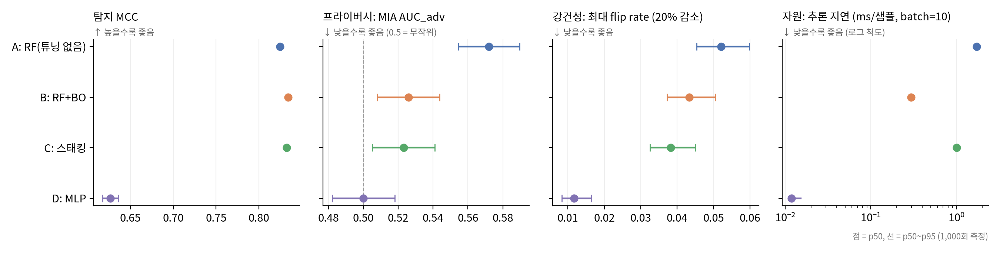
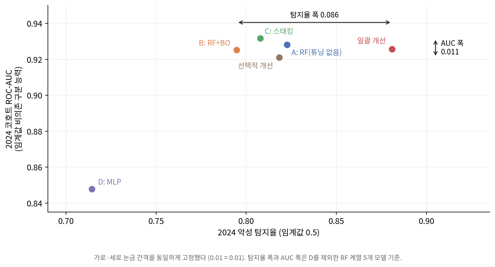

# 연구 제출 문서

## 높은 탐지 성능은 무엇을 측정하는가 — 호스트 행위 기반 악성코드 탐지 평가의 네 층위 분석

| 항목 | 내용 |
|---|---|
| 작성자 | 이도형 |
| 작성일 | 2026년 10월 3일 |
| 관심 분야 | AI와 네트워크·시스템 보안 — 특히 보안 탐지 모델의 성능 평가가 실제로 무엇을 측정하는가 |
| 제출물 | 완성 논문(본문·부록), 이 문서, 재현 패키지(원자료·스크립트·결과 파일) — ZIP 한 개 |
| 깃허브 | https://github.com/nb02079-ai/What-Does-High-Detection-Performance-Measure (8MB를 넘는 자료: 논문 PDF, 그림 원본, 실험 프로토콜 전문, 인용 확인 기록) |

이 문서는 논문을 요약하지 않는다. 과제가 요구하는 항목을 한곳에 모으고, 각 항목이 논문의 어디에 근거하는지 밝힌다. 수치는 모두 논문과 실험 결과 파일에서 가져왔다.

---

## 1. 가설

### 1.1 최종 가설 (한 문장)

> **모델 구조와 튜닝을 바꿨을 때 탐지 MCC가 높은 모델이 프라이버시·강건성·자원 비용에서도 우수하지는 않으며, 탐지 성능 차이의 일부는 모델의 능력이 아니라 데이터 수집 조건과 판단 경계에서 온다.**

**무엇이 무엇에 영향을 주는가.** 원인은 모델의 구조·튜닝(바꾼 조건)과 데이터의 수집 조건(수집 연도, 수집 환경)이고, 결과는 네 축의 성능과 탐지율이다.

### 1.2 가설에 나오는 표현의 측정 방법

| 가설의 표현 | 측정값 | 측정 방법 | 논문 |
|---|---|---|---|
| 탐지 MCC | Matthews 상관계수 | 검증 분할(8,000개), 시드 5회 평균, 임계값 0.5 | 3.6.1 |
| 프라이버시 | 멤버십 추론 공격의 방향 보정 AUC (AUC_adv) | shadow 모델 5개로 학습한 공격, 회원·비회원 각 1,999개 감사 집합 | 3.6.2 |
| 강건성 | 최대 flip rate | 조작이 쉬운 특징 7개를 5~30% 줄였을 때 악성 판정이 정상으로 바뀐 비율의 최댓값 | 3.6.3 |
| 자원 비용 | 샘플당 추론 지연 (ms) | 배치 10, 단일 코어 | 3.6.4 |
| 데이터 수집 조건 | ① 단순 기준선 정확도 ② 수집 연도만으로 라벨을 맞히는 AUC ③ 교란의 MCC 기여 | ① 깊이 1 결정트리 ② 연도를 점수로 쓴 ROC-AUC ③ 평가 데이터 재구성 | 4.1 |
| 판단 경계 | 같은 코호트 안의 탐지율과 AUC의 차이 | 2024년 코호트에서 탐지율 폭과 AUC 폭 비교 | 4.4 |

### 1.3 가설이 틀렸다면 나올 데이터 (한 줄)

> **탐지 MCC가 가장 높은 모델이 나머지 세 축에서도 가장 우수하고, 단순 기준선·수집 연도·판단 경계로 설명되는 성능 차이가 없었다면 가설은 틀린 것이다.**

세부 가설별 반증 조건은 다음과 같다(논문 3.1 표 1, 3.8).

| 세부 가설 | 틀렸다면 나올 결과 |
|---|---|
| H1 탐지 성능이 다른 축을 보장하지 않는다 | 탐지 성능 순위가 세 축의 순위와 모두 같다(반례가 없다) |
| H2 판별 중요도가 높은 특징일수록 교란에 민감하다 | 중요도와 교란 민감도의 순위 상관이 0 이하이거나 신뢰할 만한 양의 상관이 없다 |
| H3 구조·튜닝에 따라 파이프라인 사이에 차이가 있다 | 대응 비교한 MCC 차이의 95% 신뢰구간이 모두 0을 포함한다 |
| H5 선택적 개선이 일괄 개선보다 목표 축에서 뒤지지 않고 부작용은 적다 | 어느 부작용 축에서든 차이의 신뢰구간이 비열등성 한계를 넘어 열등으로 판정된다 |

### 1.4 이 가설을 최종으로 고른 이유

1. **데이터가 먼저 질문을 바꿨다.** 처음에는 백그라운드 보안 AI의 성능을 진단하고 개선하는 것이 목표였다. 그런데 데이터를 검증하다가 CIC-MalMem-2022가 특징 하나로 99.65%에 도달하는 것을 보았다. 선행 연구들이 보고한 99.9%가 무엇을 잰 것인지가 진단보다 먼저 물어야 할 질문이 되었다.
2. **검증할 수 있는 형태였다.** "탐지 성능이 높으면 다른 축도 좋은가"는 공개 데이터와 직접 만든 모델로 네 축을 함께 재면 확인할 수 있다. 반증 조건도 분명하다(1.3).
3. **진단·개선이라는 원래 목표를 버리지 않는다.** 네 축의 진단(모델 층위)과 선택적·일괄 개선의 비교(개선 층위)가 그대로 이 가설을 검증하는 실험이 된다.

---

## 2. 검토했다가 접은 주제

| # | 접은 주제 | 시기 | 접은 이유 |
|---|---|---|---|
| 1 | **합성 데이터로 백그라운드 보안 AI의 성능을 점검하는 논문** | 9월 11일 | 첫 초안이 합성 데이터로 만들어졌다. 실제로 검증한 내용이 아니므로 실증적 신뢰성이 없다고 판단하고, 실제 공개 데이터로 바꾸었다. |
| 2 | **오픈소스 침입 탐지 시스템(IDS-ML·Slips)을 설치해 그 모델 자체를 공격 대상으로 삼는 연구** | 9월 14일 | IDS-ML의 모델은 scikit-learn의 표준 구현이라, 이를 "다른 알고리즘"으로 내세우면 과장이라는 검토 의견을 받아들였다. 대신 같은 라이브러리로 직접 만든 모델들의 구조·튜닝을 비교하는 설계로 바꾸었다. |
| 3 | **BCCC 메모리 스냅샷 데이터(BCCC-MalMem-SnapLog-2025)를 주실험으로, DMBD를 교차 검증으로 쓰는 연구** | 9월 11~18일 | 데이터 용량이 약 40TB로 현실적으로 다루기 어려웠고, 접근 승인이 사전에 정한 기한(9월 18일)까지 오지 않았다. |

이 밖에 데이터 설계 단계에서 접은 방향이 두 가지 더 있다 — CIC-MalMem-2022를 주실험으로 쓰는 설계(특징 하나로 99.65% 분리되어 사례 연구로 격하), 데이터셋·연도 코호트 사이의 재현 검정 H4(2024년 악성이 모두 공식 시험 분할에 있어 폐기). 둘 다 논문 3.2와 6.2.1에 기록되어 있다.

---

## 3. 데이터

| 데이터 | 범위 | 건수 | 출처 | 받은 날짜 |
|---|---|---|---|---|
| **DMBD 2025** (주실험) | 수집 연도 2017~2024년(2016년 이전 287건, 2018~19년 440건 포함), 실행 단위 집계 | **64,747개 실행** | Lawrence Livermore National Laboratory (2025), LLNL-CODE-837816 | 2026-09-19 (파일 기록 기준) |
| **CIC-MalMem-2022** (사례 연구) | 메모리 덤프, 악성 15개 계열 | **58,596개 덤프** (정상·악성 각 29,298) | Carrier et al. (2022), 캐나다 사이버보안연구소 | 2026-09-19 (파일 기록 기준) |

원자료의 건수는 재현 패키지의 파일로 확인했다 — `dmbd_event_counts.csv` 64,747행, `MalMem2022.csv` 58,596행으로 설계와 일치한다.

**두 파일은 배포 원본 그대로가 아니다.** DMBD는 LLNL이 배포한 이벤트 기록 원본(약 8GB)을 작성자가 실행 단위로 집계한 파일이다(집계 스크립트: `04_재현/phase0/aggregate_dmbd.py`). CIC-MalMem-2022는 CIC 공식 배포본(`Obfuscated-MalMem2022.csv`)과 파일 이름·라벨·숫자 특징 55개가 정렬 후 완전히 일치하고, 열 구성과 행 순서만 다른 가공본이다. 자세한 내용과 SHA-256 검증값은 `03_원자료/원자료_출처.md`에 있다.

---

## 4. 실험 설계

### 4.1 설계 개요

| 층위 | 질문 | 방법 | 논문 |
|---|---|---|---|
| 벤치마크 | 높은 정확도는 단순한 규칙으로 설명되는가 | 깊이 1~3 결정트리 기준선, 수집 연도와 라벨의 관계, 평가 데이터 재구성 | 4.1 |
| 모델 | 탐지 성능이 높은 모델이 다른 축에서도 우수한가 | 모델 4종 × 네 축 동시 측정 (H1·H2·H3) | 4.2 |
| 개선 | 진단에 기반한 선택적 개선이 일괄 개선보다 나은가 | 비열등성·우위 검정 (H5) | 4.3 |
| 해석 | 시간적 일반화의 탐지율 차이는 무엇에서 오는가 | 2024년 코호트에서 탐지율과 AUC 비교 | 4.4 |

### 4.2 바꾼 조건과 고정한 조건

| 바꾼 조건 | 값 |
|---|---|
| 모델 구조 | 랜덤 포레스트 / 다층 퍼셉트론 |
| 튜닝 | 튜닝하지 않음(모델 A·D) / 베이지안 최적화 30회(모델 B) |
| 결합 | 단일 모델 / 스태킹(모델 C) |
| 개선 전략 | 선택적 개선(진단에서 문제가 된 축만) / 일괄 개선(준비된 개선 모두) |
| 교란 크기 | 5%, 10%, 15%, 20%, 30% 감소 |
| 평가 코호트 | 2017년 / 2024년 (공식 시험 분할) |

| 고정한 조건 | 값 |
|---|---|
| 데이터 분할 | 학습 24,000 / 검증 8,000 / H5 시험 8,000 / 공식 시험 24,747 (분할 시드 42, 봉인 해시 기록) |
| 입력 특징 | 12개 (중복 2개 제거) |
| 학습 시드 | 42, 7, 123, 2024, 777 |
| 판정 임계값 | 0.5 |
| 멤버십 추론 감사 집합 | 회원·비회원 각 1,999개 (연도별 개수 맞춤) |
| 교란 대상 특징 | 7개 |
| 실행 환경 | Python 3.12, scikit-learn 1.8.0, CPU 1코어 |

### 4.3 반복 횟수와 표본 수

| 항목 | 값 |
|---|---|
| 모델 학습 | 시드 5회 |
| 신뢰구간 | 부트스트랩 2,000회 |
| 베이지안 최적화 | 30회(무작위 10 + 가우시안 과정 20) |
| shadow 모델 | 5개 |
| 추론 지연 | 배치 크기마다 20회 반복, 중앙값은 1,000회 |

전체 설계는 논문 3장(표 1~4, 그림 1)과 부록 B에 있다.

---

## 5. 결과

### 5.1 가설별 결과 요약

| 가설 | 기대 | 결과 | 판정 | 근거 값 | 근거 파일 |
|---|---|---|---|---|---|
| 벤치마크 (CIC) | 높은 정확도가 단순한 규칙으로 설명된다 | 실행 중인 서비스 수 하나로 **99.65%** (실행 단위 교차검증) | **가설대로** | 깊이 1 결정트리 정확도 | `MalMem2022.csv` → `빠른_확인.py` |
| 벤치마크 (DMBD) | 수집 조건이 라벨과 얽혀 있다 | 수집 연도만으로 라벨을 **ROC-AUC 0.907**, 교란의 기여 **약 0.03 MCC** | **가설대로** (기여는 작음) | 연도 AUC / 재구성 조건 (c)의 MCC 0.7788 | `dmbd_event_counts.csv` → `빠른_확인.py`, `phase4/results/cohort_check.json` |
| H1 | 탐지 순위와 다른 축의 순위가 다르다 | 탐지 MCC가 가장 높은 B(0.8342)는 프라이버시(AUC_adv 0.5259)에서 C(0.5230)보다 나쁨 — 차이 **0.0029**로 미미. 반면 탐지가 가장 낮은 D(0.6267)가 세 축 모두에서 가장 유리 | **가설대로** (형식적 반례는 작음) | MCC, AUC_adv | `phase3/results/results_all.json`, `phase4/results/mia.json` |
| H2 | 중요도가 높을수록 교란에 민감하다 | 네 모델 모두 양의 상관(A +0.750, B·C +0.536, D +0.893). BH 보정 후 유의한 것은 **D뿐**(p=0.027). `net_connect`는 경향에서 벗어남 | **경향만** | 순위 상관과 p값 | `phase4/results/perturb.json` (BH 보정은 원고 작성 중 계산) |
| H3 | 구조·튜닝에 따라 차이가 있다 | 구조 차이 **MCC 0.198**, 튜닝 차이 **0.010** (약 20배). 스태킹은 −0.0017, 신뢰구간 [−0.0045, +0.0011]로 0 포함 | **가설대로** (스태킹 효과는 검출 안 됨) | 시드별 MCC의 대응 차이 | `phase3/results/results_all.json` |
| H4 | 코호트 사이에 재현된다 | 2024년 악성이 학습·검증에 0개 | **폐기** (검정 불가) | 분할별 연도·라벨 건수 | 원자료 + `phase3/indices/` |
| H5 | 선택적 개선이 일괄 개선을 지배한다 | 멤버십 추론 축에서 선택적 개선이 **열등**(차이 +0.0587, 신뢰구간 [+0.0330, +0.0687] > 한계 0.02) | **다르게 나옴 — 기각** | 차이의 추정값과 신뢰구간 | `phase6/results/h5_eval_part2_mia.json` |
| 해석 (시간적) | 탐지율 차이가 판단 경계에서 온다 | 2024년 코호트에서 랜덤 포레스트 계열의 탐지율 폭 **0.0862**, AUC 폭 **0.0106** (약 8배) | **가설대로** | 모델별 2024 악성 탐지율과 `auc_2024` | `phase6/results/official_test_cohort.json` |

"근거 파일"은 재현 패키지 안의 경로다. 차이·폭·보정 p값은 파일의 값으로 계산한 것이다.

### 5.2 결과 그래프

**그림 A.** 네 축에서의 모델 비교 (논문 그림 5). 탐지는 높을수록, 나머지 세 축은 낮을수록 좋다. 탐지 MCC가 가장 낮은 D가 나머지 세 축에서 모두 가장 유리하다.

**그림 B.** 2024년 악성 탐지율과 2024년 코호트 AUC (논문 그림 8). 랜덤 포레스트 계열 다섯 모델의 탐지율은 크게 퍼지지만 AUC는 좁은 띠에 머문다.

---

## 6. 해석

**데이터는 가설을 뒷받침한다.** 네 층위 모두에서 탐지 성능 수치 하나가 서로 다른 원인을 같은 숫자로 가렸다. CIC-MalMem-2022의 높은 정확도는 특징 하나로 거의 다 설명되고, DMBD 2025의 탐지 성능에는 수집 연도의 몫이 섞여 있으며, 탐지 순위는 다른 축의 순위와 맞지 않고, 시간적 일반화의 탐지율 차이 대부분은 판단 경계에서 왔다(논문 5.1).

**가설과 다르게 나온 결과와 그 이유로 검토한 가능성.**
- **H5 기각** — 일괄 개선은 프라이버시와 강건성을 **의도적으로** 개선하도록 설계되었는데, H5는 그 축들을 "부작용 축"으로 두었다. 일괄 개선이 그 축에서 앞서는 것은 설계상 예정된 결과였을 수 있다(논문 4.3.4, 6.2.3). 다만 판정은 바꾸지 않았다.
- **H2의 `net_connect`** — 트리 기반 모델에서 판별 중요도는 높았지만 30%를 줄여도 판정이 바뀐 샘플이 없었다. 비례 감소라는 교란 방식의 한계일 수 있다(논문 4.2.3).
- **H1의 작은 반례** — 형식적 반례(B와 C)는 0.0029로 신뢰구간이 거의 겹친다. 가설을 뒷받침하는 것은 이 반례보다 D의 뚜렷한 순위 역전이다.
- **CIC의 서비스 수 차이** — 악성 행위의 흔적인지 수집 구성의 차이인지 데이터만으로 가릴 수 없다. 두 해석을 모두 열어 두었다(논문 4.1.1).

---

## 7. 가설을 고친 과정

| 시기 | 고치기 전 | 고친 후 | 이유 |
|---|---|---|---|
| 9월 11일 | 합성 데이터로 백그라운드 AI의 보안 성능을 점검 | 공개 데이터로 진단과 개선을 검증 | 합성 데이터는 실증 근거가 되지 못함 |
| 9월 15일 이전 (v1.3) | H3: "순수 구조 효과" | H3: "파이프라인 사이의 차이" | 같은 라이브러리의 구성 차이를 "순수 구조"로 부르면 과장 |
| 9월 18일 (v2.3·v2.4) | H5: 선택적 개선이 "20% 개선" | H5: 선택적 대 일괄 개선의 **비열등성·우위 이중 검정**, 지표 방향별 부등식 | 외부 검토에서 판정 기준의 모호함과 수학적 오류를 지적받음 |
| 9월 18일 (v2.6) | H4: 데이터셋 사이의 재현 (BCCC ↔ DMBD) | H4: DMBD 안의 **연도 코호트 사이**(2017 대 2024) 재현 | BCCC 승인 불발, CIC-MalMem은 사례 연구로 격하 |
| 9월 19일 (v2.7) | H2 분석 단위 n=9 | n=7 (판정 규칙은 유지) | 중복 특징 제거 |
| 9월 20일 (v3.1) | H4 검정, 확증적 가설 H1~H5 | **H4 폐기**, 확증적 가설은 H2·H3·H5 | 2024년 악성이 학습·검증에 0개 |
| 9월 21일 | 연구 초점: 보안 성능의 진단과 개선 | 연구 초점: **높은 탐지 성능은 무엇을 측정하는가** (최종 가설, 1.1) | CIC의 단일 특징 분리와 DMBD의 연도 교란을 보고, 진단에 앞서 "수치가 무엇을 재는가"를 묻게 됨 |

모든 변경의 원문 기록은 논문 부록 A(변경 이력 69건, 버전 이력, 정정 대조표)에 있다.

---

## 8. 한계

이 연구로 말할 수 없는 것들이다(논문 6장).

- **다른 데이터셋에서도 그런가** — 주실험 데이터셋이 하나이고, 코호트 사이의 재현 검정(H4)을 폐기했다.
- **CIC의 서비스 수 차이의 원인** — 다른 수집 환경으로의 전이나 개입 실험을 하지 않아 판정을 유보했다.
- **실제 회피 공격에 대한 내성** — 강건성은 특징 공간에서의 교란으로 쟀다. 실행 파일을 실제로 변형하는 공격이 아니다.
- **프라이버시 위험의 크기** — 단순화한 shadow 모델 공격으로 쟀으므로 유출을 과소평가했을 수 있다.
- **실제 배치 환경의 성능** — 분할의 악성 비율(50%, 78.8%)이 실제 환경을 대표하지 않으며, 공식 분할은 엄밀한 시간 순서가 아니다.
- **일괄 개선의 강건성 향상** — 교란 학습 샘플이 575개뿐이어서 평균 약 8.3배 중복해 썼다. 이 샘플들에 맞춰진 결과일 수 있다.

---

## 9. 참고문헌과 문헌별 연결

### 9.1 참고문헌 목록과 각 문헌이 뒷받침하는 부분

| 문헌 | 출처 | 가설의 어느 부분을 뒷받침하는가 |
|---|---|---|
| Arp et al. (2022) | USENIX Security 22 | 단일 지표 평가의 함정 — 연구 질문 전체의 출발점 |
| Carlini et al. (2022) | IEEE S&P 2022 | 프라이버시 측정의 해석 — 단순한 공격의 미검출은 안전이 아님 |
| Carrier et al. (2022) | ICISSP 2022 | CIC-MalMem-2022의 원 논문 — 벤치마크 층위의 데이터와 수집 절차 |
| Caruana et al. (2004) | ICML 2004 | 앙상블 개선 폭은 크지 않음 — 스태킹 효과(H3) 해석 |
| Chicco & Jurman (2020) | BMC Genomics | MCC를 주지표로 쓴 근거 — "탐지 MCC"의 측정 |
| Dener et al. (2022) | Applied Sciences | CIC 선행 정확도 99.97% — 벤치마크 층위의 비교 기준 |
| Frazier (2018) | arXiv | 베이지안 최적화 — 모델 B의 "튜닝" |
| Geirhos et al. (2020) | Nature Machine Intelligence | 지름길 학습, 강한 기준선 시험 — 단순 기준선 진단의 근거 |
| Hasan & Dhakal (2023) | IEEE ICTP 2023 | CIC 선행 최고 정확도 99.99% — 벤치마크 층위의 비교 기준 |
| Holzmann & Klar (2024) | arXiv | 극단적 불균형에서 MCC의 한계 — 지표 선택의 단서 |
| Jacobs et al. (2022) | ACM CCS 2022 | 결정트리로 보안 모델의 지름길 진단 — 진단 방법의 선행, "문제가 단순할 수도" 단서 |
| Kuncheva & Whitaker (2003) | Machine Learning | 다양성과 앙상블 성능의 관계가 불분명 — 스태킹 해석 |
| Lapuschkin et al. (2019) | Nature Communications | 같은 점수 아래 다른 판단 방식 — 가설의 중심("수치가 능력을 그대로 반영하지 않는다") |
| Lawrence Livermore National Laboratory (2025) | LLNL 데이터셋 | 주실험 데이터 DMBD 2025 |
| Madamidola et al. (2025) | Intelligent Systems with Applications | 같은 관찰의 행위 해석 — 벤치마크 층위의 두 해석 |
| MITRE (2026) | MITRE ATT&CK | 서비스 중지 기법 — 서비스 수 차이의 행위 해석이 미치는 범위 |
| Nassar (2026) | arXiv | 같은 실행의 덤프 누수와 정상 식별자 부재 지적 — CIC 분할의 한계 |
| Pendlebury et al. (2019) | USENIX Security 19 | 시간·공간 편향 — 해석 층위와 분할의 한계 |
| Pierazzi et al. (2020) | IEEE S&P 2020 | 문제 공간 공격 — 강건성 측정(특징 공간 교란)의 한계 |
| Shafin et al. (2023) | Sensors | CIC 이진 분류가 비교적 쉽다는 선행 언급 — 벤치마크 층위 |
| Shokri et al. (2017) | IEEE S&P 2017 | shadow 모델 기반 멤버십 추론 — 프라이버시 측정 방법 |
| Wang et al. (2026) | arXiv | 입력 특징의 지름길 진단(BiasSeeker) — 본 연구의 차별점(입력에 없는 교란) |

전체 서지(APA 7판, DOI 포함)는 논문의 참고문헌에 있다. 본문 인용 22편과 목록 22편이 일치함을 양방향으로 대조했다.

### 9.2 이미 알려진 사실과 이 연구가 새로 주장하는 것

| 이미 알려진 사실 (선행 연구) | 이 연구가 새로 주장하는 것 |
|---|---|
| CIC-MalMem-2022의 이진 분류는 비교적 쉽다 (Shafin et al.) | 분기 하나로 99.65% — 그 쉬움의 **정량화**와, 15개 계열 모두 같은 서비스 수라는 **균일성** |
| 단일 지표 평가에는 함정이 있다 (Arp et al.) | 그 함정이 **네 층위에서 차례로** 무엇을 가리는지를 한 연구 안에서 추적 |
| 높은 점수가 다른 판단 방식을 숨길 수 있다 (Lapuschkin et al.), 지름길 학습 (Geirhos et al.) | DMBD 2025의 **수집 연도 교란**(AUC 0.907)과 그 기여(약 0.03 MCC)의 **분리** |
| 입력 특징의 지름길을 가려서 진단할 수 있다 (Wang et al.) | 입력에 없는 교란은 **평가 데이터를 재구성**해 분리 |
| 시간 편향이 성능을 부풀린다 (Pendlebury et al.) | 시간적 탐지율 차이의 대부분이 **판단 경계**에서 온다(탐지율 폭이 AUC 폭의 약 8배) |
| — | 네 축을 함께 재면 **탐지 순위와 다른 축의 순위가 어긋나고**, 구조 차이가 튜닝 차이의 약 20배 |

### 9.3 출처를 확인한 방법

1. **서지** — 출판사·학회의 공식 페이지, dblp, ACM Digital Library, 저자·소속 기관의 저장소에서 저자 전원(이니셜 포함), 제목, 게재처, 권·호·쪽수, DOI를 확인했다. 출처끼리 다르면 다수의 공식 출처를 따랐다(예: Pierazzi et al.의 쪽수).
2. **내용** — 원고에 쓴 주장 하나하나를 원문과 대조했다(최소 초록, 대부분 본문). 다른 논문을 통해 알게 된 수치는 원문에서 다시 확인했다.
3. **연도** — 사전 공개본과 게재판이 다르면 게재판을 따랐다(Hasan & Dhakal 2023, Madamidola et al. 2025).
4. **기록** — 문헌별 확인 결과는 `references_verified.md`(깃허브)에 남겼다.

### 9.4 확인 과정에서 걸러낸 항목

**참고문헌에서 뺀 문헌**

| 문헌 | 뺀 이유 |
|---|---|
| 업계 성능 기준(CrowdStrike 벤치마크 보고, arXiv:2511.08352) | 원문을 확인하지 못했고 업체 자료라, 이를 근거로 한 "업계 기준 CPU 1% 미만" 서술과 함께 뺐다 |
| Mandiant M-Trends 2026, BMC의 비용 민감 평가 노트 | 실험 프로토콜이 근거로 들었으나 원문을 확인하지 못했다. 원고는 외부 수치 없이 서술했다 |
| Domingos (2000), Dieterich et al. (2023), Barr-Smith et al. (2021) | 프로토콜의 변경 기록에만 언급되었다. 원고가 인용하지 않았고 원문 확인도 거치지 않았다(부록 A.1에 명시) |
| Wickramasinghe et al. (2025, SoK) | 다른 문헌의 내용을 잘못 묶는 과정에서 후보로 떠올랐으나 확인하지 않았다 |
| Alani et al. (2023), Brennan (2021) | Madamidola et al.이 근거로 든 2차 문헌(후자는 보안 업체 블로그)이다. 원고는 Madamidola et al. 원문만 인용했다 |
| Zech et al. (2018), Beery et al. (2018) | Geirhos et al.이 소개한 사례다. 원고는 Geirhos et al.만 인용했다 |

**확인 과정에서 바로잡은 인용** (원고 작성 중 원문 대조로 발견)

| 문헌 | 처음의 오독 | 원문 확인 후 |
|---|---|---|
| Caruana et al. (2004) | 앙상블 이득이 배깅·부스팅보다 작다 | 앙상블 선택이 배깅·부스팅 모델을 포함한 최고 단일 모델을 일관되게 앞섰다(개선 폭은 크지 않음) |
| Kuncheva & Whitaker (2003) | 다양성과 성능은 무관하다 | 관계가 불분명하다 |
| Carlini et al. (2022) | 약한 공격의 미검출을 안전의 근거로 읽음 | 미검출은 안전을 뜻하지 않는다 |
| Jacobs et al. (2022) | 다른 문헌의 내용을 이 논문의 것으로 기록 | 결정트리 추출로 지름길·허위 상관·분포 밖 취약성을 드러낸 연구 |
| Wang et al. (2026) | 지름길을 "탐지만" 한다 | 특징을 가려서 성능 영향도 측정한다 — 차별점을 "입력에 없는 교란"으로 바로잡음 |
| Dener et al. (2022) | 2차 인용의 "최대 99.9%" | 원문 99.97% |

---

## 10. 재현

재현 패키지(ZIP)에 원자료, 실험 스크립트, 결과 파일이 함께 있다. 자세한 절차는 `재현/재현_방법.md`에 있다.

**짧은 확인 (10초 안팎).** `python 재현/빠른_확인.py`를 실행하면 원자료에서 두 핵심 수치를 다시 계산한다.
- CIC-MalMem-2022: 실행 단위로 묶은 5겹 교차검증에서 깊이 1 결정트리의 정확도 → **99.65%**
- DMBD 2025: 수집 연도만으로 라벨을 예측한 ROC-AUC → **0.9070**

**이 패키지에서 실제로 확인한 것.** `prep.py`로 원자료에서 다시 만든 분할 인덱스 4개와 특징 목록이 봉인된 원본과 바이트까지 같았고, `year_confound.py`와 `cohort_check.py`의 결과가 원래 실행의 결과와 완전히 같았다. 나머지 스크립트는 문법 검사만 했다(실행 시간이 길다).

---

## 11. AI와 함께한 과정

### 11.1 AI와 가설을 다듬은 과정

| 시기 | 과정 |
|---|---|
| 9월 11일 | 목표("디바이스 백그라운드 AI 보안 성능 체크 및 개선")를 제시했다. AI가 합성 데이터로 초안 전체를 먼저 만들자, 실제로 검증한 내용인지 묻고 멈추게 한 뒤 **단계별로 함께 정하는 방식**으로 바꾸었다. AI가 공개 데이터셋 후보를 찾고 내가 둘을 골랐다. |
| 9월 14~18일 | AI가 실험 프로토콜을 문서로 만들고, 내가 가져온 **외부 검토 의견을 두 차례** 함께 검토해 반영했다(H5 판정 방식 재구성, MCC 채택 등). 가설과 판정 규칙을 실험 전에 고정했다. |
| 9월 18~21일 | 사전 규칙에 따라 CIC-MalMem-2022가 주실험 데이터가 되었으나, 모델을 학습하기 전 데이터 검증에서 특징 하나로 거의 완전히 분리되는 것을 확인하고 주실험을 DMBD로 바꾸었다(데이터를 본 뒤의 변경이므로 변경 기록에 남겼다). 실험 결과를 본 뒤 연구의 초점을 "탐지 성능은 무엇을 측정하는가"로 옮기기로 결정했다. |
| 9월 30일~10월 3일 | AI가 장마다 초안을 쓰고 원문과 대조했다. 해석이 갈리는 곳(서비스 수 차이의 두 해석, 사후 해석의 표시 등)은 선택지를 받아 내가 정했고, 모든 수정은 목록으로 모았다가 "반영해줘" 뒤에 한 번에 적용했다. |

### 11.2 AI와 나의 판단 (3줄)

1. **AI에게 맡긴 일**: 문헌 검색과 원문 대조, 실험 코드 작성과 실행, 원고 초안 작성과 수치 점검.
2. **내가 판단한 일**: 합성 데이터 대신 공개 데이터 사용, 주실험 데이터셋 선정, 해석이 갈리는 곳의 서술 방향(두 해석 병기 등), 각 수정의 반영 여부.
3. **진행 방식**: 한 번에 완성하지 않고 단계마다 보고받아 결정했으며, "반영해줘" 전에는 어떤 변경도 적용하지 않게 해서 모든 수정을 검토했다.
